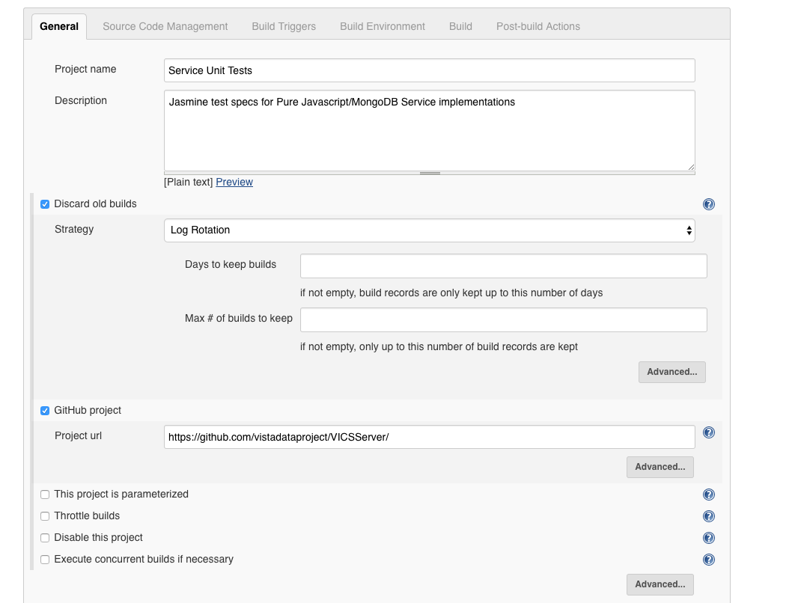

## Overview Project Development/ Testing/ Build

__Framed around thorough SCOPING__ 
  * Three Capture Phases: [P1 (signon)](https://github.com/vistadataproject/VICSServer/blob/df8182f4bec45caa68ec04c7acd829ce84b76900/tests/captures/capture-p1bpsel.txt), [P2 (patient select)](https://github.com/vistadataproject/VICSServer/blob/df8182f4bec45caa68ec04c7acd829ce84b76900/tests/captures/capture-p2psel.txt), [P3 (allergy)](https://github.com/vistadataproject/VICSServer/blob/df8182f4bec45caa68ec04c7acd829ce84b76900/tests/captures/capture-p3allergies.txt) - used in Regression Tests too
  * [Meta RPC Report](http://vistadataproject.info/artifacts/cprsRPCBreakdown/metaInMongoScope) - _note parameter heavy B1_
    * [Example ORDEA DEATEXT](http://vistadataproject.info/artifacts/devdocs/EmulatedRPC/ORDEA_DEATEXT) - _leads to MUMPS Server, CPRS code and see Parameter(s) inside_
  * [Parameter Analysis for Data Extract/Sync](https://github.com/vistadataproject/DataExtractNSync/blob/master/metaMongo/Datasets/9999/Reports/parameterCoverage9999.md)

__GITs (Required, Open)__
  * [VICS Server](https://github.com/vistadataproject/VICSServer)
  * [RPC Router](https://github.com/vistadataproject/rpcRouter)
  * [(node)VISTA](https://github.com/vistadataproject/nodeVISTA)
  * [DataExtractAndSync](https://github.com/vistadataproject/DataExtractNSync) -- not dev, analysis, data grooming and extraction
  * [web site](https://github.com/vistadataproject/vistadataproject.github.io) - _report above is on this site which itself is an open git_, new site will go on demo linode
    
__[CI](https://ci.vistadataproject.info)__
  * _Linode_ (Cloud VM) with a VISTA and the latest Server and Router
  * [Unit](https://ci.vistadataproject.info/job/VISTA%20Adaptive%20Maintenance/job/VICSServer/job/Regression%20Tests/job/Comparison%20Tests/test_results_analyzer/), [Regression](https://ci.vistadataproject.info/job/VISTA%20Adaptive%20Maintenance/job/VICSServer/job/Regression%20Tests/job/Comparison%20Tests/test_results_analyzer/) and [Performance Tests](https://ci.vistadataproject.info/job/VISTA%20Adaptive%20Maintenance/job/VICSServer/job/Performance%20Tests/job/Benchmark%20Tests/Performance_Report/)
  * Scripts (like all else in project) [in open git](https://github.com/vistadataproject/VICSServer/tree/master/scripts)
    
__Demo VM For B1__
  * Modeled on the [Workload Demo](https://workload.vistadataproject.info/login)
  * [Manual Assembly Wiki](https://github.com/vistadataproject/VAMDemo/wiki/Setting-up-VAM-Demo-Linode)
  * Will Automate build out in Jenkins - rebuilds
  * In Build 2 - we'll add a Cloud Demo

## Background Shots

Development in Branches ...

Unit Tests in CI ...

Regression ...

Jenkins Setup ...

