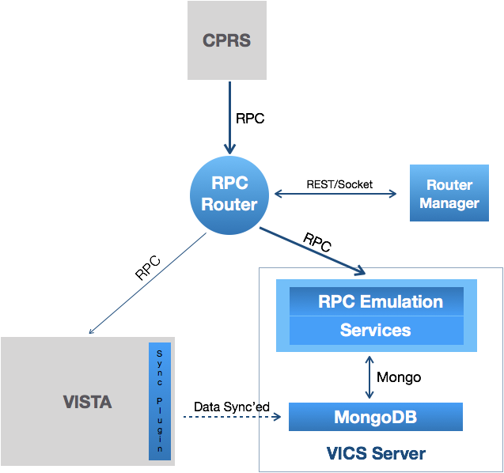

# VAM (Build 2) Demonstration Outline

> VAM is to [1] __secure and audit__ access to VistA by RPC-based clients and [2] __migrate__ a representative set of VistA functionality to VA-wide, centralized services by [3] deploying components on __FedRAMP AWS__ [4] while ensuring the continued operation of current clients such as CPRS and VistA instances.



Some Key Features:
  * Audit all RPC traffic
  * Distinguish Patient from Meta
  * Emulated and Migrated _143_ RPCs to National Veteran Integrated Care Services (VICS) - __routing is per RPC__ (switch on or off)
  * Distinguish Patient from Meta - both at RPC level and for Services (for deployment ease)
  * VICS-VISTA synchronization for Change RPCs (Patient and Meta) to maintain _remaining services_ in VistA

Running as a set of containers ...

> docker container list

```shell
CONTAINER ID        IMAGE                                  COMMAND                  CREATED              STATUS              PORTS                                                                                       NAMES
027b13bc561e        vistadataproject/router:latest         "npm start"              About a minute ago   Up About a minute   0.0.0.0:9011-9012->9011-9012/tcp                                                            compose_router_1
b5bd8bbd150b        vistadataproject/vics-server:latest    "npm start"              About a minute ago   Up About a minute   0.0.0.0:9999->9999/tcp                                                                      compose_vics-server_1
b000595eea0a        vistadataproject/vicsdb:latest         "docker-entrypoint.s…"   2 minutes ago        Up About a minute   0.0.0.0:27017->27017/tcp                                                                    compose_vicsdb_1
866c62245455        vistadataproject/nodevista999:latest   "/bin/sh -c /home/no…"   2 minutes ago        Up 2 minutes        22/tcp, 0.0.0.0:9000->9000/tcp, 9030/tcp, 0.0.0.0:9430->9430/tcp, 0.0.0.0:32774->1342/tcp   compose_nodevista_1
```

and CPRS in a VM and a "Client X".

Two simple "look inside" clients, the [Rambler](http://localhost:9000) that looks inside VistA FileMan and the __[Router Manager](http://localhost:9012/#management)__ that shows __RPC logs and traffic__.

Other Links:
  * [RPC orwdal32-save-allergy](https://github.com/vistadataproject/VICSServer/blob/master/emulation/models/orwdal32-save-allergy.js) 
  * [Service](https://github.com/vistadataproject/VICSServer/tree/master/services/allergyService)
  * [Run it yourself](https://github.com/vistadataproject/VAMDocker/tree/master/compose)
  * [Build Pipeline](https://ci.vistadataproject.info/job/VISTA%20Adaptive%20Maintenance/job/VICSServer/job/Automated%20Tests/view/Build%20Pipeline/)

