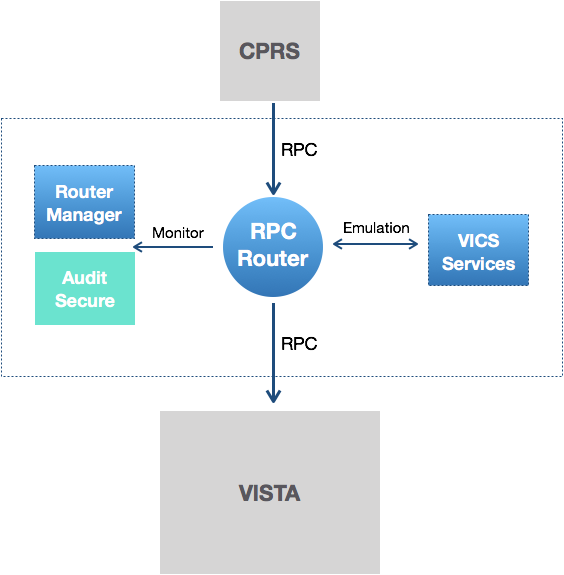

# Build 2.2 in AWS

A brief demonstration of Build 2.2 in AWS (Public) and a preview of Build 3



## Behind the AWS Curtain

  * Setup using basic [AWS Demonstration Setup](https://github.com/vistadataproject/VAMDocker/wiki/Deploy-the-VAM-Demo-with-Docker-for-AWS). 
  * Cloudformation [Stack](https://us-west-1.console.aws.amazon.com/cloudformation/home?region=us-west-1#/stacks?filter=active)
  * [The two instances](https://us-west-1.console.aws.amazon.com/ec2/v2/home?region=us-west-1#Instances:sort=desc:dnsName)
  * __GO TO SHELL TO LIST SERVICES__
    * _ssh -i vam-demo-21.pem docker@18.144.10.124_
  
## Points to see

__Note__: Variation of the [Build 2 Demo](http://vistaadaptivemaintenance.info/builds/build2/demo/)

__1. Logged and Model RPCs and further to _Emulated RPCs_: VICS,  VISTA, BOTH__ 


... 143 

__2. Track User identity based on logins and session monitoring__ 

_User Name Unknown_ at first ...


__3. Select and Coversheet__ 


and 


and


__4. Change: Save Allergy__


and see in FMQL/VistA too ...


__5. Vitals off Shell__ w/ Mary Smith

```shell
Connected to 10.2.2.222 on port 9011

...

<<<Received
65
0
0

0
0

Good morning SMITH,MARY
     You last signed on today at 02:03

...

>>> Sending RPC: ORWPT SELECT [ '25' ]

<<<Received
CARTER,DAVID^M^2810302^000000113^^^^^0^^0^0^^^37^0

...

>>> Sending RPC: GMV ADD VM [ '3180207.200921^25^1;120/90^10^65*51:109' ]

<<<Received

...

>>> Sending signoff

<<<Received
#BYE#
```

and __different variations of Vital GETS__.

And Refresh in CPRS.

## Technical (git) Links
 
  * Composition Files - [Swarm File](https://github.com/vistadataproject/VAMDocker/blob/master/swarm/demo-swarm.yml)
  * RPC Models:
    * Patient
      * [ORQQPL DETAIL](https://github.com/vistadataproject/VICSServer/blob/master/emulation/models/orqqpl-detail.js#L20) - see READ, see Patient session (shouldn't be explicit as could change)
      * [ORQQPL ADD SAVE](https://github.com/vistadataproject/VICSServer/blob/master/emulation/models/orqqpl-add-save.js) - including [details not noted in current i/f file](https://github.com/vistadataproject/VICSServer/blob/master/emulation/models/orqqpl-add-save.js#L50)
    * Meta Get/Lookup: [ORQDAL32 ALLERGY MATCH](https://github.com/vistadataproject/VICSServer/blob/master/emulation/models/orwdal32-allergy-match.js) - META
    * Meta GET/SET
      * [orworb-setsort](https://github.com/vistadataproject/VICSServer/blob/master/emulation/models/orworb-setsort.js) - set SORT (META/CHANGE)
      * [orworb-get-sort](https://github.com/vistadataproject/VICSServer/blob/master/emulation/models/orworb-get-sort.js) - META/ PARAMETER / READ ie/ list parameters and files
  * [VICS DB Layered Schema](https://github.com/vistadataproject/vicsDB/tree/master/JSONSchema)


## Preview Build 3: (4 Builds in Year 1)
      
  * Move to Cloudwatch - [Cloudwatch](https://us-west-1.console.aws.amazon.com/cloudwatch/home?region=us-west-1#logStream:group=VAM-DEMO-22-lg;streamFilter=typeLogStreamPrefix), see VAM-DEMO logs and the vicsServer log and rules to add
  * Move to VA EC - [See instance list in one dev subnet](https://console.amazonaws-us-gov.com/ec2/v2/home?region=us-gov-west-1#Instances:sort=instanceState)
    * See also: AWS GovCloud Reference Architecture.pdf

## Extra: Explore AWS Links
 
   * [Cloudformation](https://us-west-1.console.aws.amazon.com/cloudformation/home?region=us-west-1#/stacks?filter=active), see VAM-DEMO stack
