# Allergies

Before running the following, follow the [nodeVISTA Introduction](http://vistadataproject.info/demo/) on how to setup the nodeVISTA management client and CPRS.

A discussion on nodeVISTA emulation statistics can be found below in the [Emulation Statistics](#emulation-statistics) section below.

## Demo Procedures

The following shows creation, reading and removal of Patient Allergies using CPRS, VISTA's client, running over a nodeVISTA manager. CPRS may think it's running over a 20 year old RPC interface but it's actually invoking RPCs through an _RPC Emulator_ that runs over _nodeVISTA_. The _nodeVISTA Manager_ shows not only what CPRS sends and receives but also the underlying MVDM activity.

Running the following demonstrates that re-housing the old RPC interface over a modern, CRUD-based object model provides a new level of auditing and access control for VISTA and lays bare the behavior of the system.

### Create an Allergy

Unlike other domains such as Problems or Documents, Allergies don't have their own tab in CPRS. You start Allergy creation with a right-click in the CPRS Chart's Allergy widget ...

Selecting _Enter a new Allergy_ takes you to a search dialog where you pick the _causative agent_ that the patient is allergic to. Here we search for and select _Chocolate_ ...

And this takes us to the _Allergy Entry_ dialog. Allergies come in two flavors - historical and observed. We choose _Historical_ and fill in some details including the side effects and a comment ...

Now switching over to the _RPC Events Tab_ of the _nodeVISTA Management Client_, notice the **ORWDAL32 SAVE ALLERGY** entry ...

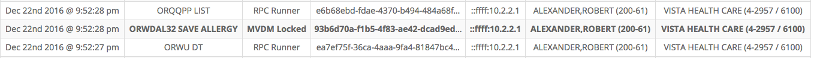

Clicking on it will bring up details about this RPC. This was the call dispatched by CPRS to VISTA when you hit OK in the _Allergy Entry_ dialog above. The red box highlights a _transaction id_ assigned by MVDM and it groups all activity that arises from this one RPC call ...

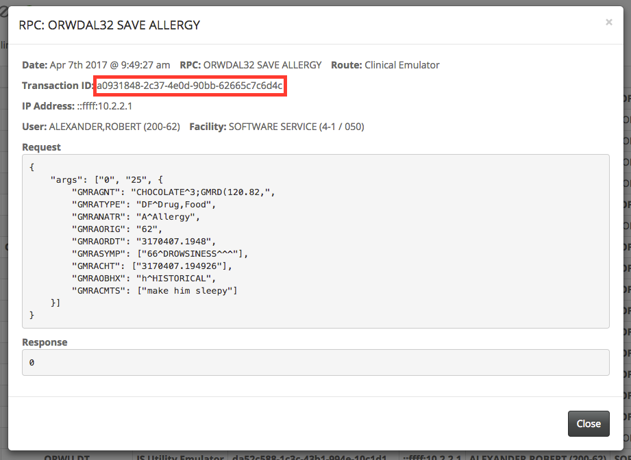

Now switch to the Management Client's _MVDM Events_ tab and hone in on the two create events that share the same transaction id ...

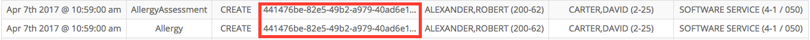

Click on the entry for _Allergy_ ...

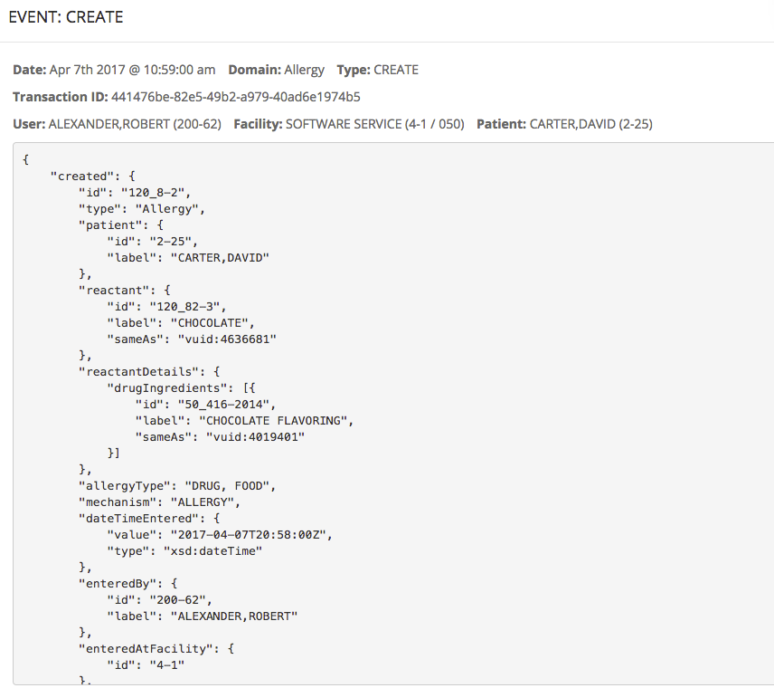

The RPC Emulator implements the RPC call with an MVDM _createAllergy_ operation. After creating and updating appropriate information in VISTA, the nodeVISTA manager will dispatch this create event. Unlike the cryptic RPC fields such as _GMRAORIG_, that event and the object that led to it have easy to understand properties such as _enteredBy_.

And the other event, the one for _AllergyAssessment_? That shows that one RPC call to create an Allergy actually leads to two objects in VISTA, one for the Allergy itself and another to record that a Patient has been assessed ...

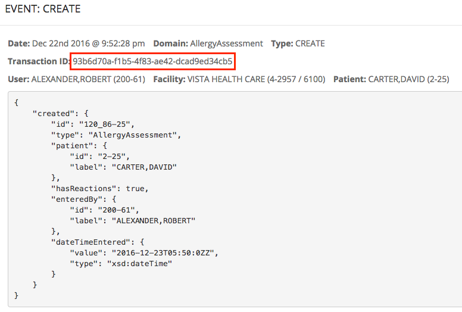

One RPC from CPRS is dispatched as it has been for twenty years but now MVDM renders every aspect of this activity transparent.

### Reading is emulated and exposed too

Back in _CPRS_ and the cover sheet, we can click on the new allergy record and see its details ...

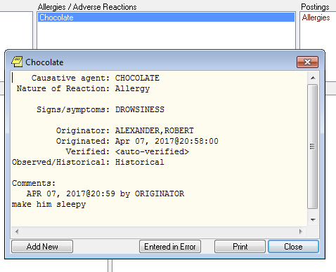

And now the _Management Client_ shows that the query RPC, **ORQQAL DETAIL** used by this CPRS view is monitored by nodeVISTA ...

as is the underlying MVDM _DESCRIBE_ ...

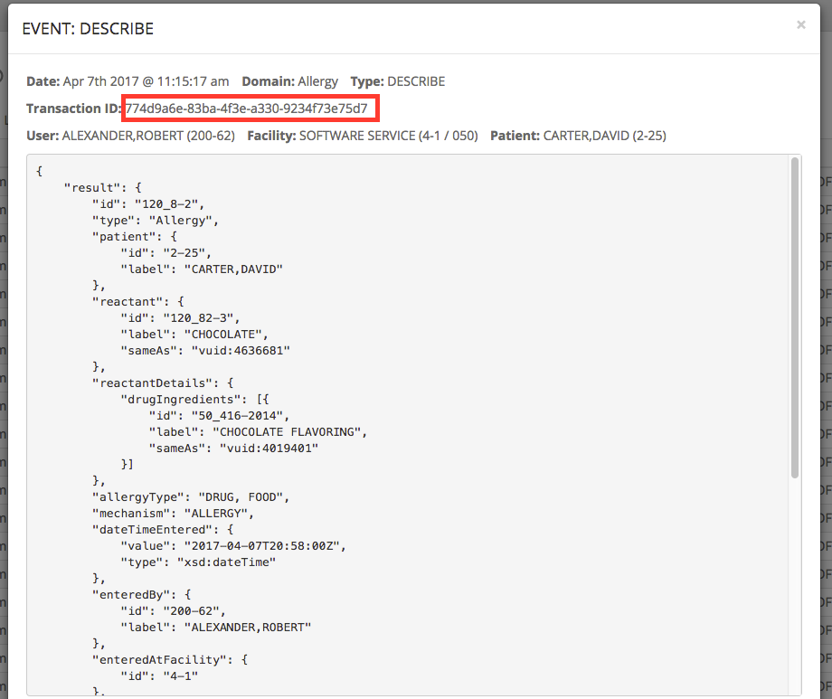

The MVDM _DESCRIBE_ has well-structured, machine processable JSON and notice how User ("who described"), Facility ("where described") and the Patient ("for which Patient") are clearly distinguished. This level of nuance allows MVDM to offer a whole new level of auditing and access control for VISTA.

### Remove an Allergy and the Document it creates

CPRS let's a provider remove an allergy by declaring that it was _entered in error_. To do this, we press _Entered In Error_ in the Details window shown above. Up pops a dialog that let's a provider make a comment ...

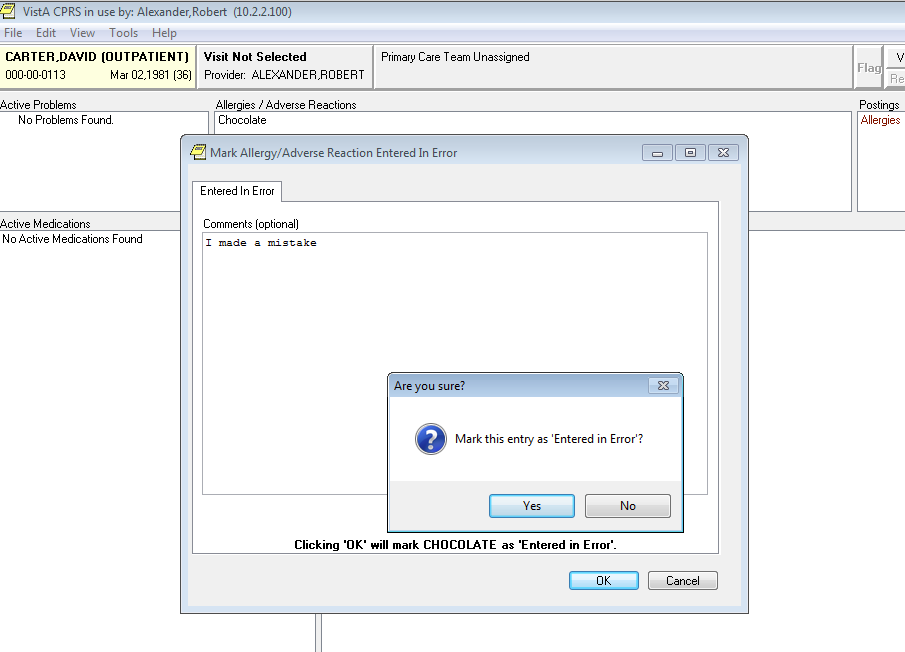

which leads MVDM to remove the allergy ...

and in CPRS Chart, the Patient once again has no allergies ...

But something else happened - a document is created that describes the error. Go to the notes tab and you'll see it ...

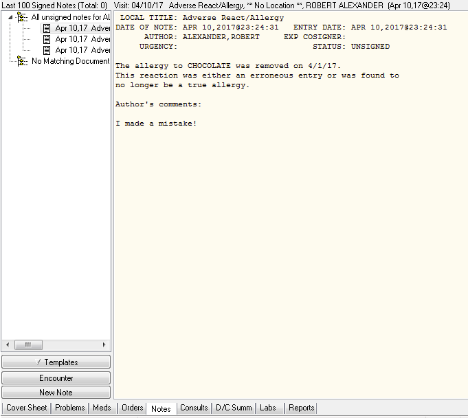

and as expected, MVDM will note the creation with an event ...

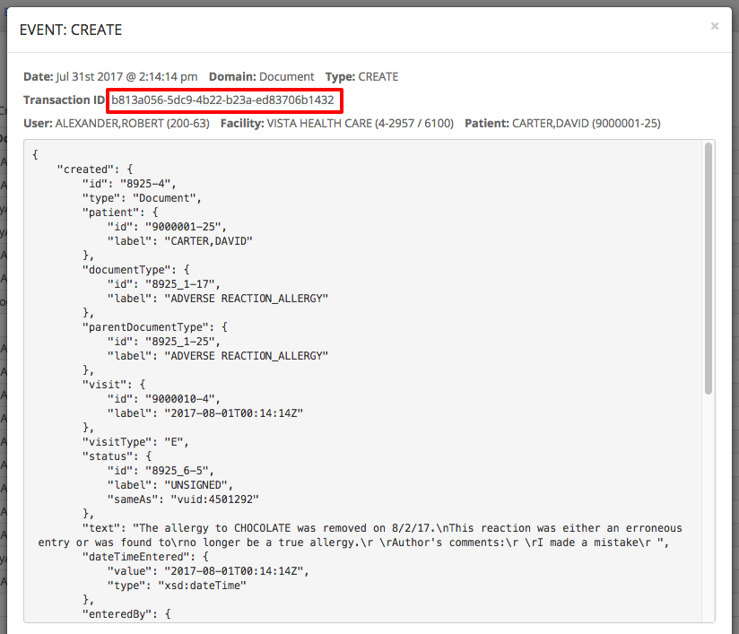

As the MDVM events show, the nodeVISTA manager implements the series of behaviors called for in CPRS - yes, an allergy is removed but also a specific type of document is created. In object terms, the Allergy object is removed and a Document object is created.

### No Known Allergies is not the same as No Allergies

An empty allergy list is ambiguous - does it mean a patient has no allergies or simply that her allergies have not been recorded. In CPRS and in the MVDM Allergy Model, you can explicitly note that a Patient has _no reaction_. Again right-click in the CPRS Chart's Allergy widget ...

but this time, select _No Known Allergies (NKA)_. When you do CPRS sends a **ORWDAL32 SAVE ALLERGY** RPC to VISTA ...

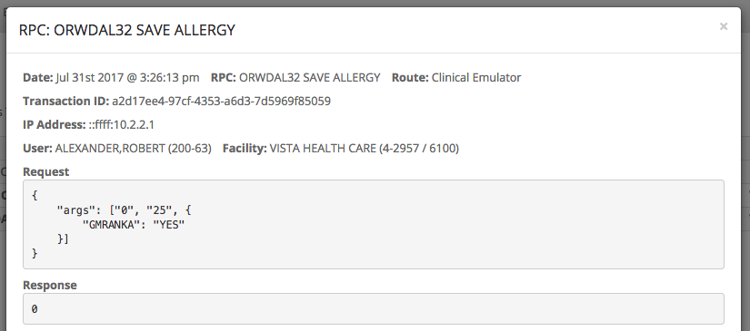

and yes you're right - that's the same RPC shown above creating a specific allergy, only this time it carries different arguments. The RPC interface works in mysterious ways. But MVDM clears up any mystery - this time an AllergyAssessment is created and it notes that the patient has "No Known Allergies" ...

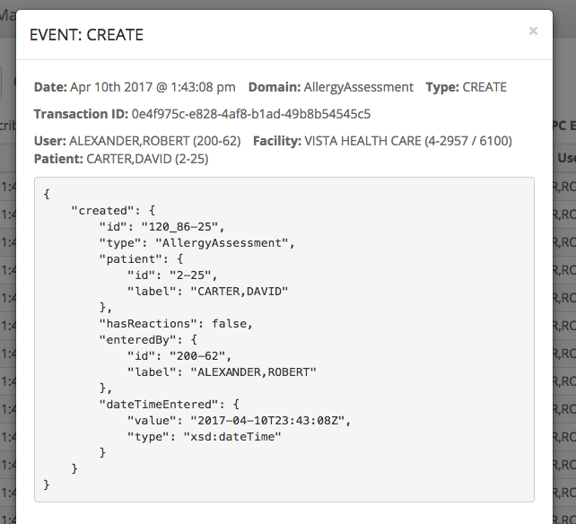

## Emulation Statistics

Upon successful completion of the Allergies demo trail, the nodeVISTA system will have processed close to 189 individual RPCs from CPRS, using a combination of RPC emulations and pass-through native RPC implementations.The table below contains a breakdown of nodeVISTA's RPC emulation capabilities as a series of percentages against native and overall RPC processing as of v1.3 (8/2/2017):

All RPCs | Unique RPCs
--- | ---
**Total RPCs:** **189**  `Total RPCs By Category`{:.title} &nbsp;&nbsp;**Server**: **1** _(0.53%)_ &nbsp;&nbsp;**Native**: **56** _(29.63%)_ &nbsp;&nbsp;**Emulated**: **132** _(69.84%)_  `Total RPCs By Sub-Category`{:.title} &nbsp;&nbsp;**UNKNOWN:** **2** &nbsp;&nbsp;&nbsp;&nbsp;**Server**: **1** _(50.00%)_ &nbsp;&nbsp;&nbsp;&nbsp;**Native**: **1** _(50.00%)_  &nbsp;&nbsp;**AUTHENTICATION:** **9** &nbsp;&nbsp;&nbsp;&nbsp;**Native**: **8** _(88.89%)_ &nbsp;&nbsp;&nbsp;&nbsp;**Emulated**: **1** _(11.11%)_  &nbsp;&nbsp;**NON CLINICAL:** **108** &nbsp;&nbsp;&nbsp;&nbsp;**Emulated**: **101** _(93.52%)_ &nbsp;&nbsp;&nbsp;&nbsp;**Native**: **7** _(6.48%)_  &nbsp;&nbsp;**OUT OF SCOPE:** **5** &nbsp;&nbsp;&nbsp;&nbsp;**Emulated**: **5** _(100.00%)_  &nbsp;&nbsp;**CLINICAL:** **65** &nbsp;&nbsp;&nbsp;&nbsp;**Native**: **40** _(61.54%)_ &nbsp;&nbsp;&nbsp;&nbsp;**Emulated**: **25** _(38.46%)_  | **Total Unique RPCs:** **101**  `Total Unique RPCs By Category`{:.title} &nbsp;&nbsp;**Server**: **1** _(0.99%)_ &nbsp;&nbsp;**Native**: **36** _(35.64%)_ &nbsp;&nbsp;**Emulated**: **64** _(63.37%)_  `Total Unique RPCs By Sub-Category`{:.title} &nbsp;&nbsp;**UNKNOWN:** **2** &nbsp;&nbsp;&nbsp;&nbsp;**Server**: **1** _(50.00%)_ &nbsp;&nbsp;&nbsp;&nbsp;**Native**: **1** _(50.00%)_  &nbsp;&nbsp;**AUTHENTICATION:** **5** &nbsp;&nbsp;&nbsp;&nbsp;**Native**: **4** _(80.00%)_ &nbsp;&nbsp;&nbsp;&nbsp;**Emulated**: **1** _(20.00%)_  &nbsp;&nbsp;**NON CLINICAL:** **50** &nbsp;&nbsp;&nbsp;&nbsp;**Emulated**: **44** _(88.00%)_ &nbsp;&nbsp;&nbsp;&nbsp;**Native**: **6** _(12.00%)_  &nbsp;&nbsp;**OUT OF SCOPE:** **5** &nbsp;&nbsp;&nbsp;&nbsp;**Emulated**: **5** _(100.00%)_  &nbsp;&nbsp;**CLINICAL:** **39** &nbsp;&nbsp;&nbsp;&nbsp;**Native**: **25** _(64.10%)_ &nbsp;&nbsp;&nbsp;&nbsp;**Emulated**: **14** _(35.90%)_ 
