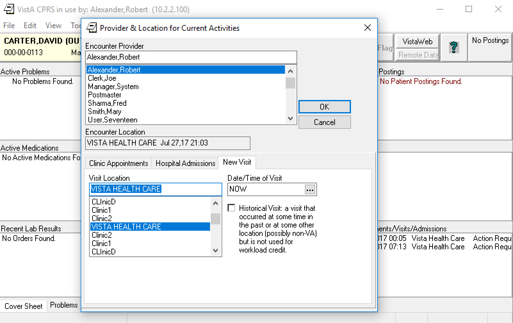
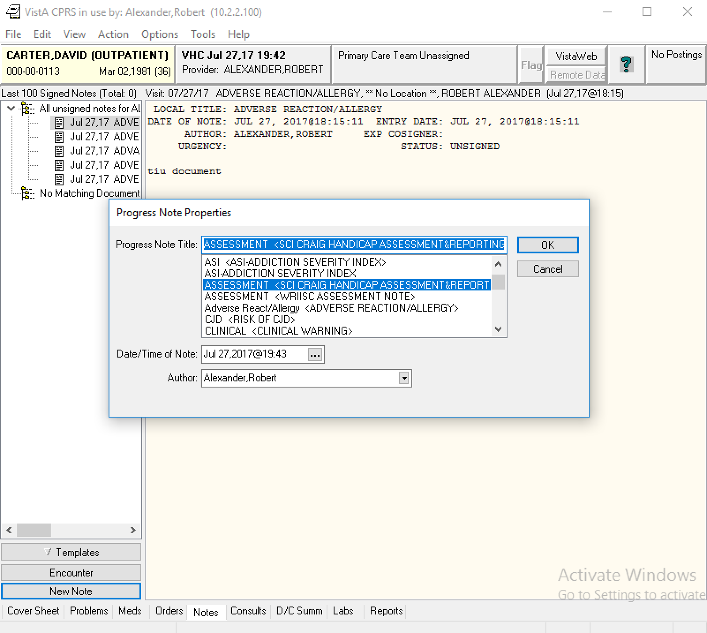
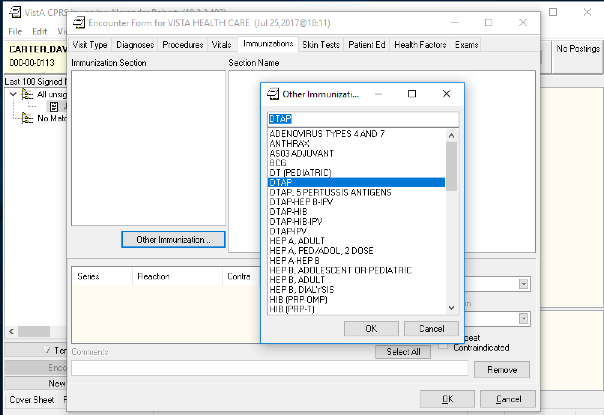
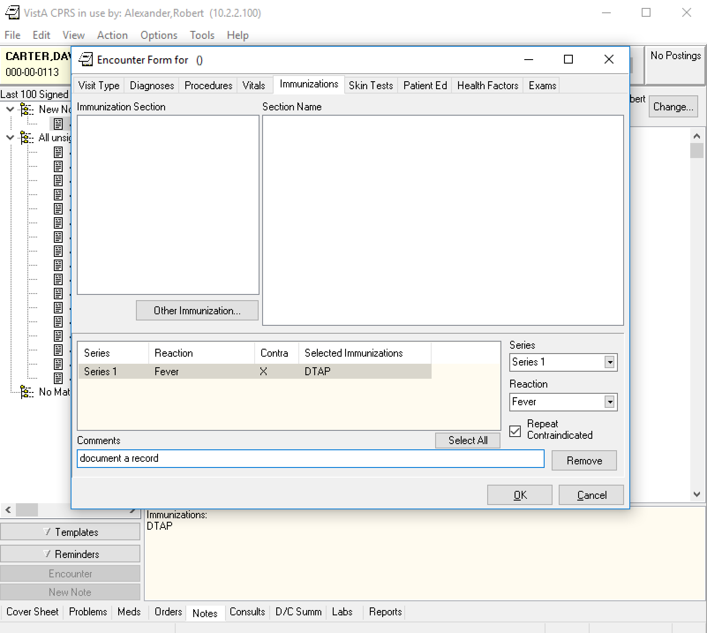
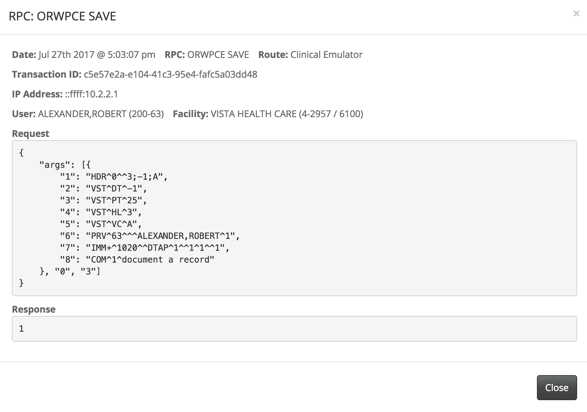
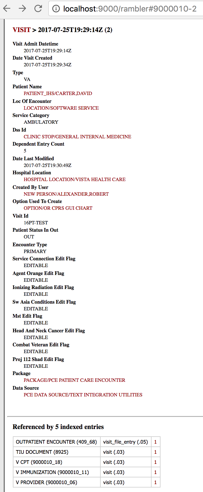
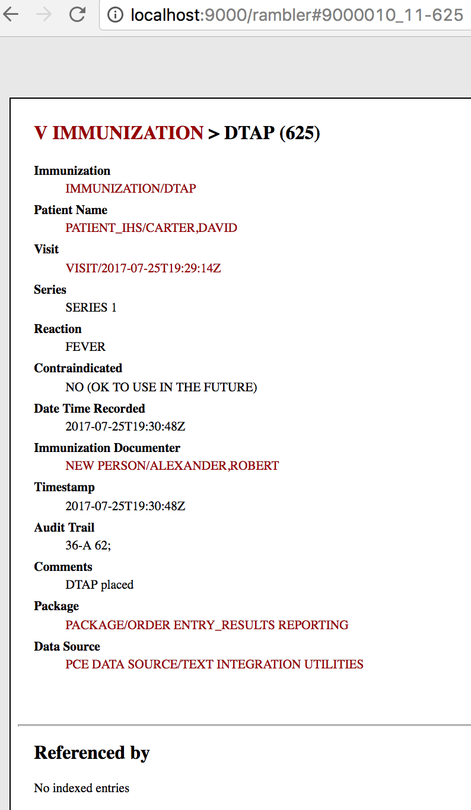
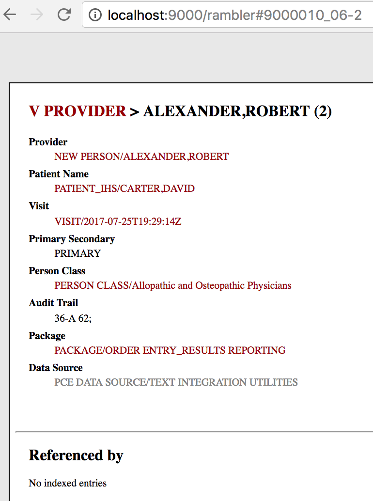
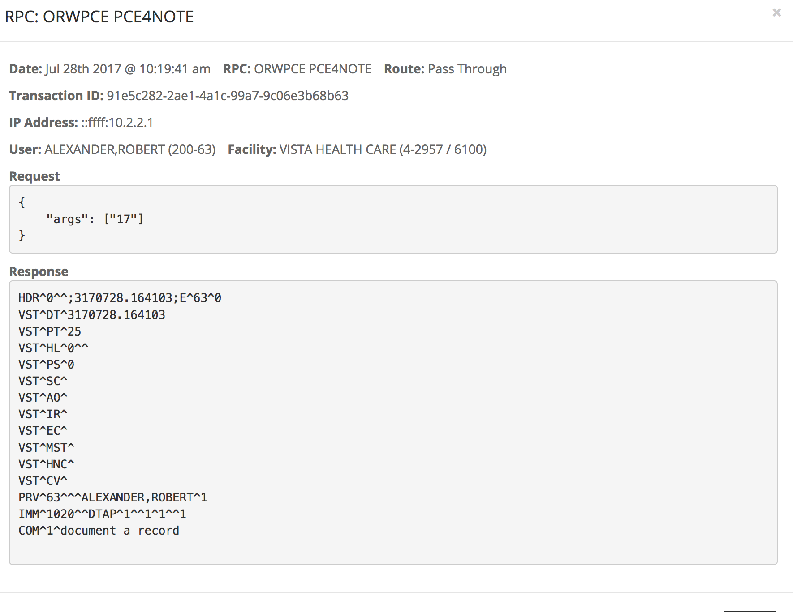

Before running the following, follow the [MVDM Demo Introduction](http://vistadataproject.info/demo/) on how to setup the nodeVISTA management client and CPRS. 

The following shows creation, and reading of patient encounter immunization using CPRS, VISTA's client, running over a nodeVISTA manager. CPRS may think it's running over a 20 year old RPC interface but it's actually invoking RPCs through an _RPC Emulator_ that runs over _nodeVISTA_. The _nodeVISTA Manager_ shows not only what CPRS sends and receives but also the underlying MVDM activity.

Running the following demonstrates that re-housing the old RPC interface over a modern, CRUD-based object model provides a new level of auditing and access control for VISTA and lays bare the behavior of the system.

## Create a Visit

Immunization is a subtab under Patient Care Encounter (PCE) progress note. An PCE note is associated with a visit. Therefore, a visit must be created before editing a note. Select an Encounter Provider (Alexander, Robert) and Visit Location (VISTA HEALTH CARE). Date/Time of Visit is default to NOW. 

## Create a Progress Note

Once a new visit is set, click New Note at the bottom left cornor and select a title for the progress note.

## Create a Immunization

Once a new progress note is created, click Encounter above the New Note and then select the "Immunization" tab. Enter "add" in the search box and select a procedure.   

Select appropriate Series, Reaction and Contraindicted, if any, and enter optional comments. Click OK and an alert asking if you are the Primary Provider for this Encounter. Click Yes to save this procedure.

The RPC Emulator implements the RPC call with an ORWPCE SAVE operation. After creating and updating appropriate information in VISTA, the nodeVISTA manager will dispatch this create event.

Switch to the MVDM Events in the nodeVISTA management client. There is a CREATE event for VImmunization with the same tranction ID as the previous ORWPCE SAVE RPC call in the emulation. 

This new procedure is now in CPRS with its associated outpatient encounter, visit,tiu Document and provider records.

Note the procedure has the same visit time as provider and tiu document.

Note the provider has the same visit time as skin test and tiu document.

## Read the Immunization
The RPC emulator implements the RPC call with an ORWPCE PCE4NOTE operation as well. 

