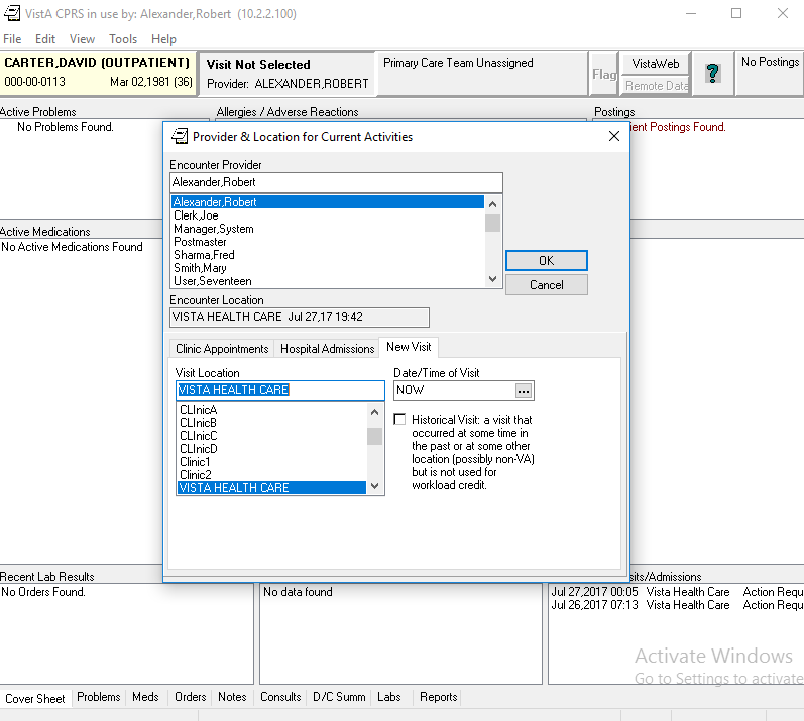
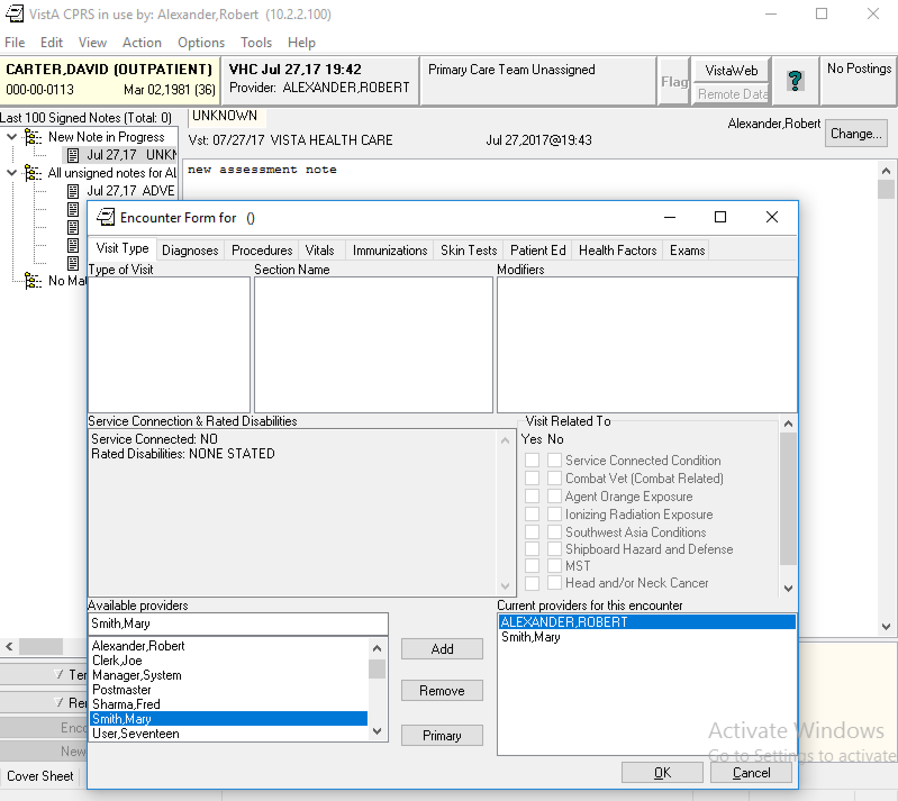
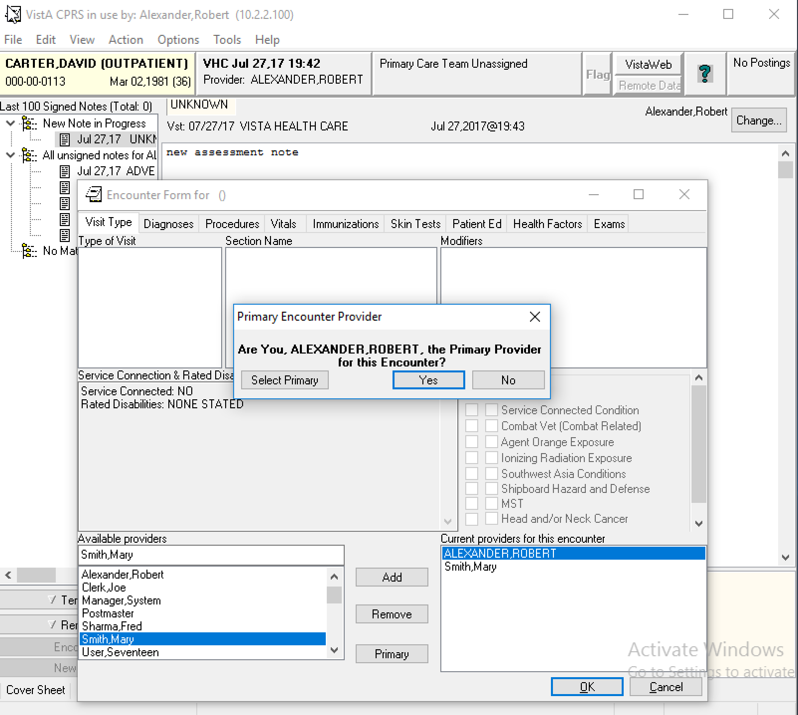
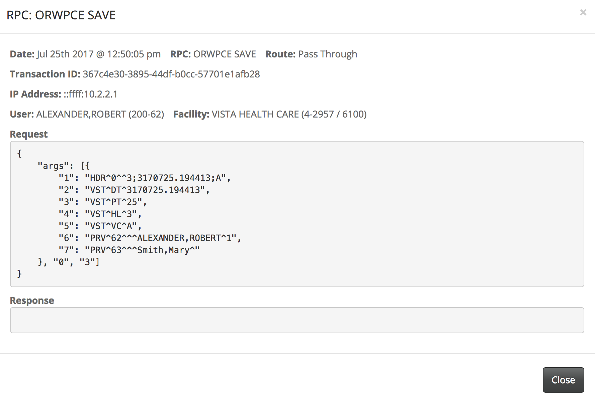
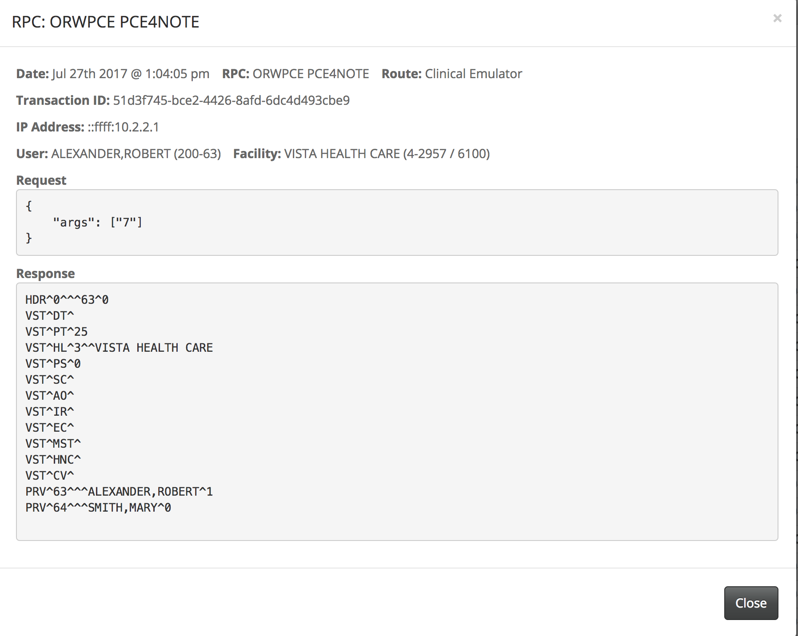
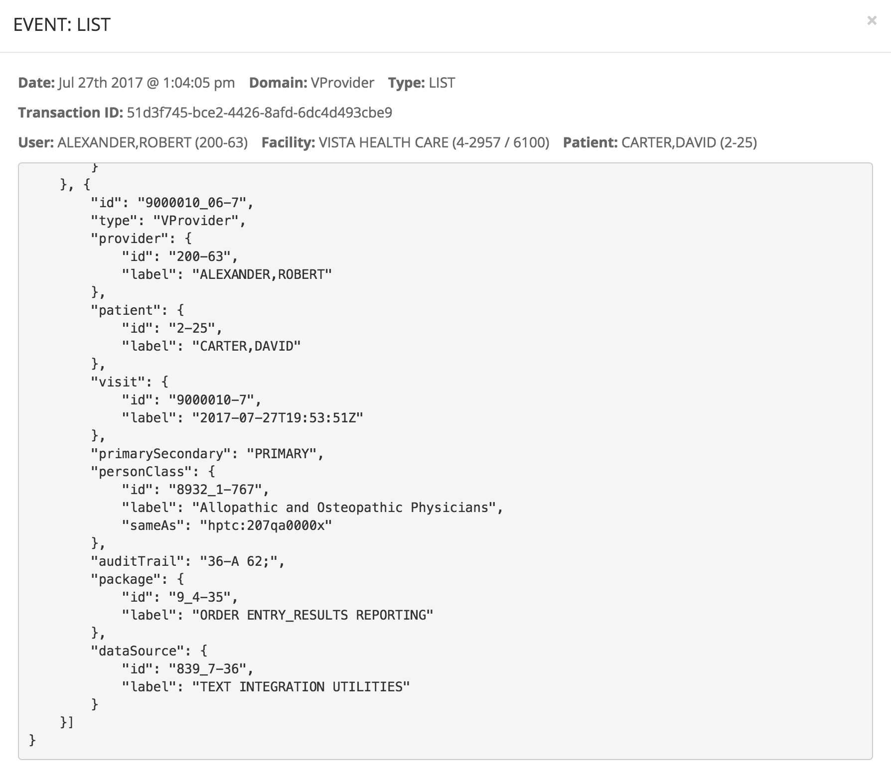
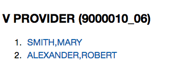
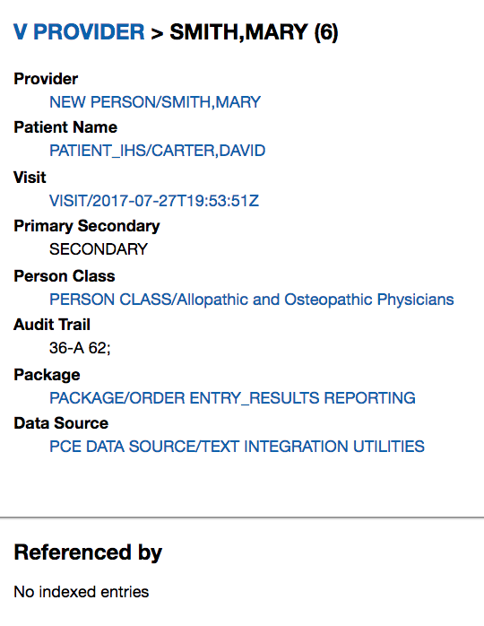
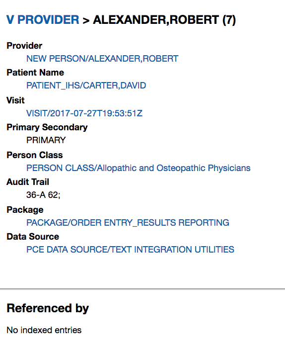

Before running the following, follow the [MVDM Demo Introduction](http://vistadataproject.info/demo/) on how to setup the nodeVISTA management client and CPRS. 

The following shows creation, and reading of patient encounter skin test using CPRS, VISTA's client, running over a nodeVISTA manager. CPRS may think it's running over a 20 year old RPC interface but it's actually invoking RPCs through an _RPC Emulator_ that runs over _nodeVISTA_. The _nodeVISTA Manager_ shows not only what CPRS sends and receives but also the underlying MVDM activity.

Running the following demonstrates that re-housing the old RPC interface over a modern, CRUD-based object model provides a new level of auditing and access control for VISTA and lays bare the behavior of the system.

## Create a Visit

A visit must be created before editing a note. Select an Encounter Provider (Alexander, Robert) and Visit Location (VISTA HEALTH CARE). Date/Time of Visit is default to NOW. 

## Create a Progress Note

Once a new visit is set, click New Note at the bottom left cornor and select a title for the progress note.

## Assign a Secondary Provider

Once a new progress note is created, click Encounter above the New Note. Add a secondary provider and click Ok. 

CPRS asks for the primary provider. (Alternatively, you may assign it by clicking the Primary button in the previous screenshot) 

The RPC Emulator implements the RPC call with an MVDM ORWPCE SAVE operation. After creating and updating appropriate information in VISTA, the nodeVISTA manager will dispatch this create event. 

## Read the Provider 
Make sure you are selecting the new note you just created and click Encounter again. The RPC Emulator implements the RPC call with an MVDM ORWPCE PCE4NOTE operation.  

Switch to the MVDM Events in the nodeVISTA management client. There is a LIST event for V Provider and the provider assignment is now emulated in the listing (toward the end).

Through nodeVISTA'S Rambler, this new provider entries are now in CPRS with their associated visit and tiu Document records. Please note both provider entries point to the same visit.

