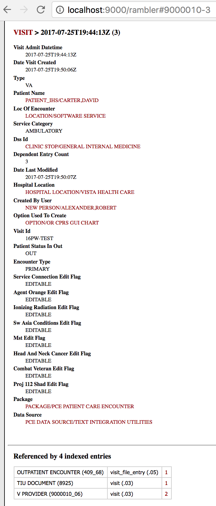
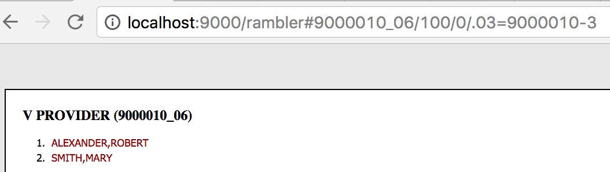

Before running the following, follow the [MVDM Demo Introduction](http://vistadataproject.info/demo/) on how to setup the nodeVISTA management client and CPRS. 

The following shows creation, and reading of patient encounter skin test using CPRS, VISTA's client, running over a nodeVISTA manager. CPRS may think it's running over a 20 year old RPC interface but it's actually invoking RPCs through an _RPC Emulator_ that runs over _nodeVISTA_. The _nodeVISTA Manager_ shows not only what CPRS sends and receives but also the underlying MVDM activity.

Running the following demonstrates that re-housing the old RPC interface over a modern, CRUD-based object model provides a new level of auditing and access control for VISTA and lays bare the behavior of the system.

## Create a Visit

A visit must be created before editing a note. Select an Encounter Provider (Alexander, Robert) and Visit Location (VISTA HEALTH CARE). Date/Time of Visit is default to NOW. 

## Create a Progress Note

Once a new visit is set, click New Note at the bottom left cornor and select a title for the progress note.

Now switching over to the RPC Events Tab of the nodeVISTA Management Client, notice the TIU CREATE RECORD RPC call. This call may be emulated but we will focus on emulating skin test below in this demo. 

## Assign a Secondary Provider

Once a new progress note is created, click Encounter above the New Note. Add a secondary provider and assign the primary one by clicking the Primary button while selecting the provider. 

The RPC Emulator implements the RPC call with an MVDM ORWPCE SAVE operation. After creating and updating appropriate information in VISTA, the nodeVISTA manager will dispatch this create event.

This new procedure is now in CPRS with its associated outpatient encounter, visit,tiu Document and provider records.

Note both providers have the same visit time as tiu document.

