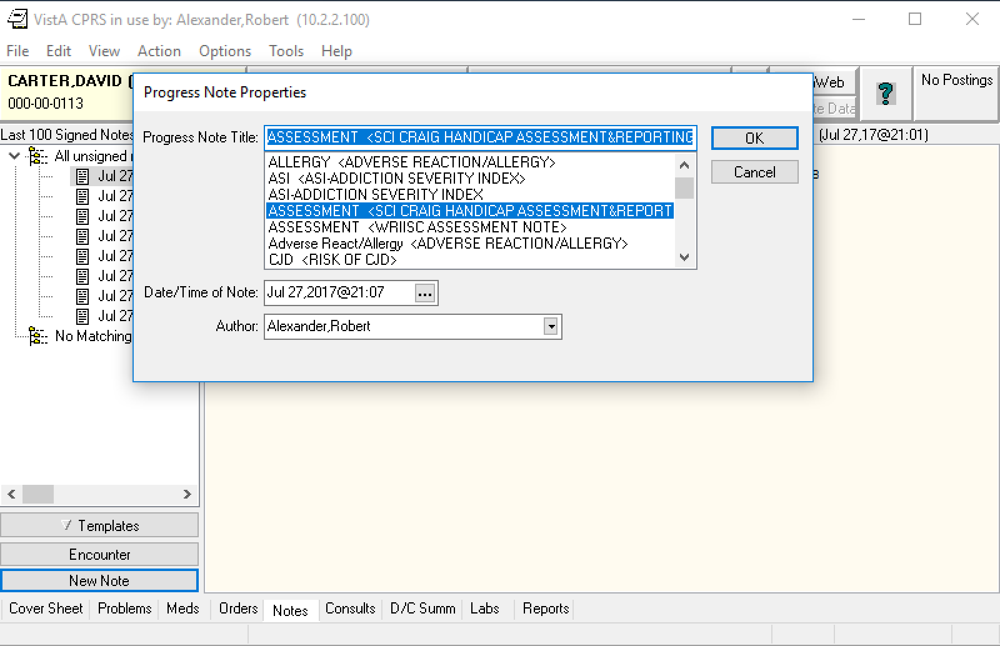
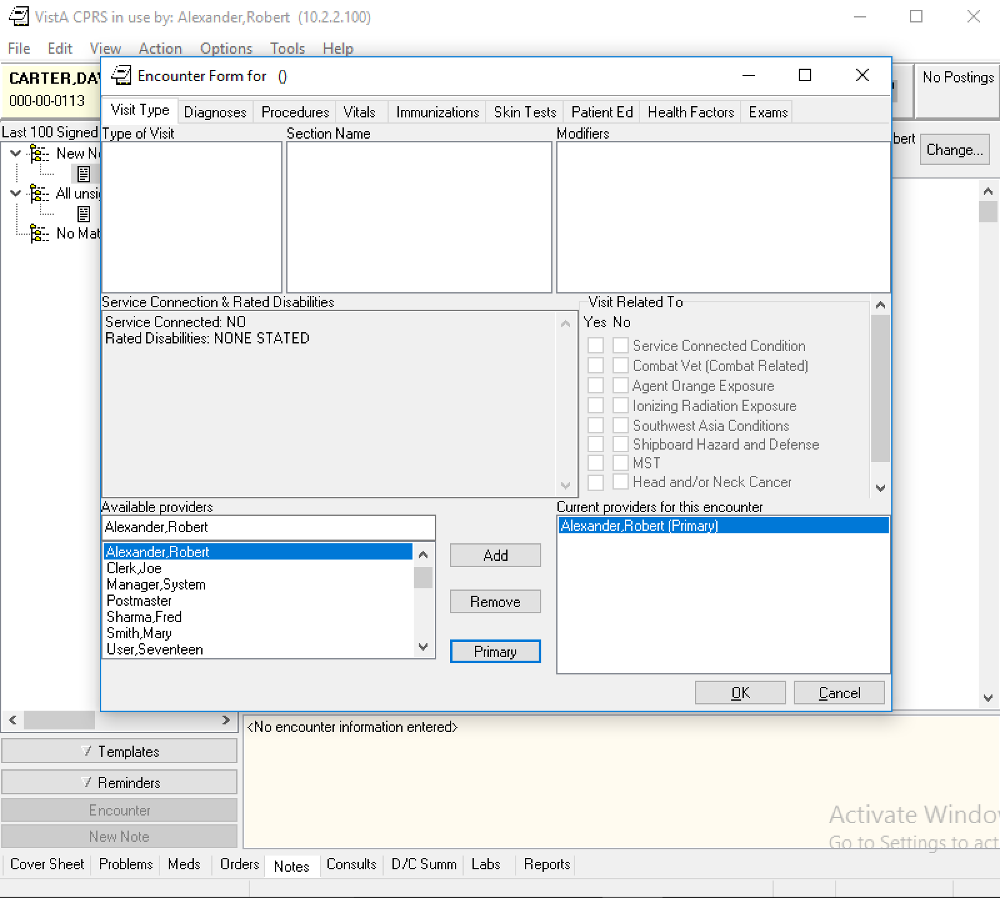
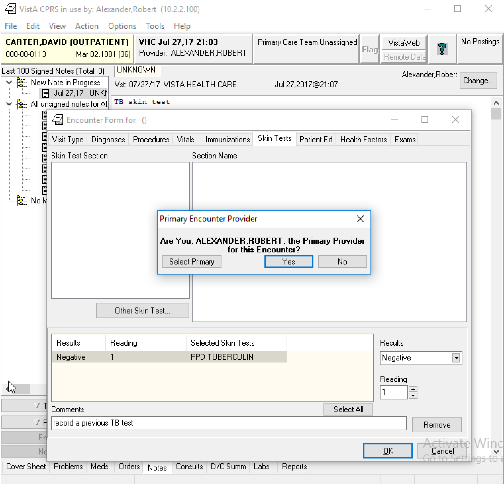
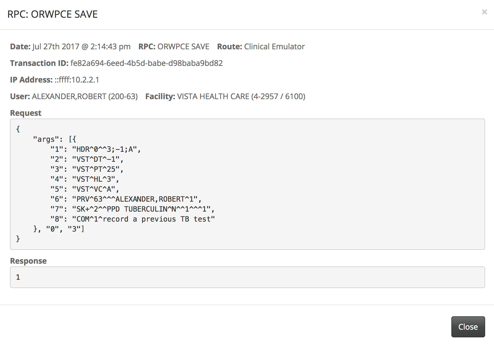
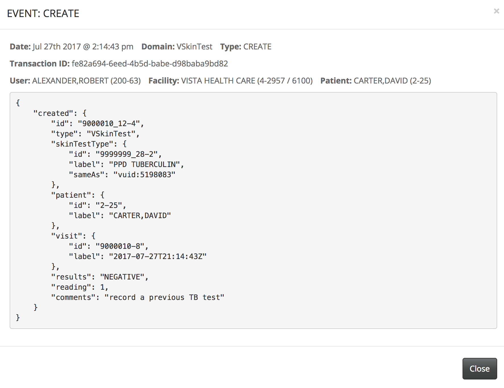
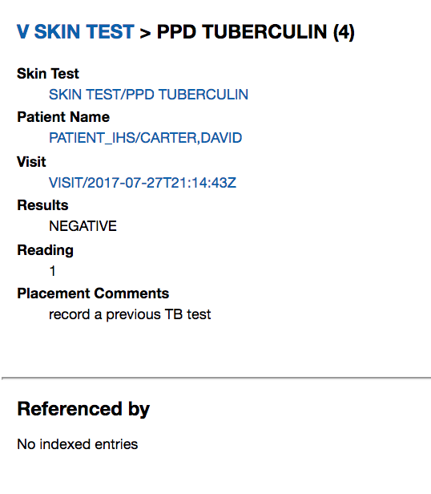
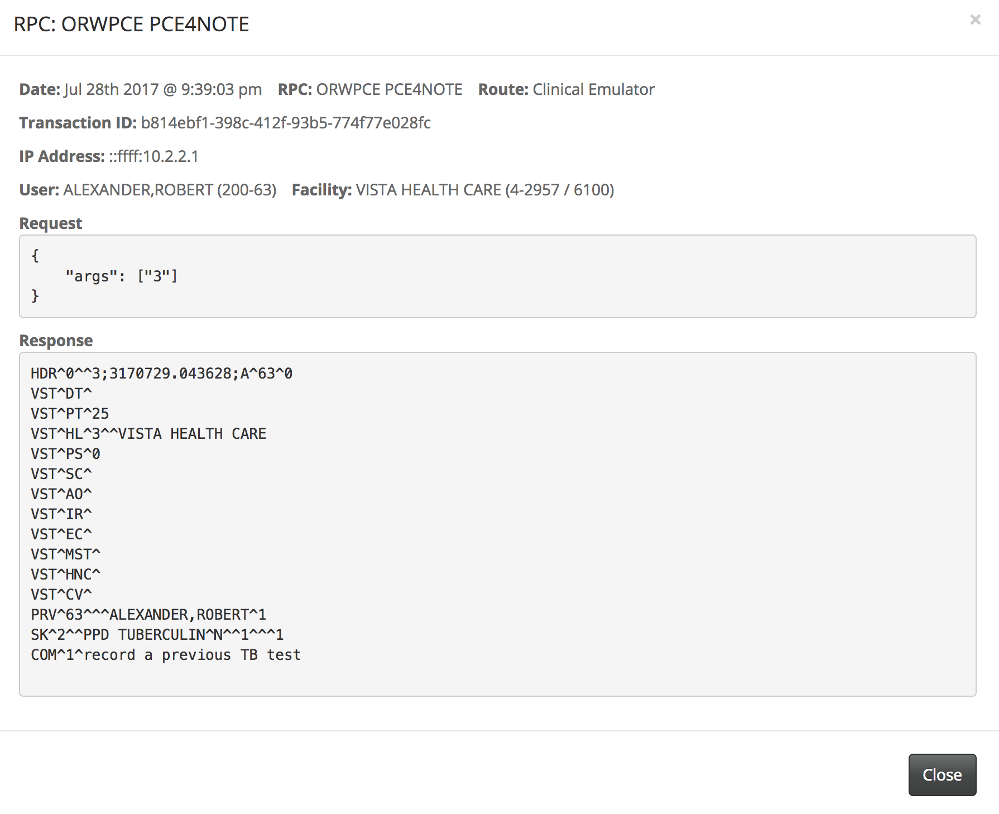

Before running the following, follow the [nodeVISTA Demo Introduction](http://vistadataproject.info/demo/) on how to setup the nodeVISTA management client and CPRS.

The following shows creation, and reading of patient encounter skin test using CPRS, VISTA's client, running over a nodeVISTA manager. CPRS may think it's running over a 20 year old RPC interface but it's actually invoking RPCs through an _RPC Emulator_ that runs over _nodeVISTA_. The _nodeVISTA Manager_ shows not only what CPRS sends and receives but also the underlying MVDM activity.

Running the following demonstrates that re-housing the old RPC interface over a modern, CRUD-based object model provides a new level of auditing and access control for VISTA and lays bare the behavior of the system.

## Create a Visit

Skin Test is a sub-tab under the Patient Care Encounter (PCE) progress note. An PCE note is associated with a visit. Therefore, a visit must be created before editing a note. Select an Encounter Provider (Alexander, Robert) and Visit Location (VISTA HEALTH CARE). Verify that the Date/Time of Visit is default to NOW.

## Create a Progress Note

Once a new visit is set, click New Note at the bottom left corner and select a title for the progress note.

## Create a Skin Test

Once a new progress note is created, textual notes may be entered in the blank area (e.g. "TB skin test" in the screenshot's background). Then click Encounter above the New Note. Select a primary provider by Add the name first to Current Providers to this encounter and click the Primary button.

Now click the Skin Tests tab and click the Other Skin Test button. A list of skin test options are displayed.  

Select PPD TUBERCULIN, enter Results, Reading and put comments to note this operation. Click OK and an alert asking if you are the Primary Provider for this Encounter if you haven't set the primary provider yet. Click Yes to store this skin test.

While the New Note in Progress is selected, click Options > Save without Signature to ensure this note is saved.

The RPC Emulator implements the RPC call with an MVDM ORWPCE SAVE operation. After creating and updating appropriate information in VISTA, the nodeVISTA manager will dispatch this create event.

Switch to the MVDM Events of the nodeVISTA management client. Note that there is a new VSkinTest with the same transaction ID as the previous SAVE operation in the emulation.

Using the nodeVISTA'S rambler, this new skin test is now in CPRS with its associated outpatient encounter, visit, Text Integration Utilities (TIU) Document and provider records.

Note the skin test has the same visit time as provider and TIU document.

## Read the Skin Test
The RPC emulator implements the RPC call with an ORWPCE PCE4NOTE operation as well. Once a progress note is saved, if you logout CPRS and re-login to select the saved note (or select a different patient and select back to the same patient), you will be able to see the ORWPCE PCE4NOTE RPC call via the management client's RPC Events.

## Update Skin Test

This feature is not implemented yet so any update will create a new record.
