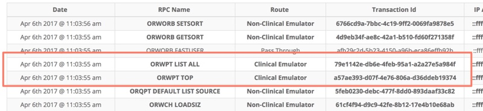
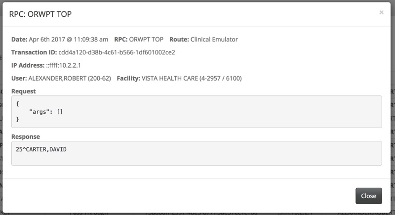
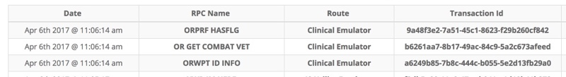
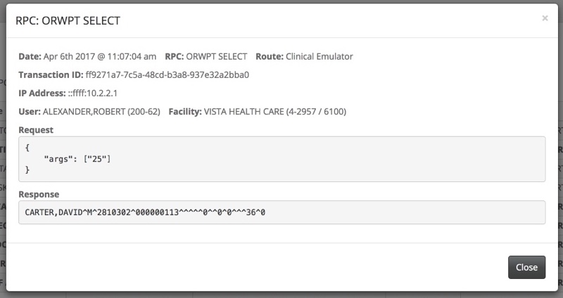

# Patient Selection

See the [nodeVISTA Demo Introduction](http://vistadataproject.info/demo/) posting to setup the nodeVISTA management client and CPRS.

## Emulation Statistics

The following shows the processing breakdown of RPCs generated by CPRS by running the demo trail described below as of v1.3. The table shows both the total RPC counts, unique RPC counts and the percentage of RPCs handled by the nodeVISTA emulators.

All RPCs | Unique RPCs
--- | ---
**Total RPCs:** **117**<br/><br/>**Total RPCs By Category**<br/>&nbsp;&nbsp;**Server**: **1** _(0.85%)_<br/>&nbsp;&nbsp;**Native**: **28** _(23.93%)_<br/>&nbsp;&nbsp;**Emulated**: **88** _(75.21%)_<br/> | **Total Unique RPCs:** **73**<br/><br/>**Total Unique RPCs By Category**<br/>&nbsp;&nbsp;**Server**: **1** _(1.37%)_<br/>&nbsp;&nbsp;**Native**: **23** _(31.51%)_<br/>&nbsp;&nbsp;**Emulated**: **49** _(67.12%)_<br/>

## Demo Procedures

This section will highlight the patient related clinical RPCs that are emulated by nodeVISTA.

* Open the nodeVISTA manager and select RPC Events.

* Then log into CPRS as ALEXANDER,ROBERT
```
   Access Code: fakedoc1
   Verify Code: 1doc!@#$
   (You are assigned the fictional user account: ALEXANDER,ROBERT)
```

* Once you log into CPRS, the patient search screen will appear.

    Take a look at the two patient RPC clinical events in the nodeVISTA Manager that have fired.

    

    The first patient RPC to fire is ORWPT TOP. This RPC determines if there was a patient that the user previously had searched for.
    The second RPC, ORWPT LIST ALL performs the patient search.

    If this is your first time running CPRS, ORWPT TOP will not return any patient data.

    

    Otherwise you'll see the previously selected patient.

    

    The ORWPT LIST ALL return data includes the listed patients.

    

    Those two patient RPC calls invoked two MVDM Events. From the nodeVISTA Manager, select MVDM events and observe the two events that were fired.

    

* Back at CPRS, search for or clikc on CARTER,DAVID but don't select him. Click back to RPC Events in the nodeVISTA Manager.

    Observe the three additional RPCs that were invoked by CPRS.

     

     The ORPRF HASFLG RPC call will determine whether this patient has any special warning flags and will show them before the user selects the patient.

     The OR GET COMBAT VET call returns if a veteran is char marked as a combat veteran.

     

* In CPRS, go ahead and select CARTER,DAVID and go into the patient chart. Several more patient related RPCs will be invoked.

     

     The ORWPT SELECT call selects a patient, by setting a special VistA global but also returns some basic demographic data.

     


