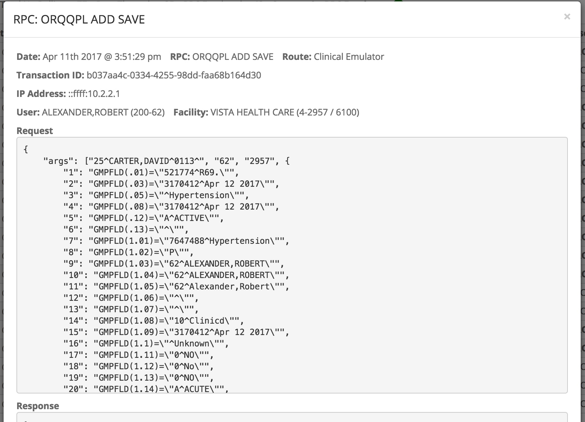
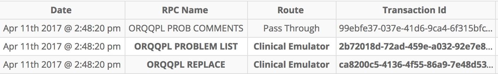
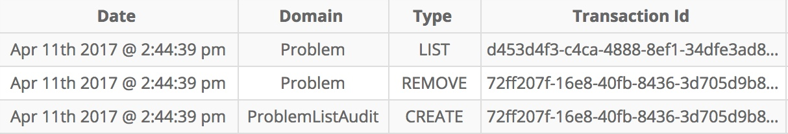
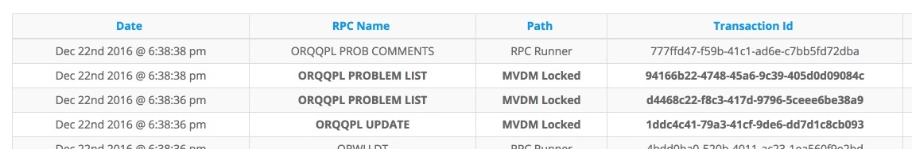

# Problems

See the [nodeVISTA Demo Introduction](http://vistadataproject.info/demo/) posting to setup the nodeVISTA management client and CPRS.

A discussion on nodeVISTA emulation statistics can be found below in the [Emulation Statistics](#emulation-statistics) section below.

## Demo Procedures

### Create a Problem

* From the nodeVISTA CPRS patient chart, select the 'Problems' tab at the bottom of the window and click 'New Problem'

* You will then be prompted with the visit context dialog. Choose Alexander,Robert as the provider and clinicD as the location and click ok.

* In the problem search dialog, search for "hypertension" and select OK.

* In the problem create dialog, add a comment and set the immediacy value to acute, then click ok.

* In the nodeVista client under the RPC Events tab, notice the **ORQQPL ADD SAVE** RPC nodeVISTA emulated line item.

* If you click on the **ORQQPL ADD SAVE** line item, observe the modal which includes the RPC request parameters and RPC Server response value.

* Next, still at the nodeVISTA client, navigate to the MVDM Events tab. Notice the nodeVISTA create event line item for problems. This event was generated when nodeVISTA created the hypertension problem.

Also, take a look at the create event's transaction ID. That transaction ID matches the same transaction ID for the RPC Event **ORQQPL ADD SAVE** line item: **b037aa4c-0334-4255-98dd-faa68b164d30** (yours will be different).

* Then click on the MVDM create event line item and bring up the details modal. Observe the nodeVISTA create response. This is the hypertension MVDM problem instance as JSON.

### Edit a Problem

* From the problem dialog, right click on the problem you wish to edit. This will bring up the problem context menu. Click on 'Change...'

* The problem edit dialog will come up. Change the onset date and add an additional comment.

* Look at the nodeVISTA Client RPC Events tab. Notice the **ORQQPL EDIT SAVE** line item. It has a transaction ID of **7cfcc8a5-3844-4d71-b4d4-a89e46b1cb58** (yours will be different).

* Then look at the nodeVISTA client MVDM Events menu tab. See that there are three MVDM events with same transaction ID **7cfcc8a5-3844-4d71-b4d4-a89e46b1cb58**.

  These three MVDM events were all part of the same nodeVISTA problem update transaction that just took place: Problem UPDATE, Audit CREATE, and Problem DESCRIBE.

  Click on the problem update and audit create MVDM event line items.

   

   * The MVDM update event which provides details on the actual problem update made to nodeVistA.

   

   * The create event is associated with a problem audit entry that was created after the problem was updated in nodeVistA.

   

### Remove a problem

* From the problem dialog, right click on the problem you wish to edit.

  This will bring up the problem context menu. Click on 'Remove...'.

  From the remove dialog, and click on 'Remove'.

* Back at the nodeVISTA client, under the RPC Events tab, notice the **QRQQPL DELETE** line item.

* Under the MVDM Events tab, see the two corresponding MVDM events: REMOVE & CREATE. Like problem edit, the create event is associated with the creation of a problem audit entry.

### Restore a problem

* From the problem dialog screen, select "Removed" on the left-hand side of the screen. You will then see the Hypertension problem that was previously removed listed. Right click on the problem and bring up the context menu. Select "Restore".

* At the nodeVISTA client, under the RPC Events tab, see the **QRQQPL REPLACE** line item.

* Then on the MVDM Events tab, see the two corresponding MVDM Events: UNREMOVED & CREATE. Again the create event is associated with the creation of a problem audit entry.

### Inactivate a problem

* On problem dialog screen, select "Active" on the left-hand side of the screen. You will then see the Hypertension problem that was restored. Right click on the problem and bring up the context menu. Select "Inactivate".

* At the nodeVISTA client, under the RPC Events tab, see the **QRQQPL UPDATE** line item.

* Then on the MVDM Events tab, see the four corresponding nodeVISTA Events: 1 UPDATE & 2 CREATES & 1 DESCRIBE. The two create events are associated with the creation of a problem audit entries (change of status and resolved date).

  Double-click on the problem to trigger the **ORQQPL DETAIL** rpc and view the problem details output in the nodeVISTA client

   

## Emulation Statistics

Upon successful completion of the Problem demo trail, the nodeVISTA system will have processed close to 210 individual RPCs from CPRS, using a combination of RPC emulations and pass-through native RPC implementations.The table below contains a breakdown of nodeVISTA's RPC emulation capabilities as a series of percentages against native and overall RPC processing as of v1.3 (8/2/2017):

All RPCs | Unique RPCs
--- | ---
**Total RPCs:** **210**  `Total RPCs By Category`{:.title} &nbsp;&nbsp;**Server**: **1** _(0.48%)_ &nbsp;&nbsp;**Native**: **47** _(22.38%)_ &nbsp;&nbsp;**Emulated**: **162** _(77.14%)_  `Total RPCs By Sub-Category`{:.title} &nbsp;&nbsp;**UNKNOWN:** **2** &nbsp;&nbsp;&nbsp;&nbsp;**Server**: **1** _(50.00%)_ &nbsp;&nbsp;&nbsp;&nbsp;**Native**: **1** _(50.00%)_  &nbsp;&nbsp;**AUTHENTICATION:** **12** &nbsp;&nbsp;&nbsp;&nbsp;**Native**: **11** _(91.67%)_ &nbsp;&nbsp;&nbsp;&nbsp;**Emulated**: **1** _(8.33%)_  &nbsp;&nbsp;**NON CLINICAL:** **136** &nbsp;&nbsp;&nbsp;&nbsp;**Emulated**: **128** _(94.12%)_ &nbsp;&nbsp;&nbsp;&nbsp;**Native**: **8** _(5.88%)_  &nbsp;&nbsp;**OUT OF SCOPE:** **5** &nbsp;&nbsp;&nbsp;&nbsp;**Emulated**: **5** _(100.00%)_  &nbsp;&nbsp;**CLINICAL:** **55** &nbsp;&nbsp;&nbsp;&nbsp;**Native**: **27** _(49.09%)_ &nbsp;&nbsp;&nbsp;&nbsp;**Emulated**: **28** _(50.91%)_  | **Total Unique RPCs:** **97**  `Total Unique RPCs By Category`{:.title} &nbsp;&nbsp;**Server**: **1** _(1.03%)_ &nbsp;&nbsp;**Native**: **29** _(29.90%)_ &nbsp;&nbsp;**Emulated**: **67** _(69.07%)_  `Total Unique RPCs By Sub-Category`{:.title} &nbsp;&nbsp;**UNKNOWN:** **2** &nbsp;&nbsp;&nbsp;&nbsp;**Server**: **1** _(50.00%)_ &nbsp;&nbsp;&nbsp;&nbsp;**Native**: **1** _(50.00%)_  &nbsp;&nbsp;**AUTHENTICATION:** **5** &nbsp;&nbsp;&nbsp;&nbsp;**Native**: **4** _(80.00%)_ &nbsp;&nbsp;&nbsp;&nbsp;**Emulated**: **1** _(20.00%)_  &nbsp;&nbsp;**NON CLINICAL:** **49** &nbsp;&nbsp;&nbsp;&nbsp;**Emulated**: **44** _(89.80%)_ &nbsp;&nbsp;&nbsp;&nbsp;**Native**: **5** _(10.20%)_  &nbsp;&nbsp;**OUT OF SCOPE:** **5** &nbsp;&nbsp;&nbsp;&nbsp;**Emulated**: **5** _(100.00%)_  &nbsp;&nbsp;**CLINICAL:** **36** &nbsp;&nbsp;&nbsp;&nbsp;**Native**: **19** _(52.78%)_ &nbsp;&nbsp;&nbsp;&nbsp;**Emulated**: **17** _(47.22%)_ 
