See the [MVDM Demo](demo/index) posting to setup the MVDM management client and CPRS. 

## Create a Vital

* From the CPRS patient chart, click on visit box, you will then be prompted with the visit context dialog. Choose Alexander,Robert as the provider and clinicD as the location and click ok.

*  Then click on one of the entries in the vitals pane. This will bring up the vitals dialog. If no vital is present, click on 'No data found'.

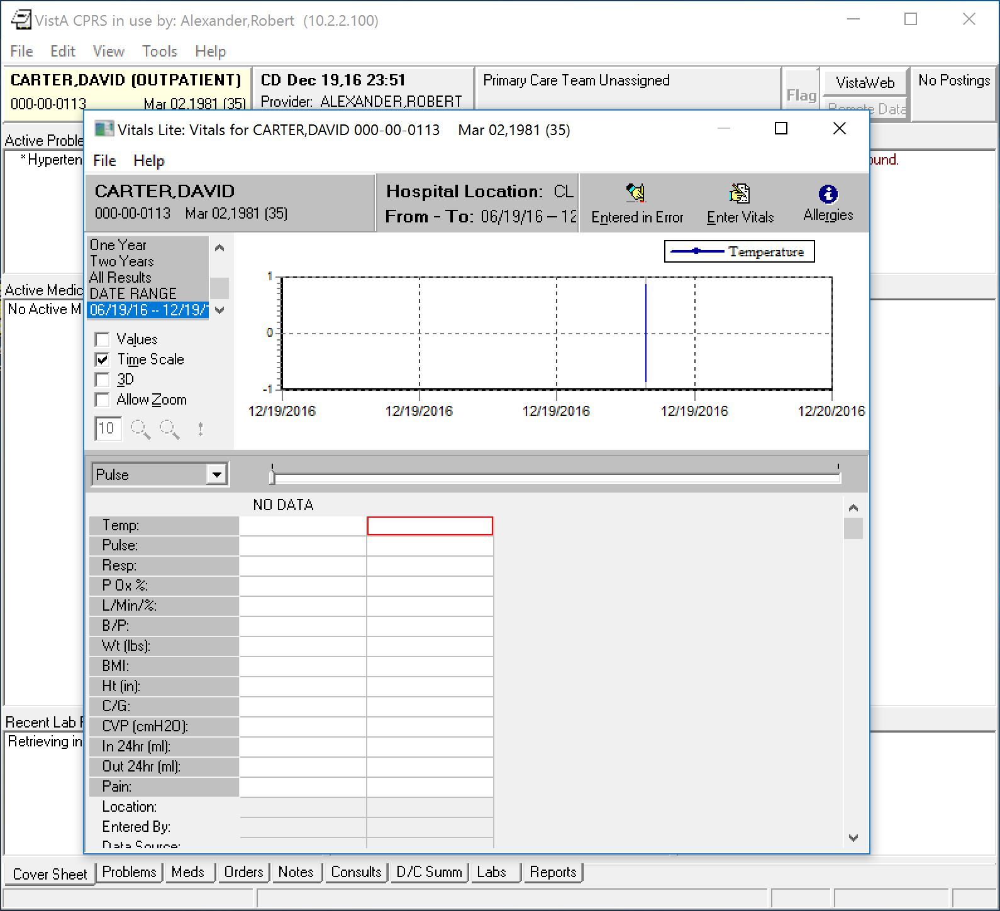

* Then click on the 'Enter Vitals' button at the top right-hand side of the dialog. This will bring up the vitals entry dialog.

 Enter values for blood pressure, temperature, and height. 

* You may also want to enter qualifiers, like cuff size and position for blood pressure.

  Click on save and exit when you are done. You may be prompted with a dialog that says the vitals data differs by 10 percent, just click ok.

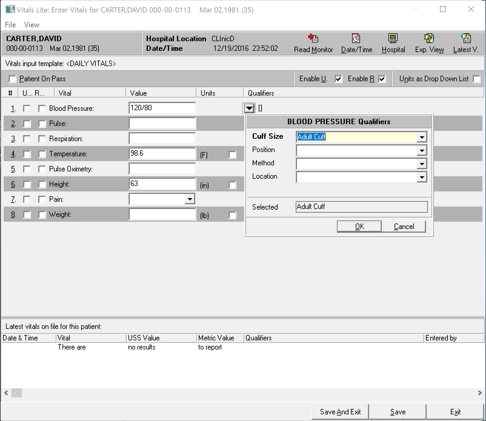

* The main vitals dialog now displays the entered data.

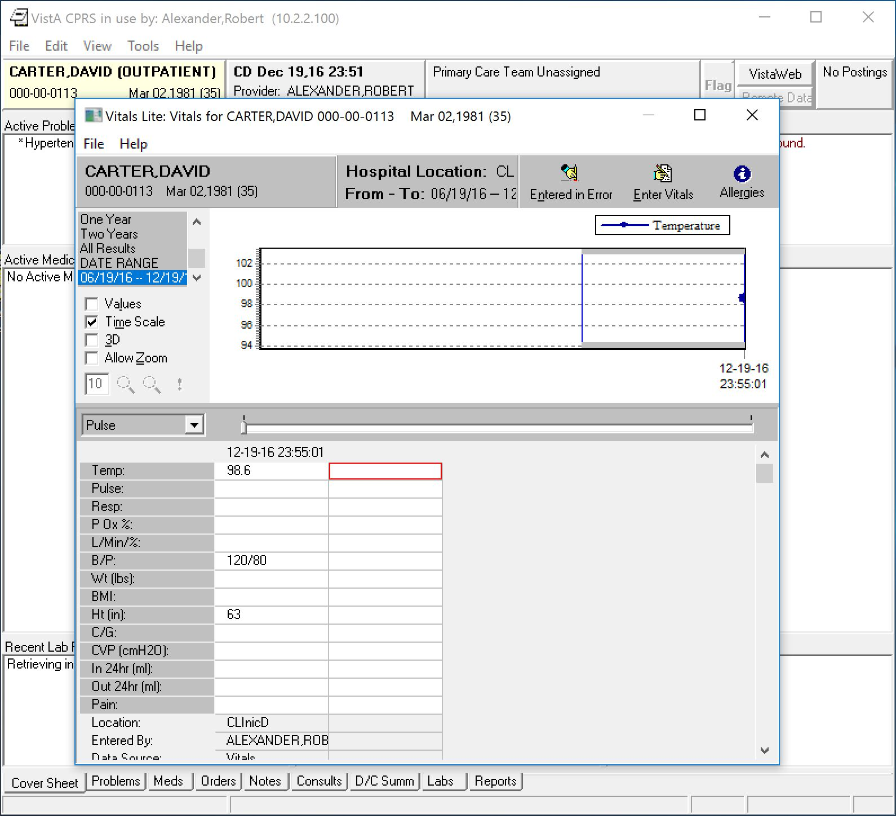

* Navigate to the MVDM client and open the RPC Events tab. Notice the three **GMV ADD VM** RPC Event line items. Each RPC calls has its own transaction ID associated with the call.

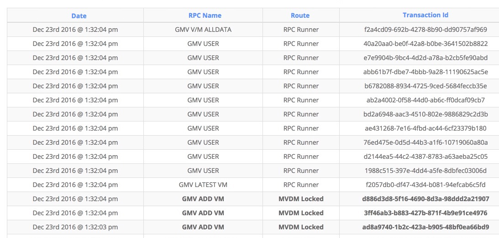

* Clicking on one of the RPC Events will bring up a details modal. Observe the RPC request parameters. The response pane is empty per the RPC spec.

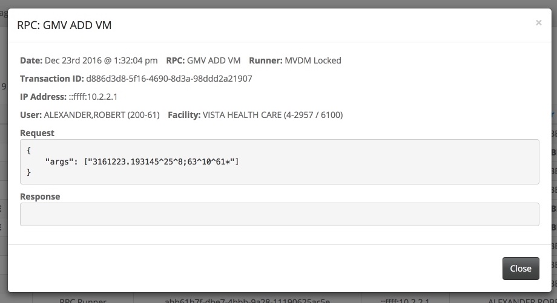

* Navigate to the MVDM Events tab. Observe the three MVDM create events that are associated, by transaction ID, with the **GMV ADD VM** RPC Events. 

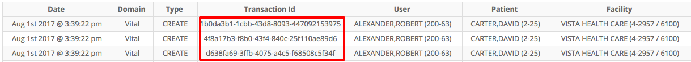

* Clicking on one of the MVDM create events will bring up a details modal.

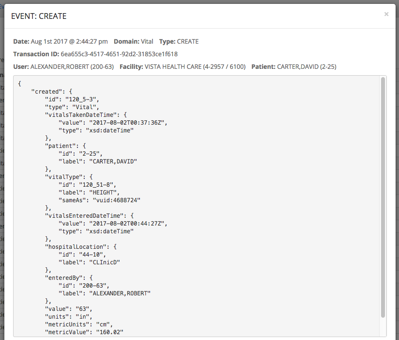

## Mark as Entered in Error

* In CPRS, bring up the vitals dialog and click the 'Entered in Error' button in the top right-hand side of the vitals dialog. 

* This will bring up the 'Entered in Error' dialog. Select the height vital. The reason section will now be enabled. Select the 'Incorrect Reading' radio button then click the 'Mark as Entered in Error' button.

* Go over to the MVDM client. Under RPC Events, observe the **GMV MARK ERROR** RPC Event line item. 

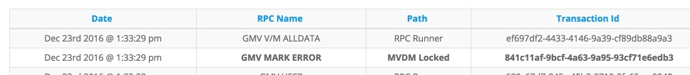

* Clicking on the RPC event line item will bring up the details modal.

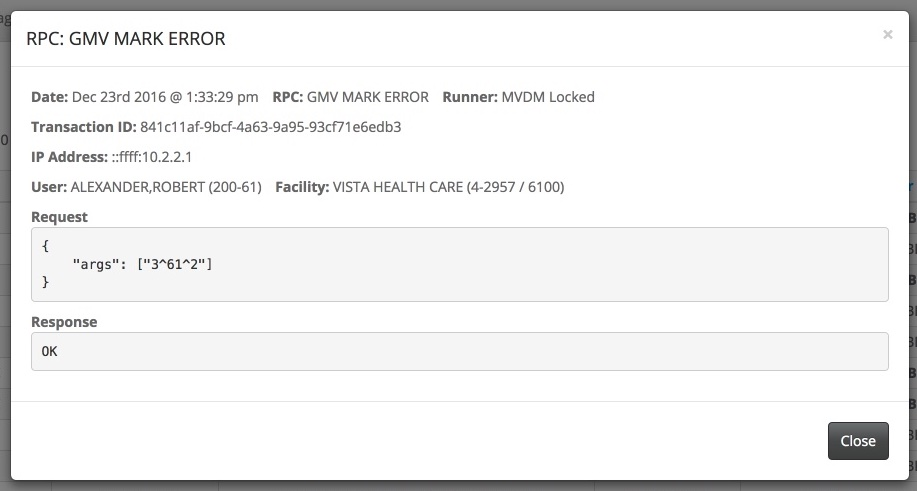

* Click on the MVDM Events. Observe the corresponding MVDM remove event, note that the transaction ID is the same as the corresponding RPC Event.

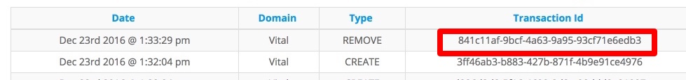

* Clicking on the MVDM remove event line item will bring up the details modal.

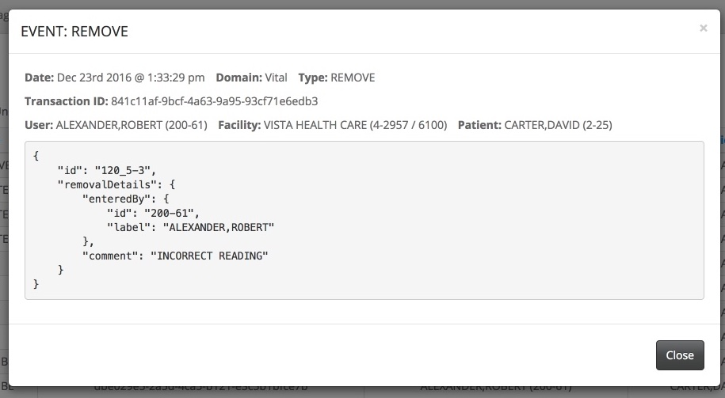
