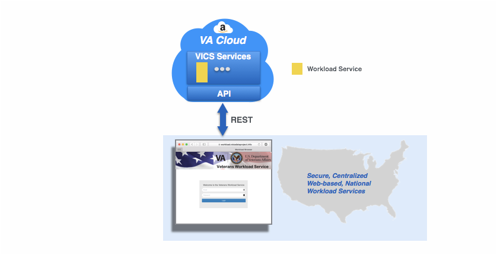
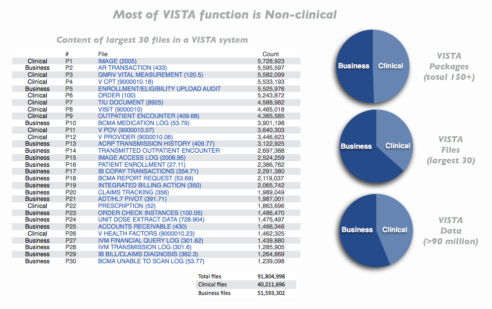
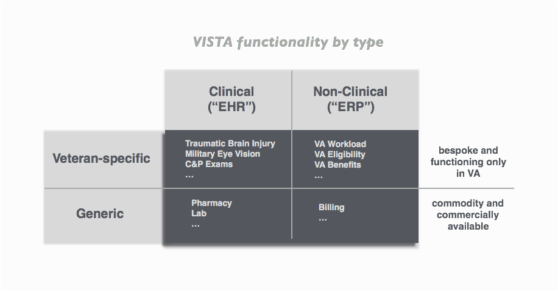
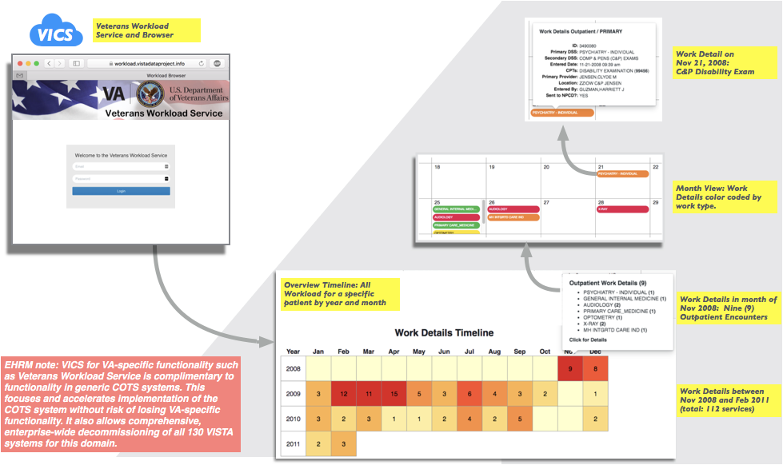
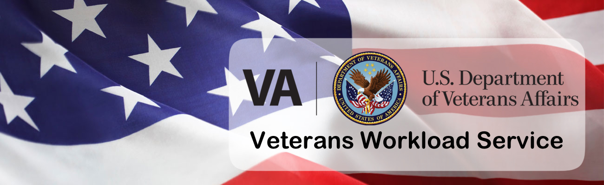

# Veteran Integrated Cloud Service (VICS)

The following demonstration is an example of a Veteran Integrated Cloud Service (VICS) for Workload. This provides a single, centralized cloud-based Workload service with the identical functionality of the composite of Workload functionality of the 130 decentralized VISTA systems.

## VISTA is a lot more than an EHR

VISTA is a lot more than a Clinical information system ("EHR"). In fact, more than half of VISTA function and data is Non-clinical and Business ("ERP") related. This VISTA functionality generates the thousands of required financial, regulatory, quality, safety, access, and efficiency reports to Congress, to Federal and State regulators, and all 1200+ VA care facilities to ensure the highest quality and access to VA- and Veteran-specific care and benefits.

One example of Non-clinical functionality in VISTA is _Workload Measurement_, the accounting for work performed by providers for patients. Such measurement helps the VA manage hospital costs, allocate resources and staffing, and is the basis for billing.

Like much else in VISTA, the applications and utilities for Workload are bound up with other functionality. As part of separating VISTA's Clinical (EHR) and Non Clinical (ERP) function, the VISTA Data Project (VDP) has created a _Veteran Workload Service_ and _Browser_ which distinguish and demonstrate how VISTA manages and monitors workload. 

Both the Workload Service and the Workload Browser provide a basis for VA-wide, VISTA-system independent workload management. Such a National Service would centralize workload collection, storage and presentation.

## About Workload in the VA and VISTA

> VHA collects workload data that supports the continuity of patient care, resource allocation, performance measurement, quality management, and third-party collections. Decision Support System (DSS) Identifiers assist VA medical centers in defining workload, which is critical for costing purposes. DSS Identifiers are used to identify workload for all outpatient encounters, inpatient appointments in outpatient clinics, and inpatient billable professional services. They also serve as guides to select DSS outpatient department structures.

and

> VHA facilities are required to report all electronic data concerning the provision of services in VHA facilities to the National Patient Care Database (NPCD) in Austin, TX. VHA facilities must ensure that all encounters in outpatient settings, inpatient appointments in outpatient clinics and inpatient billable services are identified, coded, completed and reside in the Patient Care Encounter (PCE) package for transmission to NPCD.

## Workload Services and Browser Demo

The Veteran Integrated Cloud Service (VICS) for Workload and its Browser client are available at [https://workload.vistadataproject.info/](https://workload.vistadataproject.info) (login required).

The _Service_ houses a typical VA workload dataset generated from a statistical analysis of production VISTAs. The dataset depicts the workload of a fictional _IOWA Hospital_ which matches the attributes of a typical VA medical center. The _Browser_ allows you to examine workload based on time, location and patient.

The following guides show the _Workload Browser_ examining workload based on [__Location__](location) and [__Patient__](patient).

