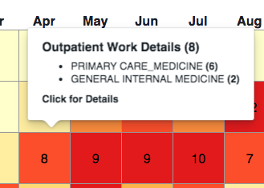
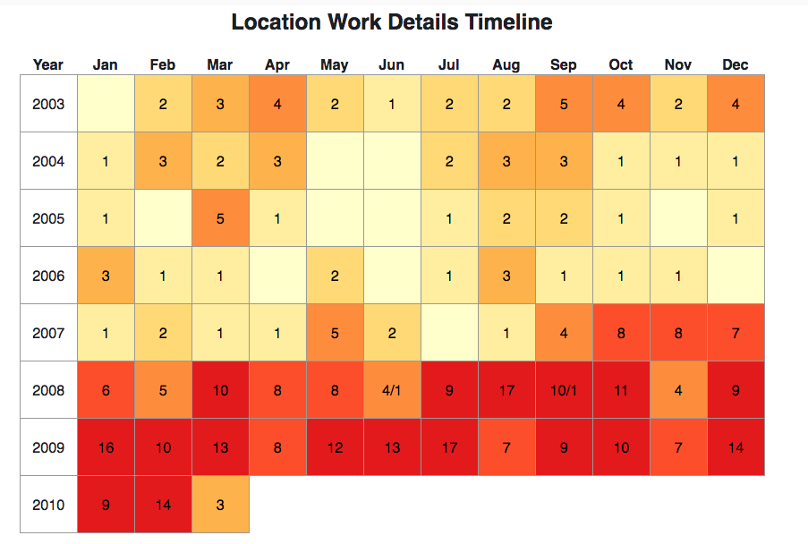
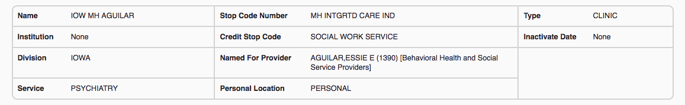

The following screenshots from the [Veteran Workload Browser](https://workload.vistadataproject.info) show the locations where care was given to a particular patient in November 2008. They show how "location" is more than a physical concept in VISTA and the VA - it represents a combination of place and the type of work performed and, in many cases, who is performing work. These combinations allow the VISTA system to capture hospital workload.

Specifically patient [_Frank Gilbert_ was seen](https://workload.vistadataproject.info/patientCalendar/workDetails/7199390/2008/10) at seven different "locations" in November 2008:
  * five are _Personal Locations_ ("ZZIOW C&P __JENSEN__", "IOW C&P AUDIO __RODGERS__", "IOW OPTOMETRY __KNIGHT__ RETURN", "ZZIOW C&P __SALAZAR__", "IOW MH __AGUILAR__"). As well as being named for an institution (_IOW_ for Iowa) and type of work (_C&P AUDIO_, _OPTOMETRY_), these locations are named for a particular provider such a Nancy __ROGERS__ or Jayden __KNIGHT__. Such _locations_ allow a provider's time to be scheduled and the nature of work performed to be designated.
  * one, _IOW OIF/OEF CASE MGT NURSE_, is named for the role of the provider, _NURSE_, instead of for a specific provider
  * one, _RADIOLOGY DIV 999 OOS ID 105_, is primarily named for a class of work (_RADIOLOGY_) performed at the institution with Station Number _999_ (_IOWA_). The specific DSS code for this class of work is _105_ (_XRAY_) 

The [Location List shows](https://workload.vistadataproject.info/locations?page=0&pageSize=20&sortBy=label&sortDir=asc&institution=-1&division=-1&stopCode=-1&creditStopCode=-1&type44=-1&isPersonal=true&excludeDeleted=false) that _Personal Locations_ make up 698 of the 1900 locations in the _IOWA Hospital System_.

__Note__: the Workload Data inside the _Workload Service_ finished in March 2011. In the descriptions below, "Now" means _March 2011_.

## IOW C&P AUDIO RODGERS ([947](https://workload.vistadataproject.info/locationDetails/947))

Nancy Rodgers, an Audiologist, names this _Personal Location_. Work at this location is _AUDIOLOGY_, specifically
_C&P EXAMS_ ...

On November 2008, there were 18 piece of work (workload) performed there ...

Work is spread [throughout the month](https://workload.vistadataproject.info/locationCalendar/workDetails/947/2008/10) and, as expected from the location's definition, it is all _AUDIOLOGY_ ...

_AUDIOLOGY_ is red, the color of _Ancillary and General Support Services_ which is the DSS grouping it belongs to.

Patient _Frank Gilbert_ was seen on the 25th. The workload is _AUDIOLOGY/C&P EXAMS_ with a very generic CPT, _DISABILITY EXAMINATION_. This is a case of the DSS codes being more precise than CPT and if you examine [other Workload in the same month](https://workload.vistadataproject.info/locationCalendar/workDetails/947/2008/10), they share the same DSS/CPT combination ... 

What is _NPCD_ in the property _Sent to NPCD_? That's the VA's _National Patient Care Database_ in Austin Texas. Every VISTA sends Workload data to Austin.

## IOW OIF/OEF CASE MGT NURSE ([1302](https://workload.vistadataproject.info/locationDetails/1302))

This location isn't personal - its "named for provider" property has no value. Instead it is named for the role _NURSE_,  the discipline of the providers who use it ...

On November 2008, six pieces of work, all _Primary Care Medicine_ were performed there ...

The location's DSS is _GENERAL INTERNAL MEDICINE_, a DSS from the same DSS grouping. At some point between November 2008 and "now" (March 2011), the location's DSS changed. A browse of its timeline shows the change happened in April 2009 ...

Frank Gilbert was seen on the 25th and the Workload was given a Telephone CPT. This may be a mistake - CPTs used in other work for the month such as _CASE MANAGEMENT (t1016)_ or _OFFICE/OUTPATIENT VISIT EST (99211)_ seem more appropriate. Remember that CPTs for this type of Workload are manually chosen by the Provider making errors more likely ...

Despite being named for a role (_NURSE_), all work performed [at this location on this month](https://workload.vistadataproject.info/locationCalendar/workDetails/1302/2008/10) is by one nurse, Edna Dawson. At least for this month, the location could have been named _IOW OIF/OEF CASE MGT DAWSON_.

## IOW OPTOMETRY KNIGHT RETURN ([855](https://workload.vistadataproject.info/locationDetails/855))

Jayden Knight, an Optometrist in the Iowa Hospital, names this location ...

and this provider has performed steady work of this sort from late in 2001 until "now" ...

There were six pieces of credited work in November 2008, all of type OPTOMETRY ...

and all colored yellow, the color of OPTOMETRY's DSS grouping, _Surgical Services_.

Frank Gilbert was seen on the 25th as part of a disability exam. Only the CPT code tells us that ...

## RADIOLOGY DIV 999 OOS ID 105 ([193](https://workload.vistadataproject.info/locationDetails/193))

Like other work performed by Radiologist's, XRAYs get their own "location" ...

and perhaps _XRAY DIV 999 OOS ID 105_ would have been a better name.

The deep burgundy color of its timeline which stretches back to 1996 reflects large numbers of XRAYs taken in IOWA hospital over the years. 

In November 2008 alone, there were 149 OUTPATIENT XRAYs and 27 INPATIENT ...

which span the month ...

Frank Gilbert had two on the 25th, each given a CPT. As they both occurred at the same time, they were gathered into one Workload record ...

## ZZIOW C&P SALAZAR ([932](https://workload.vistadataproject.info/locationDetails/932))

Genevieve Salazar is a Registered Nurse who names this location for General Medicine and specifically for C&P EXAMs ...

The timeline for the location shows that March 2010 had the last work - though the official retirement date was months later. Hence __ZZ__ in front of the name. This location is no longer in use as Ms Salazar has left the Iowa Hospital. A "ZZ" prefix is a VISTA convention for marking locations as obsolete ...

and Frank Gilbert was seen by her on the 25th of November 2008 for a Disability Exam. Here again, the CPT is less precise than the DSS combination ...

## IOW MH AGUILAR ([1390](https://workload.vistadataproject.info/locationDetails/1390))

Essie Aguilar is a social worker working in mental health (_MH_) who names this location ...

She has a very large workload ...

which starts in November 2008, the month we're considering here.

Frank Gilbert was seen on the 26th ...

## ZZIOW C&P JENSEN ([949](https://workload.vistadataproject.info/locationDetails/949))

... __TODO__ - needs data/browser fix ...

