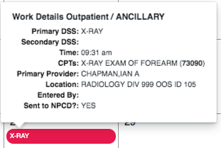
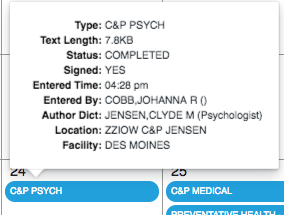
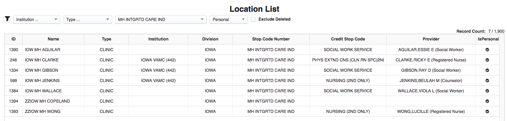

Separate the Non Clinical: show in a "Workload (DSS) Browser" uses a "VISTA DSS Service" which is sliced out of VISTA. Shows that non clinical aspects of VISTA can be cleanly separated and centralized.

Message: beyond clinical -- VISTA and Workload 

overall this month, the patient had two MH exams (C&P and Social work one), three X-Rays, 

ie/ for this month go into all workload and related items (orders, docs etc)

REM: 9 work details (AUDIOLOGY x 2 but maybe one is a dud?) and 

## Frank


...

...


## 21st has WD MH 1 with V CPT/V POV/V PROVIDER and Document off it. Document not entered til the 24th, signed on the 1st of the following month.

   * JENSEN and JENSEN: by a provider called JENSEN at a location named for him
   * CPT is less precise that the two part DSS
   * PRIMARY which means explicitly entered workload
   * Sent to NPCD means work load IS sent to Austin: WHEN?????????
   * ZZIOW means the Place name is deleted
   * One document, a C&P that is entered (transcribed) 3 days later and signed even later
   
## 25th and 28th have X RAYs

```text
- first one:
  - 2 CPTs (from two orders) and both more precise than DSS
  - automatically entered (side effect of order(s))
  - at a generic location ... named for the function at this institution
  - primary provider is radiology or ???
  - provider has since retired/left (hence ZZ)
  - [WHY NO ENTERED BY?]
  - Ordered? x two entered on 7th
- second one: entered 
  - orders on 25th
  - report text?
  - final on 28th
  - CPT precise again
Note: exam_date_time is the 26th
```


...

...


## 26th has WD MH 2
   * DX Interview CPT ... multi level DSS
   * still current
   * MH Aguilar Document
   * 25th has a consult -- for MH but locn is DYR MH VAUGHN ... DYR and not IOWA. Need to examine more ... seems to call for MH check
     * probably next month 


   
## Audiology x 2 ... same provider, same CPT

```text
- first one: 25th ... but is this "real"?
  ... yes: 409_73-2088342 from 409_68-3668164 from 9000010-3493339 is ACCEPTED (user causing event ... 200-452 and sent 12/5, acked 12/8
  ... do more is see dates on CPTs ...
- second one: 26th
... in both cases Rogers at Rogers
... document in C&P AUDIOLOGY EXAM (8925_1-1435)  ---  132 lines for the 26th. 
    - episode_begin_date_time is for the 25th
... none for the 25th.
```


...


## General Internal Salazar: 25th

```text
- has a doc: C&P MEDICAL (8925_1-1331) 25/25 ... but sign is 2nd dec.
```


...


## PRIMARY CARE_MEDICINE (NURSE)

```text
- two docs:
  - PREVENTATIVE HEALTH - SCREENING (8925_1-1040)  ---  214 lines
  - OEF_OIF INITIAL ASSESSMENT (8925_1-1753)  ---  148 lines
- CPT is HC PRO PHONE CALL 21-30 MIN (98968) but was this a call or local??? (SEE DOCUMENTS)
  - wrong as line: "INITIAL ASSESSMENT\r\rThe following information was reported by the veteran during an in \rperson interview:\r\rOEF/OIF BRANCH OF SERVICE, "
- she is a registered nurse 
- many many health factors!!!
- patient ed: not much in popup as no enterer ... hangs off visit ie/ just the type
```

## OPTOMETRY

  * progress note
  * disability exam DSS again (must org all)


...


...

...

...		

...

...

...
				
...
