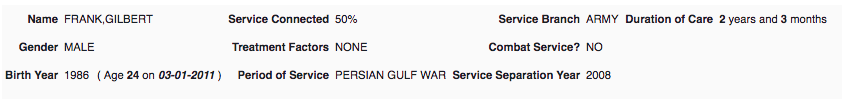
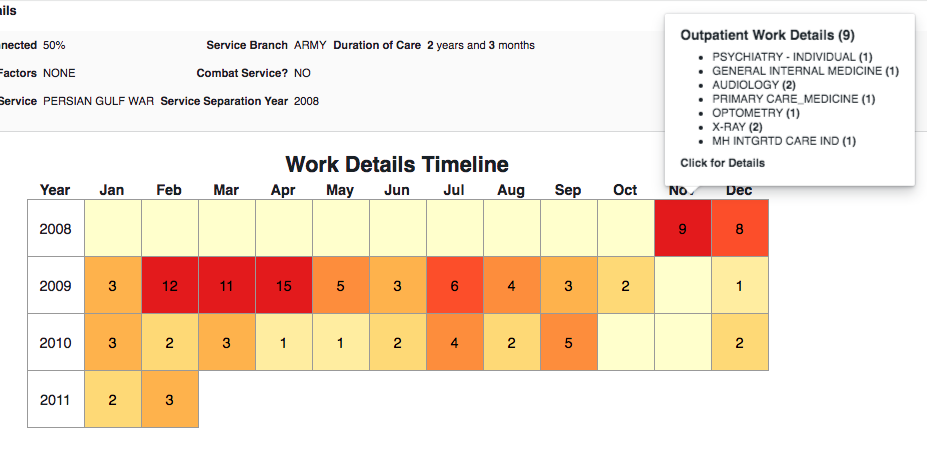
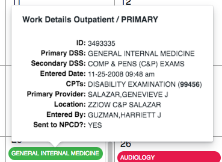
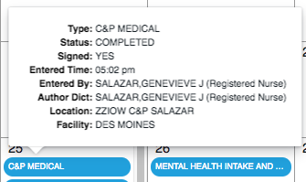
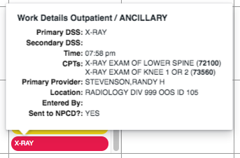
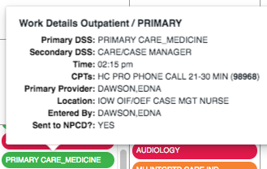
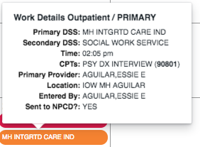

The following screenshots show how the _Veteran Workload Browser_ presents the _Workload_ of a particular patient, [Frank Gilbert](https://workload.vistadataproject.info/patientDetails/7199390) ...

He was cared for over 2 years and 3 months. His first month, [November 2008](https://workload.vistadataproject.info/patientCalendar/workDetails/7199390/2008/10) ...

featured Psychiatric and Physical examinations over four days ...

with related documents and orders ...

## Day 1 - 21st of November

The one Workload record describes the work performed by provider Clyde Jensen. Work is defined using both VA-proprietary Decision Support System (DSS) codes and an industry-standard CPT code. In this case, the two DSSs - Psychiatry/C&P Exam - represent a more precise description than the single CPT - _Disability Examination_. _Sent to NPCD_ means the work load description was sent to the National Patient Care Database in Austin.

One document, a C&P was entered (transcribed) 3 days later ...

## Day 2 - 25th of November

This was a busy day with five Workload records. Two are green, the color of _Medicine and Primary Care Services_, two red, signifying _Ancillary and General Support Services_ and Optometry is yellow, the color of _Surgical Services_ ...

The first record is for a C&P Exam by Genevieve Salazar, a Registered Nurse ...

which led to a document ...

The last is X-RAY representing two - as coded in CPT - exams. In records like these, CPTs are more precise than the broad DSS of X-RAY ...

and the designation _ANCILLARY_ means that the record was automatically generated - everything from the DSS to the CPTs were populated in the background by VISTA. 

Behind this workload are two Radiology reports ...

There were also Optometry and Audiology exams and a Primary Care examination by nurse Dawson ...

which led to Health Factor designations ...

and Patient Education ...

## Day 3 - 26th of November

The very next day, two pieces of work. Audiology ...

where again VA's DSS combination is more precise than the generic CPT and a Mental Health (MH) exam by a social worker ... 

with an accompanying document ...

# Day 4 - 28th of November

Another XRAY was performed.
