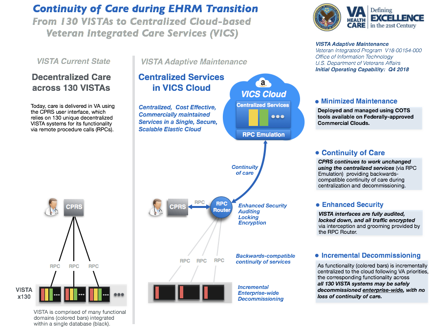

## Continuity of Veteran Care during EHR Modernization

__VISTA Adaptive Maintenance (VAM)__  provides a cloud-based roadmap and software for maintaining VISTA and the VA workflows it supports in an efficient, centralized, cost-effective manner during VA's multi-year EHR Modernization (EHRM) program. 

VAM enables VA to transition from 130 distinct, complex, legacy VISTA systems  to a single, secure, commercially-managed set of centralized cloud-based microservices - __Veteran Integrated Care Services (VICS)__ -  while maintaining full backward-compatibility and continuity of care and services of the Computerized Patient Record System (CPRS). 

VICS will be hosted in production within the VA’s Enterprise Cloud using Amazon Web Services.

__Strategic Benefits__:

  * Minimize cost, complexity, and risks of maintaining 130 legacy VISTA systems during multi-year EHRM transition
  * Current VA clients (CPRS/JLV) and workflows fully supported and secured
  * Safely and incrementally retire *all* legacy VISTA systems, with no loss of veteran-specific care or services
  * Implement commodity commercial clinical (EHR) and business (ERP) systems, while preserving veteran-specific care and services
  * Move from disparate data centers to single Fedramp-approved cloud without disturbing veteran care

__Show Me:__ browse through and run VAM's [CPRS](/vam/build1_1/demo/) and [Web Client](/vam/buildWeb1/demo/) Demos.
