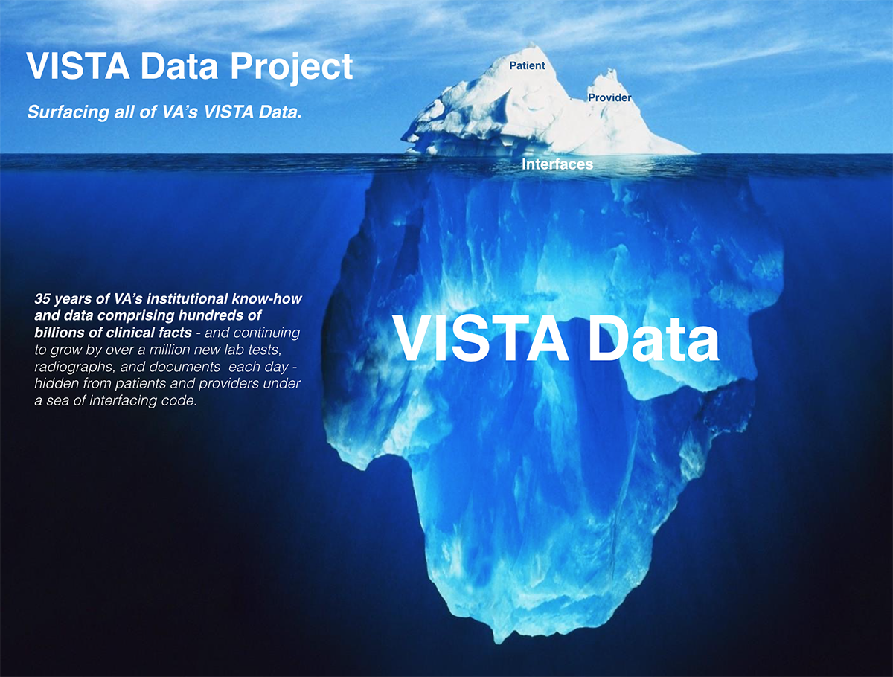

# VISTA Data Project

The Veterans Information Systems Technology Architecture ([VISTA](https://en.wikipedia.org/wiki/VistA)) is the U.S. Department of Veterans Affairs integrated longitudinal  clinical, business, and administrative information system that has supported the operations of the 1200+ VA hospitals and clinics nationwide for the past 35 years. (See: [VISTA Background](https://github.com/vistadataproject/documents/tree/master/Background/vista)).

The 130 VISTA systems in operation today encapsulate over three decades of VA- and Veteran-specific know-how and data, comprising over 300 million veteran-years of data, and continues to grow at the rate of over a million new documents, tests, and radiographs each day. It is necessary preserve all this in computable form to support veteran continuity of care, and for decades into the future.

VISTA's data model - the roadmap to all of VA's institutional, business, and clinical processes and data - has evolved organically within each system over the past 35 years, but has never been comprehensively exposed and represented in modern, computable form. VISTA's data thus remains uniquely defined, opaque, and challenging to access in each of these distinct systems. 

__In the VISTA Data Project__,  VISTA's native operational clinical and business model - the VISTA Data Model -  is comprehensively exposed, enriched, and operationalized using a modern, web-standard, computable, model-driven interface. The VISTA Data Model is in turn normalized across all VISTA systems to create a national, standardized Master Veteran Data Model (MVDM), which allows __secure read-write__ transactions across __all__ VISTA systems using a __single__ master model-driven mechanism, MVDM Services: 

  

*The figure above summarizes the evolution of interfacing to VISTA data: From __thousands of unique, inconsistent, insecure, unidirectional code-based interfaces__ to that of a __single, secure, server-side, symmetric (bidirectional), service-based, web-standard, normalized, master data-model-driven interface__.* 

For more details on the VISTA Data Project, [click here](https://github.com/vistadataproject/documents/tree/master/Background#vista-data-project)

## What's next... Cloud-based veteran care services

Leveraging the VISTA Data Project's secure model-driven interface to all VISTA data, the VISTA Adaptive Maintenance project provides a cloud-based roadmap and software for maintaining VISTA and the VA workflows it supports using straightforward off-the-shelf commercial cloud services and microservices.  

For the current state of VISTA's migration to centralized, cloud-based services, see [VISTA Adaptive Maintenance](http://vistaadaptivemaintenance.info/)

