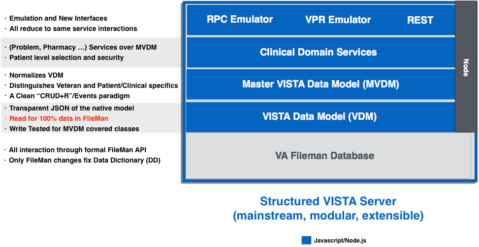
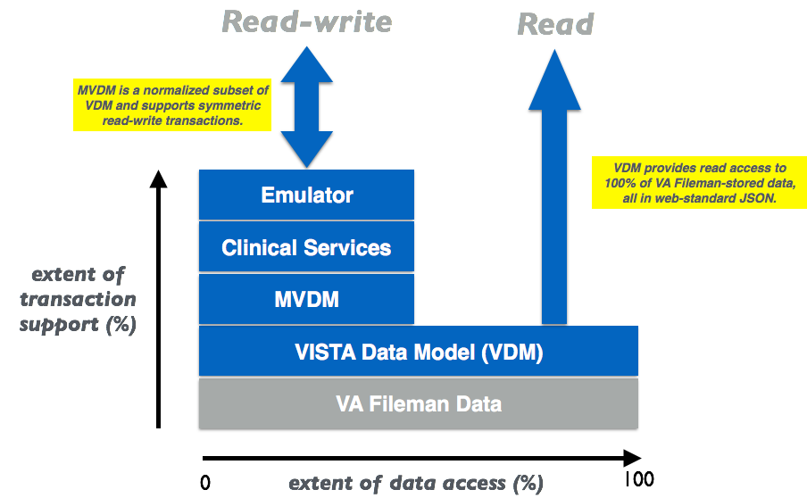

# VISTA Data Project

The Veterans Information Systems Technology Architecture ([VISTA](https://en.wikipedia.org/wiki/VistA)) is the U.S. Department of Veterans Affairs integrated longitudinal  clinical, business, and administrative information system. 130 instances support the operations of over 1200 VA hospitals and clinics nationwide.  

The VISTA Data Project (VDP) is a data-centric, model-driven approach to VA master data management, interfacing, and security.  VISTA's data model - the roadmap to all of VA's institutional, business, and clinical processes and data - has evolved organically over the past 35 years, but has not been surfaced and leveraged in computable form. 

Now, for the first time, this VISTA Data Model (VDM) is comprehensively represented and then normalized to produce a national, standardized Master Veteran Data Model (MVDM). An operationalized MVDM provides new web clients with a single, secure, symmetric read-write interface for every VISTA and through _emulation_ of existing interfaces, VISTA clients such as CPRS run unchanged but with greatly enhanced security. 

 

__Strategic Benefits__:
  * New, maintainable veteran care server based on mainstream technology
  * New web and mobile clients enabled with mainstream technology
  * Current clients (CPRS/JLV) supported and enforce VA Care coverage
  * May now safely incrementally retire legacy MUMPS VISTA [spaghetti]
  * (Some) Clinical Domain Services may be implemented over COTS

 

MVDM runs inside VISTA replacing a spaghetti of MUMPS. It turns VISTA into a modular, model-based, backward-compatible server ...

 

In _VDP_, Data Modeling starts with 100% coverage of all VISTA data in web-standard JSON and moves up to a normalized master model for the functionality used by CPRS, VISTA's client ...

 

VISTA currently has a variety of overlapping security (access control and auditing) mechanisms including FileMan permissions and permission to invoke this or that remote procedure call (RPC). MVDM introduces comprehensive patient-centric security, industry standard attribute-based access control (ABAC) and tiered auditing to VISTA for the first time ...

 
 
__Show Me:__ browse through and run VDP's [Clinical](/demo) and [Non Clinical](/demo2) Demos.

