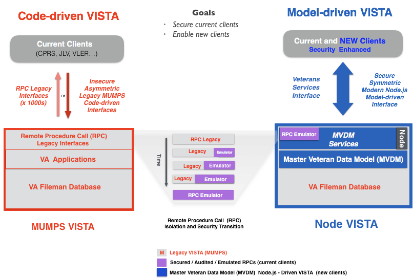

# VISTA Data Project

The Veterans Information Systems Technology Architecture (VISTA) is the U.S. Department of Veterans Affairs comprehensive integrated  clinical, business, and administrative information system that supports the operations of over 1200 VA hospitals and clinics nationwide.  

The VISTA Data Project is a new data-centric, model-driven approach to VISTA master data management, interfacing, and security.  VISTA's data model - the roadmap to all of VA's institutional, business, and clinical processes and data - has evolved organically over the past 35 years, but has not been surfaced and leveraged in computable form. 

Now, for the first time, VA's native transactional healthcare data model - the VISTA Data Model -  will be comprehensively exposed, enriched, and operationalized as a single, secure, symmetric read-write, server-side interface for all clinical operational VISTA data.   

The VISTA Data Model (VDM) is in turn normalized across all local VISTA system data models to create a national, standardized __Master VISTA Data Model__ (MVDM), alowing  transactions across all VA VISTA systems with a single, standard, secure, veteran-centric, service-based mechanism, __MVDM Services__: 

*The figure summarizes this evolution from __thousands of unique, inconsistent, insecure, unidirectional code-based interfaces__ to that of a __single, standardized, secure, server-side, symmetric (bidirectional), service-based master data model-driven interface__.*

  

For more details on the VISTA Data Project, [click here](https://github.com/vistadataproject/documents/tree/master/Background#vista-data-project--technical-overview)

