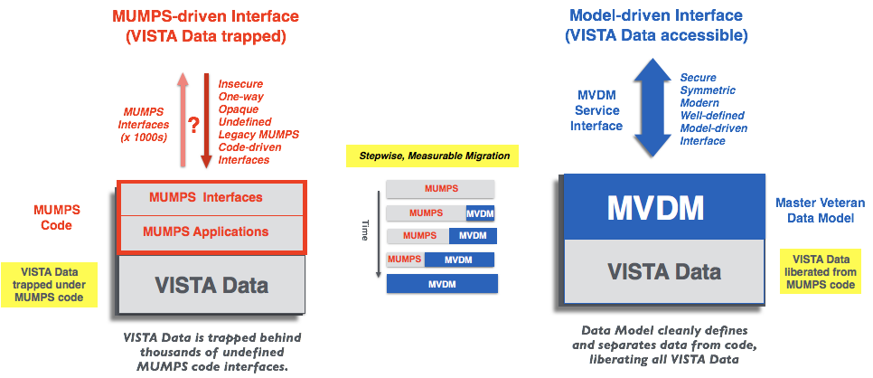

The Veterans Information Systems Technology Architecture ([VISTA](https://en.wikipedia.org/wiki/VistA)) is the U.S. Department of Veterans Affairs comprehensive integrated longitudinal  clinical, business, and administrative information system. 130 instances support the operations of over 1700 VA hospitals and clinics nationwide.  

VISTA's data model - the roadmap to all of VA's institutional, business, and clinical processes and data - has evolved organically over the past 35 years but has not been surfaced and leveraged in computable form. Until now. 

In the VISTA Data Project (VDP), this organic data model is comprehensively exposed and incrementally normalized across all VISTA systems to produce a national, standardized Master VISTA Data Model (MVDM) spanning all VISTA systems. An operationalized MVDM provides new clients with a single, secure, symmetric read-write interface to every VISTA and, through _emulation_ of existing interfaces, VISTA's current clients such as CPRS and JLV work unchanged, but with greatly enhanced security. 

Through this same MVDM-driven mechanism, VISTA functionality is incrementally migrated to a single national, cloud-based, veteran-specific Veteran Integrated Care Service (VICS),  allowing  the corresponding functionality of the decentralized VISTA systems to be decomissioned while maintaining seamless continuity of veteran-specific care and services.

 

__Strategic Benefits__:

  * New, maintainable, centralized, cloud-based veteran care services based on mainstream technology
  * New web and mobile clients enabled with mainstream technology
  * Current clients (CPRS/JLV) supported and secured, enforcing continuity of VA Care coverage
  * May now safely incrementally retire legacy MUMPS VISTA systems, with no loss of veteran-specific care or services
  * May now implement generic COTS clinical and business systems (EHR/ERP), while preserving veteran-specific care and services

 

__Show Me:__ browse through and run VDP's [Clinical](/demo) and [Non Clinical](/demo2) Demos.

