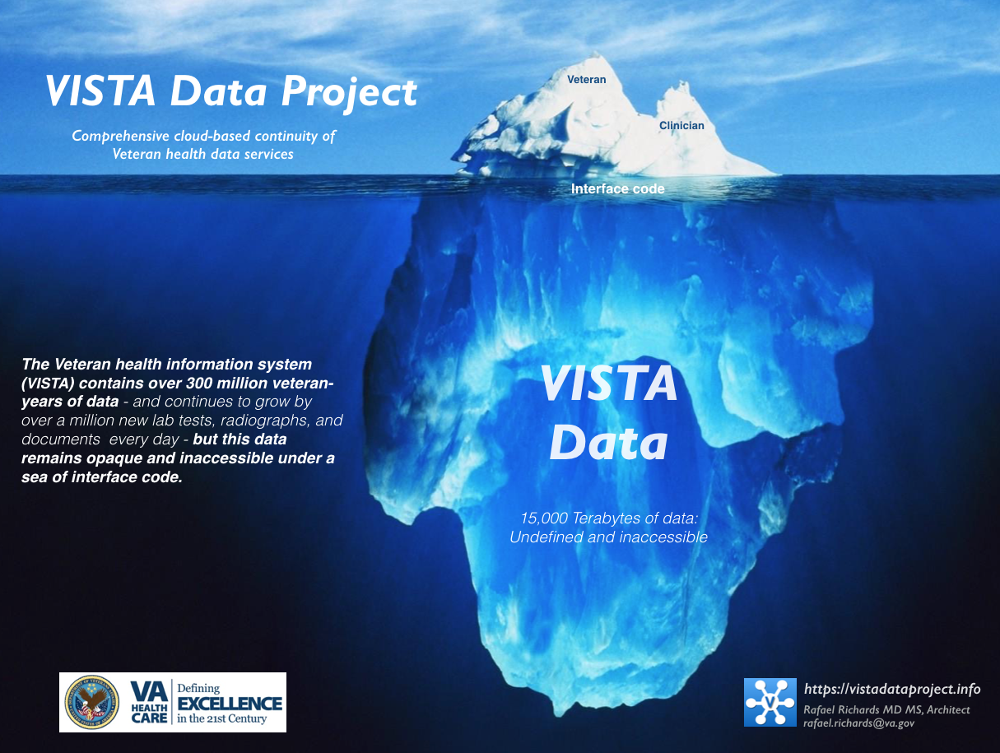
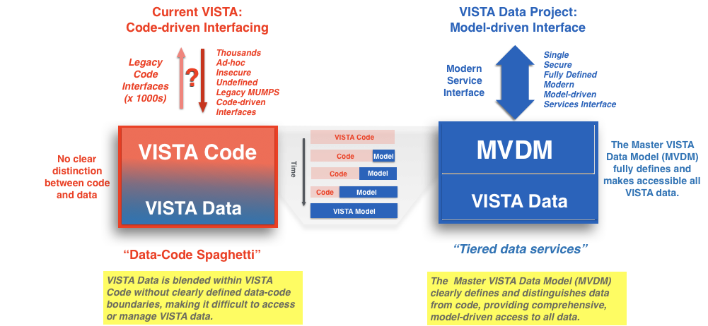

# VISTA Data Project

__*The VISTA Data Project provides a comprehensive cloud-based solution for access, interfacing, security, and management of the Veteran  data within the VA's VISTA systems*__

The U.S. Veterans Information Systems Technology and Architecture ([VISTA](https://en.wikipedia.org/wiki/VistA)) is the U.S. Department of Veterans Affairs integrated clinical, business, and administrative information system that support the operations of 1500+ Veterans Health Administration hospitals and clinics across the United States. (See: [VISTA Background](https://github.com/vistadataproject/documents/tree/master/Background/vista)). 

The 130 VISTA systems in operation today contain over three hundred million veteran-years of health data spanning nearly four decades, and continue to grow at the rate of over a million new clinical documents, lab tests, and radiographs each day.  The VA Records Retention Schedule (Section 6000.2b: [pdf](https://www.va.gov/vhapublications/rcs10/rcs10-1.pdf) [text](https://github.com/vistadataproject/vistadataproject.github.io/blob/master/va-records-retention-EHR-2017.md#belectronic-final-version-of-health-record) )  mandates that the *veterans complete health record must be available in digital form for 75 years after the last episode of care.*  Comprehensive access to VISTA data is thus required to provide continuity of veteran care now, and for decades into the future.   

*VISTA's* data, however, is inconsistently defined within and across each of the systems, and has only piecemeal data access using thousands of cryptic code-based data extractors, leaving VISTA data undefined and inaaccessible.  *VISTA's* internal operational data model - which has evolved organically within each distinct VISTA system over the past 35 years - and which is the authoritative roadmap to all of VA's institutional, business, and clinical processes and data - has never been leveraged for data management.

*__In the VISTA Data Project__*,  *VISTA's* internal operational data model is comprehensively exposed, enriched, and operationalized in a modern industry-standard computable form. This *VISTA Data Model* is in turn incrementally normalized across all *VISTA* systems to create a single national Master Veteran Data Model (MVDM), which enables *secure read-write access* for *all data* in *all 130 VISTA* systems using a single, modern, maintainable, industry-standard model-driven services interface.

*The figure above summarizes the evolution of access to VISTA data: From __thousands of unique, inconsistent, insecure, unidirectional, cryptic legacy code-based interfaces__ to that of a __single, secure, modern, service-based, industry-standard, normalized, master veteran data-model (MVDM)-driven interface__.*    For complete documentation on the VISTA Data Project, [click here](https://github.com/vistadataproject/documents/tree/master/Background#vista-data-project)

 
 
 
 

  
 VISTA in the Cloud has vastly improved speed, scalability, security, and reliability.

# Cloud VISTA: Cloud-First.  Cloud-Smart.

VA is currently implementing the [U.S. Federal Cloud Computing Strategy](https://cloud.cio.gov) and migrating the VA's *VISTA* systems from the many diverse, legacy on-premises data centers across the country to a single, modern, centralized commercial cloud (*Cloud-First Strategy*). 

In addition to this Cloud-First strategy,  VA is supporting __*VISTA* Adaptive Maintenance__ (VAM) to provide a cloud-based roadmap and software for cloud-native optimization and security of *VISTA* to the highest standards in the U.S. government, using straightforward off-the-shelf commercial cloud services and microservices ([*Cloud-Smart Strategy*](https://cloud.cio.gov/strategy/#cloud-smart)). 

*VISTA* will be migrated with VAM in the VA’s Enterprise Cloud leveraging Amazon Web Services ([AWS](https://aws.amazon.com)).  

 

__Strategic Benefits__:
  * Move VISTA from disparate VA data centers to single Federally-certified commercial cloud without disturbing veteran care
  * Safely and incrementally centralize VISTA functionality in the Cloud, with *no loss of VA- or veteran-specific care or services*
  * Centralized, cloud-based, off the shelf monitoring and security of VISTA client activity
  * Current VISTA clients and workflows fully supported and secured
  * Minimize cost, complexity, and risks of maintaining each of the 130 distinct, decentralized VISTA systems during multi-year VA modernization transition.

