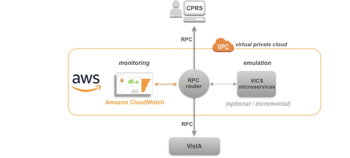

__VISTA Adaptive Maintenance__ (VAM) provides a cloud-based roadmap and software for maintaining VistA and the VA workflows it supports as straightforward off-the-shelf commercial cloud services and microservices during the multi-year transition to VA’s new commercial EHR and ERP systems.  VAM enables VA to transition from distinct, decentralized, legacy VistA systems to a single secured set of centralized cloud-based microservices - __Veteran Integrated Care Services__ (VICS) -  while maintaining full backwards-compatibility and continuity of care and workflows of the Computerized Patient Record System (CPRS). VAM will be operationalized within the VA’s Enterprise Cloud (VAEC) using Amazon Web Services (AWS) and Amazon CloudWatch.

__Strategic Benefits__:

  * Minimize cost, complexity, and risks of maintaining 130 legacy VistA systems during multi-year commercial EHR  transition.
  * Current VA clients (CPRS/JLV) and workflows fully supported and secured
  * Safely and incrementally migrate and retire VistA functional domains enterprise-wide, with *no loss of veteran-specific care or services*
  * Implement commodity commercial clinical (EHR) and business (ERP) systems, while preserving veteran-specific care and services
  * Move from disparate data centers to single Fedramp-approved commercial cloud without disturbing veteran care

__Show Me:__ browse through and run VAM's [CPRS](/builds/build1_1/demo/) and [Web Client](/builds/buildWeb1/demo/) Demos.
