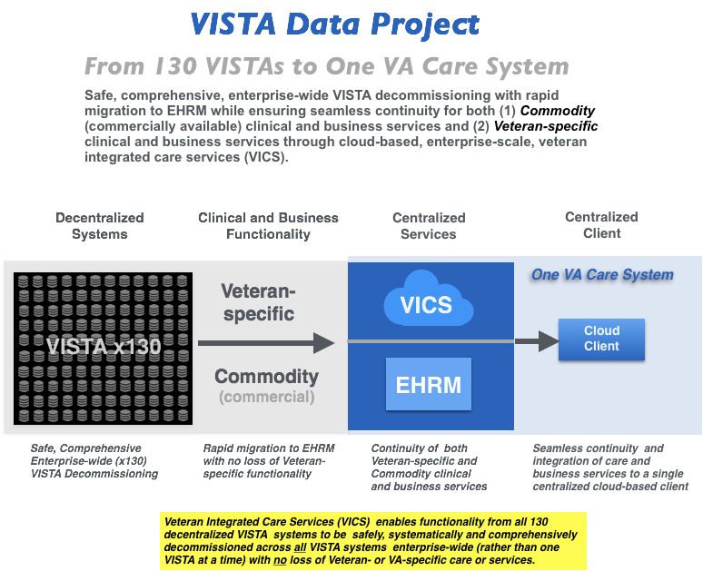

## VA Modernization with Continuity of Care
The Veterans Information Systems Technology Architecture ([VISTA](https://en.wikipedia.org/wiki/VistA)) is the comprehensive  longitudinal  clinical, business, and administrative information system of the U.S. Veterans Health Administration ([VHA](https://www.va.gov/health/aboutVHA.asp)). 130 decentralized VISTA instances support the operations of over 1200 VA hospitals and clinics nationwide.

In the VISTA Data Project (currently under VISTA adaptive maintenance), the functionality across all 130 decentralized VISTA systems is centralized to a single, secure, federally-endorsed commercial cloud-based __Veteran Integrated Care Service (VICS)__,  allowing  the corresponding functionality of the decentralized VISTA systems to be safely and systematically decomissioned while maintaining seamless continuity of veteran-specific care and services.

__Strategic Benefits__:

  * New, maintainable, centralized, cloud-based veteran care services based on mainstream technology
  * Current clients (CPRS/JLV) supported,  secured, and centralized enforcing continuity of VA Care coverage
  * May now safely incrementally retire *all* legacy VISTA/MUMPS systems, with no loss of veteran-specific care or services
  * May now implement commodity commercial clinical and business systems (EHR/ERP), while preserving veteran-specific care and services

 

__Show Me:__ browse through and run VDP's [Clinical](/demo) and [Non Clinical](/demo2) Demos.

