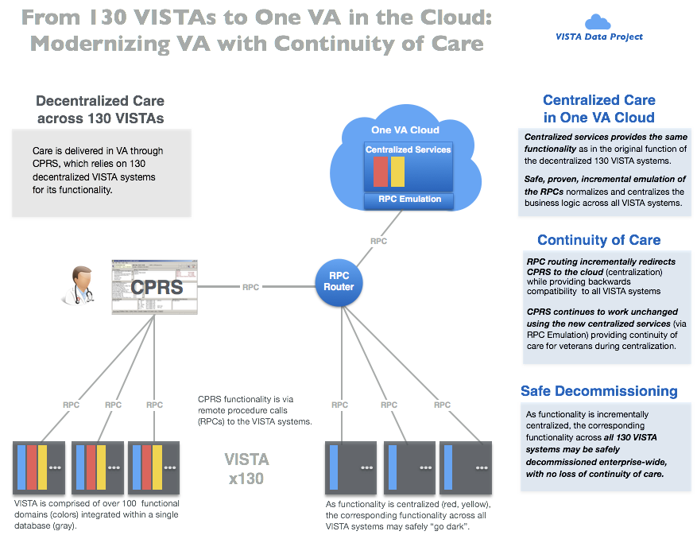

## VA Modernization with Continuity of Care
The Veterans Information Systems Technology Architecture ([VISTA](https://en.wikipedia.org/wiki/VistA)) is the comprehensive  longitudinal  clinical, business, and administrative information system of the U.S. Veterans Health Administration ([VHA](https://www.va.gov/health/aboutVHA.asp)). 130 VISTA instances support the operations of over 1200 VA hospitals and clinics nationwide.

The _VISTA Data Project_ shows how to safely migrate functionality from the 130 unique, decentralized VISTA systems to a centralized, secure, standardized, cloud-based __Veteran Integrated Care Service (VICS)__ to ensure seamless continuity of veteran care during the decommissioning of VISTA.

__Strategic Benefits__:

  * Current VA clients (CPRS/JLV) and workflows fully supported and secured
  * Safely and incrementally retire *all* legacy VISTA/MUMPS systems, with no loss of veteran-specific care or services
  * Implement commodity commercial clinical and business systems (EHR/ERP), while preserving veteran-specific care and services
  * Move from disparate data centers to fedramp-approved cloud without disturbing veteran care

### Feature-Function-Benefit

Feature | Function | Benefit
--- | --- | ----
Cloud-native | modern, industry-standard, commmercially supported  | Easily move to the commercial cloud with no impedance

__Show Me:__ browse through and run VDP's [Clinical](/vam/build1_1/demo) and [Non Clinical](/demo2) Demos.

### Background

The VISTA Data Project (VDP) has progressed in two phases.

The Discovery phase (FY16-17) under the VistA Metadata Audit, Analytics, and Automation project, the underlying model that drives all VISTA systems was exposed in machine-processable form, audited, and normalized to create a Master VistA Data model (MVDM) spanning all VistA systems.  The MVDM provides a modern, secure, symmetric, standardized, model-driven read-write interface across all VistA systems. The business logic of the clinical interfaces are also exposed, captured, and emulated with the same modern, web-standard technology on top of the MVDM.

The __Initial Operating Capability__ (IOC) phase (FY18-19) under the VistA Adaptive Maintenance (VAM) project, the Master VistA Data Model (MVDM) and its secure read-write interfaces are operationalized in a modern, secure, VA-endorsed enterprise commercial cloud (Amazon).

