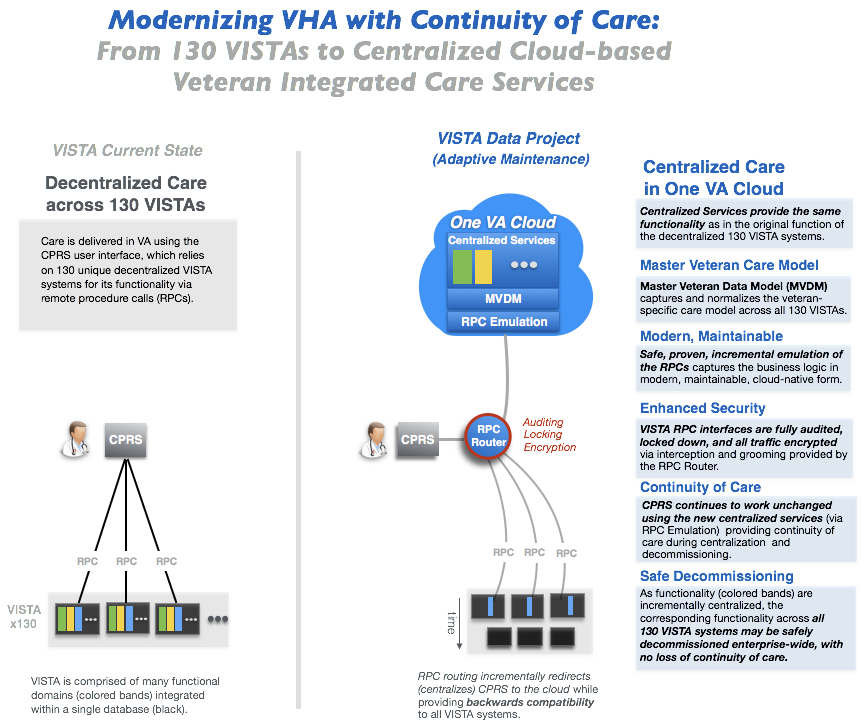

## VA Modernization with Continuity of Care
The Veterans Information Systems Technology Architecture ([VISTA](https://en.wikipedia.org/wiki/VistA)) is the comprehensive  longitudinal  clinical, business, and administrative information system of the U.S. Veterans Health Administration ([VHA](https://www.va.gov/health/aboutVHA.asp)). 130 VISTA instances support the operations of over 1200 VA hospitals and clinics nationwide.

The _VISTA Data Project_ shows how to safely migrate functionality from the 130 decentralized VISTA systems to a centralized, secure, cloud-based __Veteran Integrated Care Service (VICS)__ to ensure continuity of veteran care during the decommissioning of VISTA.

__Strategic Benefits__:

  * Current VA clients (CPRS/JLV) and workflows fully supported and secured
  * Safely and incrementally retire *all* legacy VISTA/MUMPS systems, with no loss of veteran-specific care or services
  * Implement commodity commercial clinical and business systems (EHR/ERP), while preserving veteran-specific care and services
  * Move from disparate data centers to fedramp-approved cloud without disturbing veteran care

__Show Me:__ browse through and run VDP's [Clinical](/vam/build1_1/demo) and [Non Clinical](/demo2) Demos.

## Background

The VISTA Data Project (VDP) has progressed in two phases.

* __VDP Discovery (FY16-17)__: In the VistA Metadata Audit, Analytics, and Automation project, the underlying model that drives all VISTA systems are exposed in industry-standard, machine-processable form, audited, and normalized to create a Master VistA Data model (MVDM) spanning all VistA systems.  The MVDM provides a modern, secure, symmetric, standards-based, model-driven read-write interface across all VistA systems. The business logic (remote procedure calls, or RPCs) of the clinical interface (CPRS) are exposed in industry-standard form, and emulated as services on top of the secure read-write MVDM.
* __VDP Operations (FY18-19)__: In the VistA Adaptive Maintenance (VAM) project, MVDM and its secure read-write service interfaces to CPRS are operationalized - via RPC routing - to VA's new Federally-mandated, HIPAA-secured enterprise commercial cloud (Amazon).

### Feature-Function-Benefit

Feature | Function | Benefit
--- | --- | ----
feature | function | benefit
Cloud-native | modern, industry-standard, commodity technology  | Seamlessly and rapidly move to the commercial cloud, with full commercial support; no legacy VISTA/MUMPS technology to support

