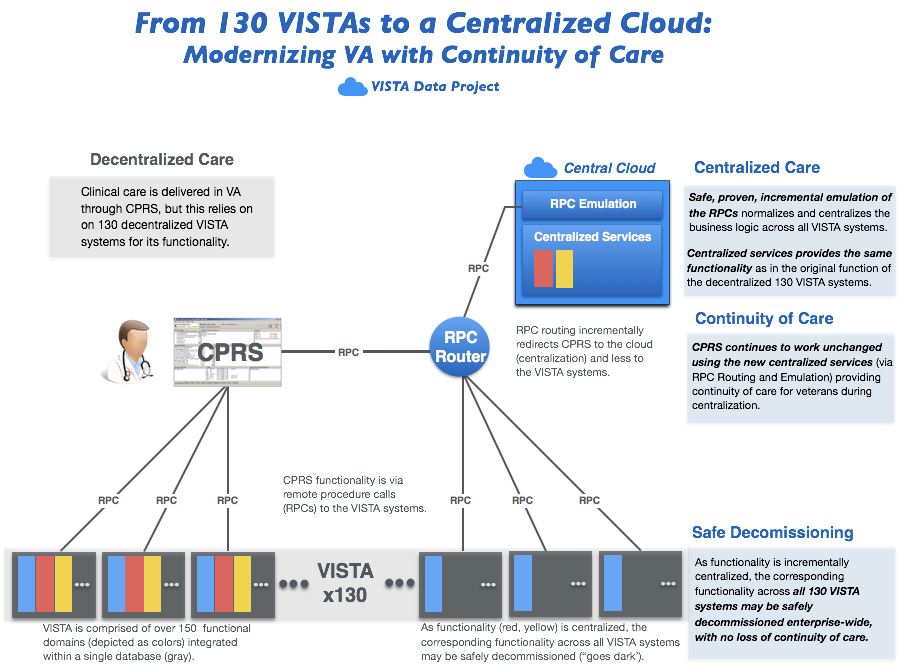

## VA Modernization with Continuity of Care
The Veterans Information Systems Technology Architecture ([VISTA](https://en.wikipedia.org/wiki/VistA)) is the comprehensive  longitudinal  clinical, business, and administrative information system of the U.S. Veterans Health Administration ([VHA](https://www.va.gov/health/aboutVHA.asp)). 130 decentralized VISTA instances support the operations of over 1200 VA hospitals and clinics nationwide.

The _VISTA Data Project_ shows how to safely migrate functionality from all 130 VISTA systems to a centralized, secure, cloud-based __Veteran Integrated Care Service (VICS)__ to ensure continuity of veteran care during the decommissioning of VISTA.

__Strategic Benefits__:

  * Current VA clients (CPRS/JLV) and workflows fully supported and secured
  * Safely and incrementally retire *all* legacy VISTA/MUMPS systems, with no loss of veteran-specific care or services
  * Implement commodity commercial clinical and business systems (EHR/ERP), while preserving veteran-specific care and services
  * Move from disparate data centers to fedramp-approved cloud without disturbing veteran care

 

__Show Me:__ browse through and run VDP's [Clinical](/vam/build1_1/demo) and [Non Clinical](/demo2) Demos.

