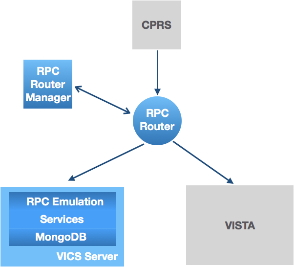
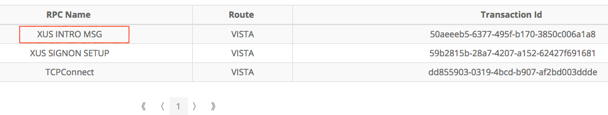
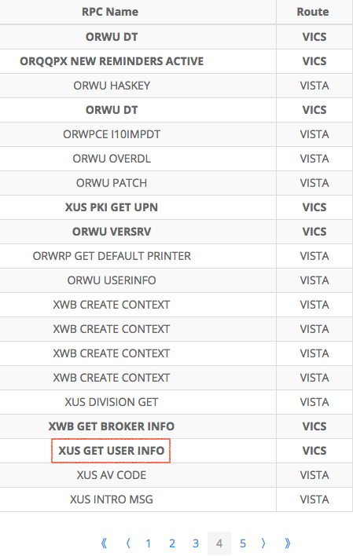

# VAM Demonstration Build 1 (December 2017)

The following demostration illustrates how _VAM Build 1_ establishes the _VICS Architecture_. This architecture enables the incremental migration of VA provider workflow from 130 separate, legacy VISTA Servers to one set of VA-wide Veteran Integrated Care Services (VICS). It addresses how to centralize relevant VISTA data while ensuring continued support for CPRS, the VA's primary client for physicians.

The _Build 1 Demonstration_ involves five components - the pre-existing _VISTA Server_ ("Demo VISTA") and its client _CPRS_ and the VAM-developed _VICS Server_, _RPC Router_ and _RPC Router Manager_. The [meta data of Demo VISTA](../vamB1DemoVISTADatasetContents) is shadowed in the VICS Server. All but CPRS are hosted on a cloud-based virtual machine at _vamdemo.vistadataproject.info_. 



The _VICS Server_ is layered - Remote Procedure Call (RPC) Emulation is built over well designed  Services. These Services normalize and refine the cryptically-named and redundantly-implemented RPCs and rely on normalized copies of data from supported VISTAs.

In addition to establishing basic routing and server infrastructure, Build 1 focused on the Meta or non patient data of VISTA and the RPCs that access that data ("Meta Data RPCs"). Specifically, it built out a generic _Parameter Service_ to hold system configurations, a basic _Time Service_, a _User Service_ for provider information, an _Identifier Service_ for working between local VISTA identifiers and national equivalents and meta-data support for the four clinical services required in VAM - Allergy, Problem, Vital and Outpatient Pharmacy. Over half of the one hundred and forty Meta Data RPCs called for in VAM were then emulated over these services.

__Note:__ by design the Router communicates with one VICS Server and one VISTA. In Build 1, it only handles one CPRS. Build 2 will add support for many concurrent CPRSs.

Open your browser and go to the _Router Manager_ at _[http://vamdemo.vistadataproject.info:9012](http://vamdemo.vistadataproject.info:9012)_. This web client let's you monitor RPCs sent by CPRS through the Router ...


It opens to an empty _RPC Events_ tab which lists the RPCs seen by the Router. The _Route_ column shows which RPCs were sent to _VISTA_ and which were routed to the _VICS Server_. 

Click on the _Management_ tab. The first thing you see is a toggle for controlling whether supported RPCs are routed to the _VICS Server_ or sent to VISTA ...


It defaults to _On_ which means the Router will dispatch select RPCs to the Server. The second part of the Management tab lists the RPCs supported by the Server ...


This list is fetched from the Server by the Router using a custom RPC. In _Build 1_, the Server supports _71 VISTA RPCs_ ...


Now, switch back to the _RPC Events_ tab. To run this part of the demo, CPRS must be installed on your local machine. Start _CPRS_ ...


CPRS should be connected to _vamdemo.vistadataproject.info:9011_. After connecting, CPRS presents a login screen ...


Back in the _Router Manager_, the _RPC Events_ tab shows the three RPCs sent by CPRS ...



Double click on the row with the _XUS INTRO_ RPC ...


Enhancing RPC auditing and security is a key requirement of VAM. The popup above, like all detail popups, shows five aspects of an RPC monitored by the Router:
  1. When the RPC was received 
  2. Where it was routed to - this RPC was routed to _VISTA_.
  3. A unique transaction id is given to every RPC received by the Router. This id allows RPC traffic to be [a] identified uniquely in audit logs and [b] RPC emulation to be traced through the VICS Server.
  4. The arguments passed in a request
  5. The response from either VISTA or the VICS Server 

Now briefly go back to CPRS and login as Dr Robert Alexander using the following credentials ...

```
   Access Code: fakedoc1
   Verify Code: 1doc!@#$
```

Back in the _Router Manager_, RPC after RPC cascades through the _RPC Event_ tab. CPRS is very "chatty" ...



Before patient selection, CPRS has sent five pages of RPCs, some handled in _VISTA_, others - those bolded - dispatched to the _VICS Server_. _ORWU DT_ was sent more than once by CPRS - CPRS asks for the date and time many many times ...


This and other date and time queries are handled by the VICS Server's _Time Service_.

The RPC, _XUS GET USER INFO_ is highlighted in red. Clicking on that row of the table brings up that RPC's details ...


Unlike _XUS INTRO DETAILS_, this RPC was handled by the _VICS Server_ and not by _VISTA_. The server's _User Service_ knows about all the users of _Demo VISTA_. 

Centralizing data requires unambiguous national identifiers for all VA data. Traditionally, data is identified within a single VISTA. For example, the response above of _XUS GET USER INFO_ shows _63_ is _Demo VISTA_'s identifier of Robert Alexander. A different VISTA may use _63_ for a different user. The _VICS Identifier Service_ turns such per VISTA identifiers into national, unambiguous equivalents while maintaining per VISTA identification for CPRS RPC emulation.

__Note__: the _User Service_ is designed to scale and could centrally manage the users of all 130 VISTAs deployed in the VA. 

Back in CPRS, you are asked to select a Patient ...


With a single click on _Carter, David_, you'll see that this patient's demographics appear to the right of the selection box ...


The _Router Manager_ shows this information comes from three RPC calls ...


The main RPC, _ORWPT ID INFO_, is resolved in VISTA in Build 1 like other Patient data RPCs ...


Patient information will move to the VICS Server in Build 2 following the pattern established for User management in Build 1. 

Clicking _Ok_ will bring you to the Patient's "Coversheet" ...


and fill another tab of RPCs in the Router Manager ...


The VICS Server stores coversheet configurations for different users in its _Parameter Service_. 

__Note__: in Build 1's demo, the Parameter Service holds configurations of one VISTA but this and other VICS services have been built to store and unambiguously manage data from all 130 VA VISTAs.


Configurations are returned in the VICS-supported RPC, _ORWCV1 COVERSHEET LIST_, ...


This RPC not only tells CPRS what data to show in its _coversheet_ including the allergies, vitals, problems and prescriptions. It also specifies the RPCs that return such data for the selected patient and the Router Manager shows the invocation of those RPCs right after CPRS receives the coversheet list. For example, _ORQQAL LIST_ lists the allergies of a patient ...


This and other coversheet invoked RPCs will move to the VICS Server in Build 2.

Finally, when you exit from CPRS ...


the _Router Manager_ will show the RPC sign out messages ending in _BYE_ ...


Once CPRS disconnects, the Router will close its connection to both VISTA and the VICS Server.

The _Router Manager_ shows this quick _connect-logon-select patient-exit_ sequence took up 7 pages of RPCs ...


and by Build 2, all 7 pages will be emulated or explicitly managed in the VICS Server.
