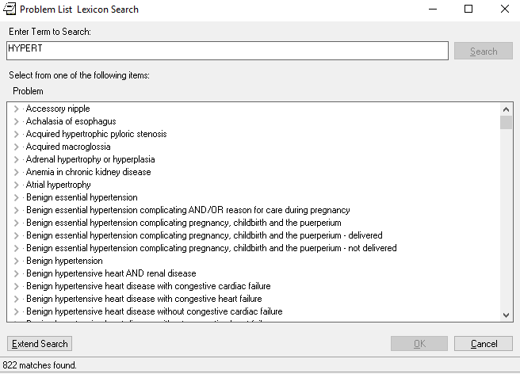
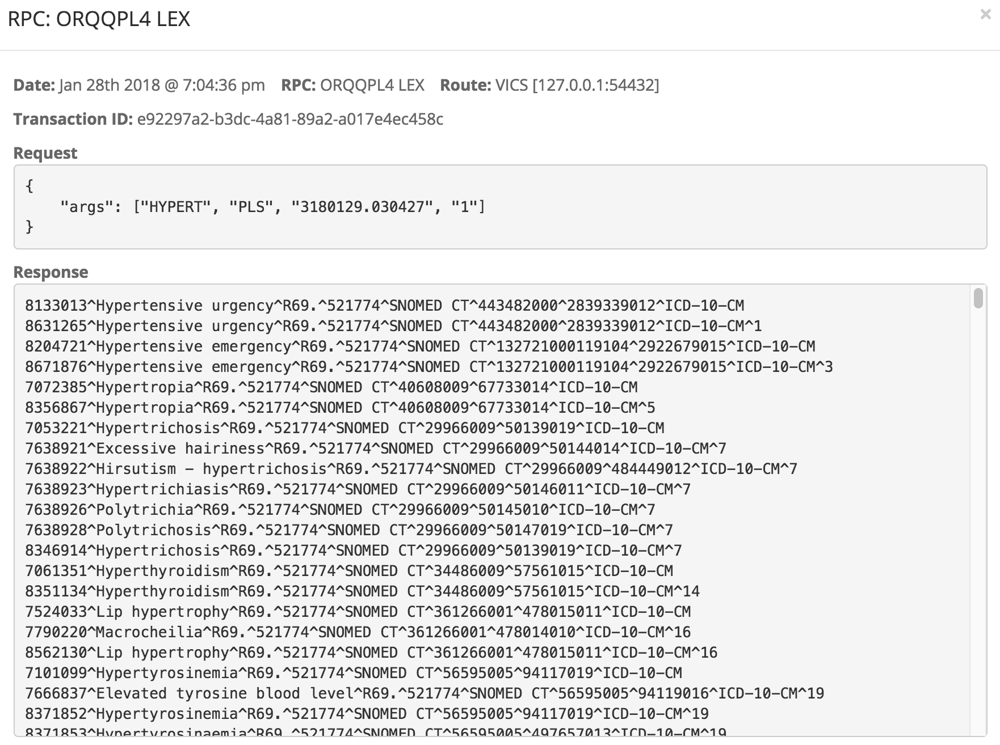
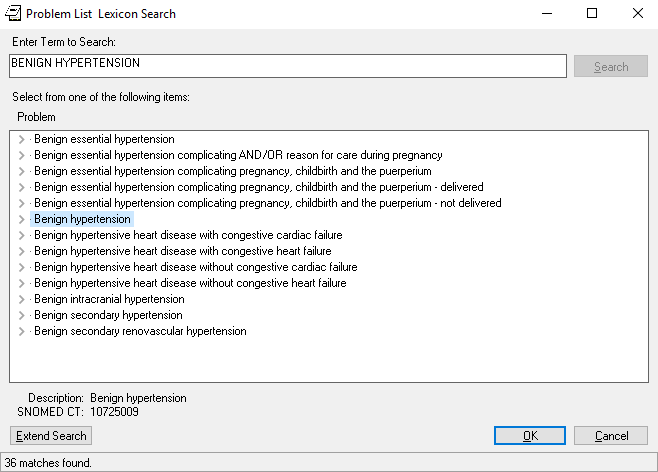
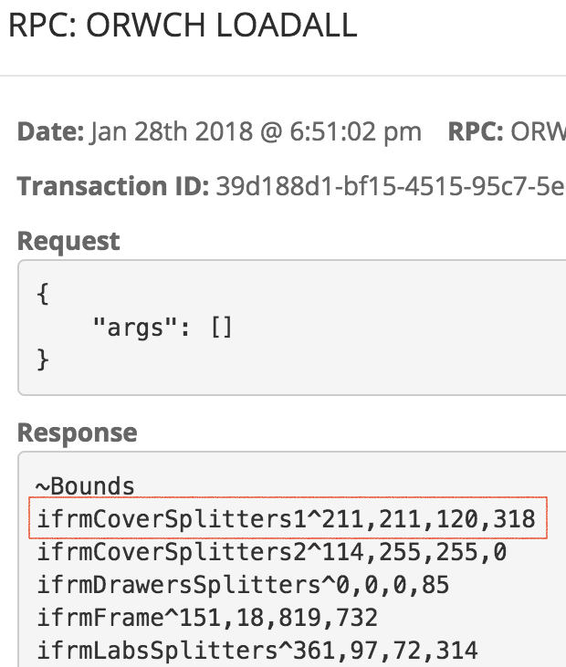

# VAM Build 1.1 Emulation Additions 

Emulation was added in four major areas:
  * Lexicon Terminology Search for problems and allergies
  * Division (hospital location) management and selection
  * User Preferences centralized through general-purpose parameter management
  * User Permissions (keys) as a key to further testing
  
In each case, an enterprise-wide offering replaces per VISTA functionality.
  
## Lexicon Search

In order to enter Problems or Allergies or Vitals, a physician must designate disorders, symptoms, allergens and vital signs from lists of medical terms. An EHR like VISTA provides a _Lexicon Service_ that allows physicians search terminologies using keywords, exact phrases and synonyms. 

Build 1.1 moved vital, problem and allergy terminology management to a VICS Lexicon Service.

Select the problem tab and choose _New Problem_ ...

and after selecting a clinic, you will be brought to a problem search dialog. Type in __Hypert__ and click _Search_ and you'll eventually see ...

If you were looking in the Router Management Client, you'd have seen that the VICS Server responded almost immediately to CPRS ...

The delay is CPRS's as it renders 822 matches. Note how the Lexicon Service both expanded the partial match "hypert" to "hypertension" and "hypertropia" but also pulled in terms such as "Excessive Hairiness". Like any _search engine_, the VISTA Lexicon, as emulated in VICS, uses synonyms and associated phrases to range beyond literal matching. 

__Note__: The VICS Lexicon is not a generic search - it __mimics exactly the algorithm followed in VISTA__. 

Let's be more precise. Type __Benign Hypertension__ in the search box and hit _Search_

and this time, CPRS responds quite quickly. 36 terms don't tax it.

The VICS Lexicon follows the algorithm and word indexing used in VISTA but re-implements it in a more efficient scheme. As a result, it over four times faster ...

In addition to Problem List Lookup, the VICS Lexicon also supports Allergin ("Peanuts") and Symptom ("Hives") search. In VISTA, these are implemented in distinct subsystems, each with their own approaches to phrase indexing and synonym handling - the approaches taken in Symptom Search are reflected in [these VICS Service Tests](https://github.com/vistadataproject/VICSServer/blob/master/services/tests/lookupSymptoms-spec.js). The VICS Service emulated these unique algorithms as upgradable __legacy terminology lookups__. VICS allows VA to maintain its multitude of Lexicon algorithms but provides for a move to one approach in the future.

All of this Lexicon Search is centralized in VICS - rather than updating and managing a variety of Lexicons in 130 separate VISTAs, VICS allows one Lexicon with clearly defined and tested behaviors to support the whole enterprise.

## Division Management and Selection

Most VISTAs support more than one facility or _division_. Typically there is one main center, a _VAMC_, and multiple clinics and other remote facilities. There is a default division for the system as a whole and users may have access to different sets of available divisions. The context of care varies depending on the division chosen.

CPRS uses two RPCs, _XUS DIVISION GET_ and _XUS DIVISION SET_ to list and choose divisions for users and these appear in the first set of RPCs it invokes ...

__Note__: in one scenario, _XUS DIVISION GET_ is actually a _set_, a behavior VICS had to support.

In build 1.1, VICS gained full support for _division management_ and full support for _XUS DIVISION_ RPCs ...

## User Preferences

In VISTA, parameters of all kinds are managed in one _Parameter Service_, an approach adopted in VICS. Build 1.1 added parameter setting to the support for retrieval provided in Build 1.

A simple parameter example is a user's preference for the layout of the CPRS coversheet. By default, the coversheet is arranged like this ...

This size of each of the boxes on the screen come from the RPC _ORWCH LOADALL_ ...

When the user resizes the screen to ...

the change will be set in _SAVEALL_ 

and reflected in _ORWCH LOADALL_ ...

and if you exit CPRS and the login again, you'll see that the preference has been persisted in VICS.

__Question__: why would a project focused on migrating Vitals, Allergies and Problems to national services be migrating user preferences and other parameter settings? 

__Answer__: VICS provides one flexible Parameter Service to enable testing and implement required RPCs.

> Vitals are configured using parameters and the Vital Domain RPCs, _GMV PARAMETER_ and _GMV MANAGER_, both emulated in Build 1.1, are built over a generic and powerful parameter service in VISTA and VICS required an equivalent. The difficult part was emulating the power of the service as seen in the Vitals RPCs but once made, it became trivial to emulate other parameter-bound RPCs such as _ORWCH LOADALL_ and _SAVEALL_. 
>
> This illustrates an underlying aspect of the VICS Architecture: __VICS has many less services and service calls than the number of CPRS RPCs it supports__. The most significant work is implementing a generic service such as Lexicon or Parameter - the RPC emulation itself becomes much less onerous once that service is in place.

Moving user preferences from VISTA to VICS would mean retiring a subsystem of VISTA and centralized preference management across the enterprise. And such preferences are just the beginning - user permissions (see the discussion of keys below) and demographics may also be centralized using the VICS pattern. In effect, the _VISTA User_ can become an enterprise-wide concept, unbound from individual VISTAs.

## User Permissions

To decide what to present to a user, CPRS asks VISTA whether that user has a _key_. It's a common request ...

with a simple yes/no, 1 or 0 answer ...

and, typical of VISTA, there are variations of _has key_ RPCs ...

but in VICS, all such variants reduce to one _hasKey_ service call.

While __testing was the major motivation for moving key management to VICS__ - changing keys effect CPRS behaviors and changing keys in VICS will be significantly easier than manipulating VISTA structures - the implication of this move is much broader. It shows that VA could centralize user permission management.