# _Build Web 1_ Demo (February 15th, 2018)

The following demonstrates [1] the basic functionality and layout of the _VICS Client_ and [2] shows basic CPRS interaction with the Web Client. 

It employs [a] a _"nodeVISTA"_ which supports a REST interface for Patient data access and entry, [b] a Web Service which implements basic meta-data services and proxies to _nodeVISTA_ for Patient Data, [c] the VICS Web Client and [d] CPRS. This collection of components are housed on a cloud-based VM. 

__INSERT DIAGRAM__

Specifically it shows how the client allows a Physician to:
  1. Log in
  2. Choose a Patient and seeing basic demographics
  3. Add an additional widget (Vitals) to the coversheet
  4. View summaries of a Patient's Vitals, Allergies and Problems
  5. Enter a new Allergy
     * Search Allergins
     * Enter specific allergy information
  6. Review details of the entered Allergy
  7. Login to CPRS and view this newly entered Allergy
  8. Return to the Web Client and remove the Allergy by marking it as _entered in error_ 

Image ClientLogin ...

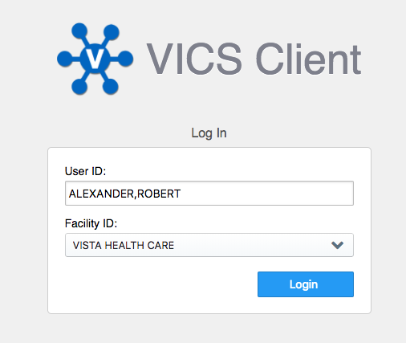

Image PatientSelectionPlain ...

Image PatientSelectionSearchCSelectDCSeeDemo ...

Image PatientMainSummaryTitleTwoWidgets ...

Image ActionsAddThreeWidgets ...

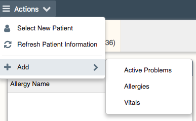

Image PatientMainSummaryThreeWidgets ...

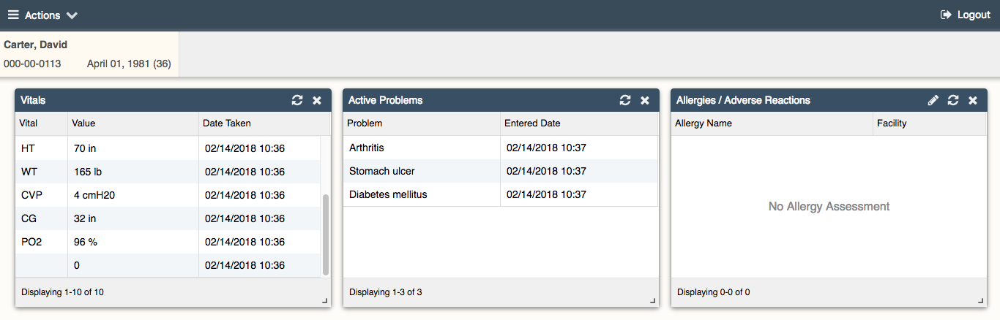

Image AllergiesWidgetEmpty ...

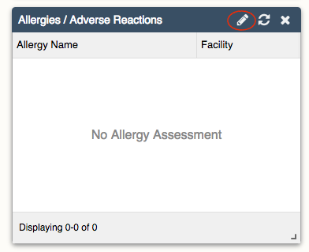

Image AllergyEnterSearchEmpty ...

Image AllergyEnterSearchChoc ...

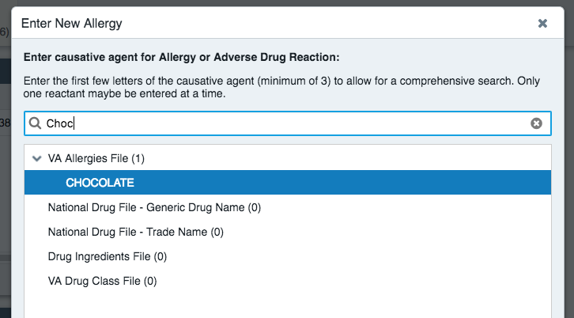

Image AllergyEnterChocolateFilled ...

Image AllergiesWidgetChocolateEntry ...

Image AllergyDetailChocolate ...

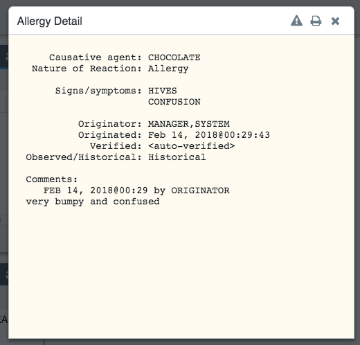

Image AllergyDetailPintButton ...

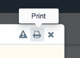

Image AllergyDetailsEnterInErrorButton ...

Image AllergyEnterInErrorReason ...

Image AllergiesWidgetEmpty ...

## CPRS Part (Backup)

AllergyEnterDetails ...

AllergyEnterSearch ...

AllergyEnterSearchCho ...

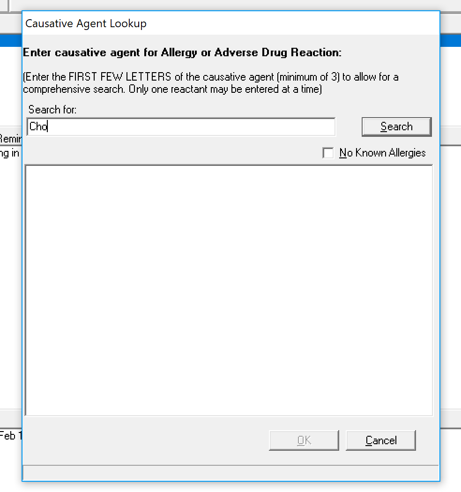

AllergyEnterSearchChoEnter ...

Coversheet ...

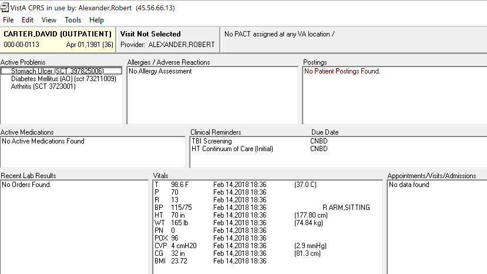

CoversheetProblemWidgetThree ...

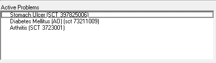

CoversheetVitalsWidgetMany ...

MainThree ...

MainTwoColumns ...

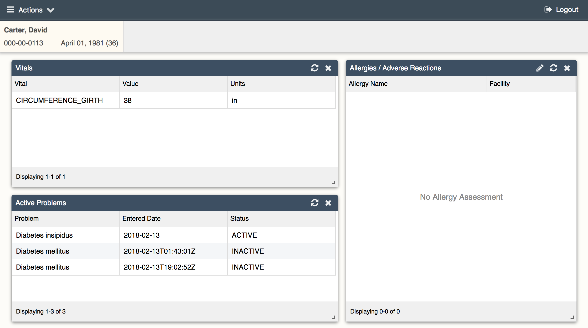

PatientCoversheetAllergyOptions ...

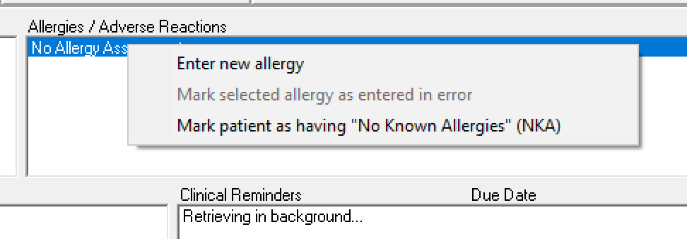

PatientSelectionChoice ...

PatientSelectionNoChoice ...

ProblemDetailPopup ...

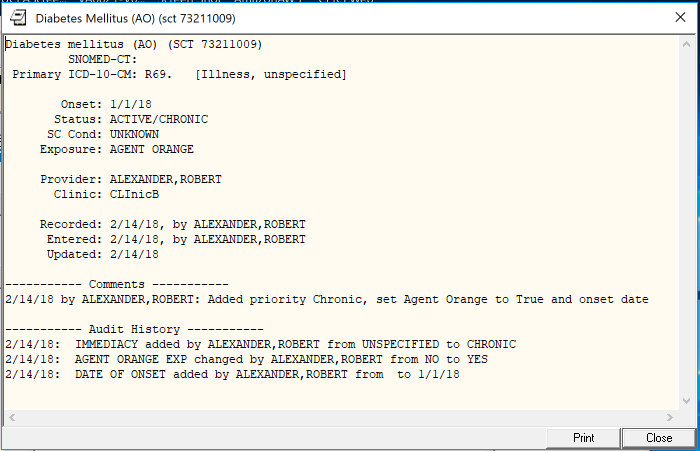

VitalsAndProblemsWidgets ...

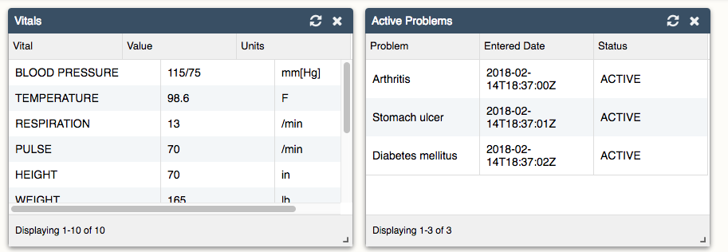

