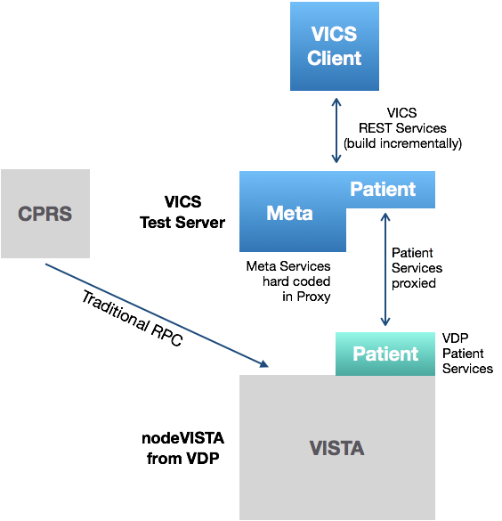

## Build Web 1 (of 3) (February 15th, 2018)

The VICS Client [a] establishes an open source, industry-standard development framework for clinical and non clinical, web-based VICS clients, [b] demonstrates that such clients can operate seemlessly along side CPRS and [c] shows that VICS _directly enables_ clients with cross VA as opposed to per-VISTA scope.

This Web Client will cover all the relevant functionality of CPRS in a web-friendly form and deliver modern visual motifs and features missing from CPRS such as auto-complete in search dialogs and ease of personalization.

VAM has three _PDE Clinical Web Client_ (_"VICS Client"_) releases:

Release | Name | Content | Due
--- | --- | --- | ---
W1 | Establish | [a] Basic GUI Component Framework, [b] __Subset of CPRS__, [c] against __nodeVISTA__ (from VDP) | February 18
W2 | CPRS Coverage Complete | [a] __CPRS-compatible and equivalent__ Client for User, Division, Patient and three PDE domains, [b] __VICS for Meta Data__ | May 18
W3 | Scalable National Client | [a] __VICS for all Data__, [b] All CPRS interaction scenarios (locking), [c] Cross VA, national client (VICS station #), [d] AWS deployment, [e] Proven scalability | August 18

__Development__: the client uses the popular React.js framework and, like the VICS Server, is being developed in open gits:
  * [React.js](https://reactjs.org/)
  * Development Gits: (note: due to move to own git in W2)
    * [VAM Client](https://github.com/vistadataproject/nodeVISTAClients/tree/master/vam-client)
    * [VAM Proxy Server](https://github.com/vistadataproject/nodeVISTAClients/tree/master/vam-server)

__Demo__: 

Both the VICS Server and Client are being developed in parallel. The focus of the first two builds of VICS Server is RPC Emulation to provide CPRS support. It will not gain REST services until its third build. 

So VICS Client development depends on a lightweight _VICS Test Server_ which [1] proxies Patient service calls to a set of in-VISTA services developed during the VISTA Data Project and hard coded, simple versions of the Meta Services scheduled to be fully supported by the VICS Server in its Build 3. This ligthweight _VICS Test Server_ allows development of the basic framework and functionality of the VICS Client independent of VICS Server development. 

Starting with Meta Services, as VICS Server support for REST increases, the client will migrate from this test server to VICS Server proper with its fuller datasets and behaviors.  

See [demo](demo/)

