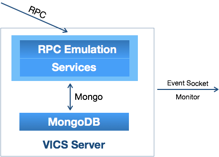
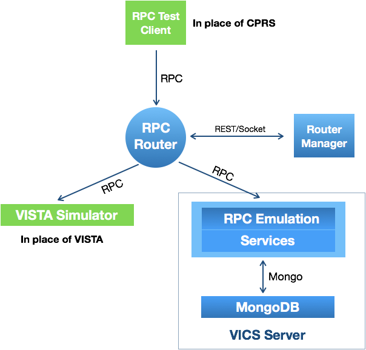

_Build 2_ finished the emulation planned for VAM's IOC. Together with Build 1, Build 2 [1] established the VICS Architecture and, as seen in the [feature demonstation](demo) [2] completed planned migration of CPRS traffic from VISTA to that architecture.  

__Build 3__ will focus __beyond emulation__ and establish that __VICS is demonstrably better__ at delivering _VISTA Level Services_ than "Legacy" VISTA itself. 

The following lists the features of VICS. All will be improved or established and be __fully manageable and demonstrable in Build 3__. 

\# | Area | Feature | vs VISTA
--- | --- | --- | ---
1. | __Current Clients continue__ | CPRS runs unchanged over "RPC Emulation" | Same behavior as "Legacy VISTA" __Build 1/2 Focus__
2. | __Web Clients supported__ | REST support for Web Clients | VISTA only has an RPC interface - __building VICS Web Client__
3. | __Robust, Secure, Audited Interfacing__ | [1] Patient level Security, [2] Negative Tested, [3] Patient vs Meta Data Audits | VISTA doesn't lock patients, expects "good behavior", (in practice) doesn't audit
4. | __"Proper" Cloud deployment__ | Fully decoupled components in AWS | Even in a Cloud, VISTA would be one solid "block" - VICS will consist of a series of _containers_
5. | __Known Scalability__ | Known User capacity/ resource needs and clear Locking | What is the user/resource capacity of a VISTA? VICS will have precise answers
6. | __National Footprint__ | Centralizing data from 130 VISTAs | VICS will provide [1] centralized and normalized meta services and [2] handling patient data from more than one (local) VISTA
7. | __Extensible__ | Straightforward to add new services | Though VISTA has namespaces, code is still intermixed based on non-automated, hard to maintain "interface agreements"
8. | __Mainstream Data Access__ | Modern Data Storage accessible to modern tools and applications | VISTA data is locked in proprietaty FileMan - VICS puts data in Mongo/AWS
9. | __Full Interoperability__ | Clearly documented, Master Veteran Data Model | Allows VA data to be integrated with others without loss of fidelity
10. | __Known, Tested Functionity__ | Tests (and test data) for all of VISTA's largely undocumented nuance | VISTA has many under or undocumented features 

__Build 3's progress won't be measured in emulation numbers. Tuesday reports will be granular__ - examples will include "Negative tests for the Allergy Service", "REST interface for Lexicon", "Analysis of Palo Alto Problem Data", "Locking problem service by Patient", "Monitor Events supported in VICS".  

The VICS Server's Build 3 12 weeks (6 sprints) - delivery Mid June - will break into three stages outlined in this table ...

Stage | Contents
--- | ---
"Roughage" | Packaging (Docker to AWS), Test tool expansion, First Clone Analysis, Service restructuring, Negative Tests, Cheyenne
Web Client Server Support | REST interface, Necessary Service alignment, Interplay (locking ...) with CPRS, Server Maintenance Release, Palo Alto
Full Feature Demonstrability | All documentation and components (including clients/views) required to fully demonstrate __All VICS Features__

__Notes__:
  * VAM needs to also deliver a backward compatible VPR interface over VICS and a Pharmacy demonstration. Both of these non IOC requirements will be tackled in Build 4.
  * The Web Client's deliverable in mid May will also require a maintenance release of the VICS server
  * Locking will involve some new RPC emulation. The LOCK RPCs are easy to implement. The cross system behavior and locking design will take the most time.

Representative areas of work are described in more detail below.

## Locking Patients in a Robust Interface

VISTA doesn't enforce Patient Selection. A client can select a particular patient or fail to select any patient and still use RPCs to gather and change the records of any patient. VICS must enforce patient selection and lock subsequent client access to the selected patient. 

Here's a trace of VISTA permitting a call even when a Patient hasn't been cleared and selected for browsing, while VICS insists on a Patient being properly selected ...

VISTA ...

```text

>>> Sending RPC: GMV EXTRACT REC [ '25^3170207^^3170207' ]
    Raw Data: "[XWB]11302\u00051.108\u000fGMV EXTRACT REC5001925^3170207^^3170207f\u0004"


<<<Received
3^02/07/17@20:09   T:   98.6 F (37.0 C)  _ALEXANDER,ROBERT
2^02/07/17@20:09   P:   89  (RIGHT, AT REST) _ALEXANDER,ROBERT
1^02/07/17@20:09   B/P:   120/90  (SITTING, ADULT CUFF) _ALEXANDER,ROBERT
4^02/07/17@20:09   Ht:   64.00 in (162.56 cm)  _ALEXANDER,ROBERT
5^02/07/17@20:09   Wt:   175.00 lb (79.55 kg)  (ACTUAL) _ALEXANDER,ROBERT
       @20:09   Body Mass Index:   30.10*
```

VICS ...

```text

>>> Sending RPC: GMV EXTRACT REC [ '25^3170207^^3170207' ]
    Raw Data: "[XWB]11302\u00051.108\u000fGMV EXTRACT REC5001925^3170207^^3170207f\u0004"


<<<Received
Error: Security Alert: Unauthorized patient data access of urn:vista:6100:2:25 by user urn:vista:6100:200:63

```

This feature is not fully implemented yet but will be completed in Build 3. As it is added across services, progress will be reported in Tuesday's calls.

## Clone Data Analysis for Full VISTA Functional Coverage

In VAM, much of the work - using node.js, Mongo, AWS, Docker-packaging, Setting up regression and stress tests - is well understood software engineering that can draw on a huge volume of online guides and prior art and one of the major justifications for VAM is the move to such mainstream engineering and software in order to reduce the cost of maintenance. It's the nature of VISTA, an underspecified, under-tested older system, that __introduces the greatest unpredictability__. What behaviors [1] does it have and what are [2] still being used?

Consider Patient Selection Nuance ...

\# | MAS Parameter "Restrict" | User has SSN |  User has Key  | is Patient Sensitive | is Patient Employee | Result 
--- | --- | --- | --- | --- | --- | ---
1 | F   | T   | F   |  T  |  F  | Display warning message/require OK to continue
2 | F   | T   | T   |  T  |  F  | Display warning message
3 | F   | T   | F   |  F  |  F  | No display/action required. Not accessing own, employee, or sensitive record
4 | F   | T   | F   |  F  |  T  | Display warning message/require OK to continue
4e | F   | T   | F   |  F  |  T(e=p)  | Display warning message/require OK to continue
5 | F   | T   | T   |  F  |  T  | Display warning message/require OK to continue
5e | F   | T   | T   |  F  |  T(e=p)  | Display warning message/require OK to continue
6 | F   | T   | F   |  T  |  T  | Display warning message/require OK to continue
6e | F   | T   | F   |  T  |  T(e=p)  | Display warning message/require OK to continue
7 | F   | T   | T   |  F  |  F  | No display/action required
8 | F   | T   |  T  |  T  |  T  | Display warning message/require OK to continue
8e | F   | T   |  T  |  T  |  T(e=p)  | Display warning message/require OK to continue
9 | T   | T   |  F  |  F  |  F  | No display/action required
10 | T   | T   |  F  |  F  |  T  | Display warning message/require OK to continue
10e | T   | T   |  F  |  F  |  T(e=p)  | Display warning message/require OK to continue
11 | T   | T   |  F  |  T  |  F  | Display warning message/require OK to continue
12 | T   | T   |  F  |  T  |  T  | Display warning message/require OK to continue
12e | T   | T   |  F  |  T  |  T(e=p)  | Access to record denied Accessing own record
13 | T   | T   |  T  |  F  |  F  | No display/action required
14 | T   | T   |  T  |  F  |  T  | Display warning message/require OK to continue
14e | T   | T   |  T  |  F  |  T(e=p)  | Display warning message/require OK to continue
15 | T   | T   |  T  |  T  |  F  | Display warning message
16 | T   | T   |  T  |  T  |  T  | Display warning message/require OK to continue
16e | T   | T   |  T  |  T  |  T(e=p)  | Access to record denied Accessing own record

CPRS for employee access ...


CPRS for accessing restricted records ...


Until we perform __clone analysis__ (ex/ "Palo Alto Patient Selection Data Analysis"), we can't claim to have full, realistic data patterns in our tests. After analysis we will be __synthesizing appropriate test data__ and documenting its background. There will be a number of _nodeVISTA configurations_ and tests and documentation will back claims of full fidelity with even the most nuanced of VISTA behaviors.

In Tuesday calls, we'll report on [1] Clone VISTA analysis and [2] the tests created that draw on it.

## Service Pattern for Extensibility and Well-defined Testing

Current services follow a broad pattern. Take the Allergy Service where we already distinguish 

Area | Example 
--- | ---
Allergy Meta | [Lookup](https://github.com/vistadataproject/VICSServer/blob/master/services/allergyMetaService/lookupAllergySiteParams.js) 
Allergy Patient | [List](https://github.com/vistadataproject/VICSServer/blob/master/services/allergyService/listAllergies.js)
RPC Interface | [RPC List](https://github.com/vistadataproject/VICSServer/blob/925903989173e1eda37b5772691cc00910a72b81/emulation/models/orqqal-list.js)

and Build 3 will distinguish REST access. 

But we need to enhance in the following areas:
  1. Formalize Errors including boundary checking (negative testing)
  2. Mongo Efficiency (Aggregation Framework)
  3. Schema move from _Mongoose_ to standard [json schema](http://json-schema.org/) which is now native to Mongo and will enable enhanced Service documentation
  4. Establish VA FileMan identity for all Service objects (REQUIRE VICS Name Space)

and to fully document a __Service Pattern__ "cookbook" to follow for adding new VICS Services.

In Build 3 Tuesday reports, we'll report on progress in these and other _service implementation particulars_.

## Audit Every Interface Fully

In Build 2, the Router distinguishes _audit logs_ from basic _operational logs_ ...

```text
{"name":"audit","hostname":"addgene-ubuntu-1604-vbox","pid":1368,"level":30,"remoteAddress":"10.2.2.1:62958","rpcPacket":"[XWB]11302\u00051.108\u000bXUS AV CODE50019$a(M E{}RARE{}CD_/!f\u0004","msg":"RPC from client","time":"2018-03-17T04:09:17.536Z","v":0}
{"name":"audit","hostname":"addgene-ubuntu-1604-vbox","pid":1368,"level":30,"remoteAddress":"10.2.2.1:62958","rpcPacket":"[XWB]11302\u00051.108\u0011XUS GET USER INFO5\u0004","msg":"RPC from client","time":"2018-03-17T04:09:17.652Z","v":0}
{"name":"audit","hostname":"addgene-ubuntu-1604-vbox","pid":1368,"level":30,"remoteAddress":"10.2.2.1:62958","rpcPacket":"[XWB]11302\u00051.108\u0013XWB GET BROKER INFO5\u0004","msg":"RPC from client","time":"2018-03-17T04:09:17.671Z","v":0}
{"name":"audit","hostname":"addgene-ubuntu-1604-vbox","pid":1368,"level":30,"remoteAddress":"10.2.2.1:62958","rpcPacket":"[XWB]11302\u00051.108\u0010XUS DIVISION GET5\u0004","msg":"RPC from client","time":"2018-03-17T04:09:17.675Z","v":0}
...
```

The router also has a _web socket_ interface that reports all activity to clients. This is used by the _Router Manager_ and could be used by __a separate Monitoring Application__ which could generate warnings in real time and separately persist logs of all activity. This __decoupling of scalable auditing__ from the underlying VICS infrastructure represents a large addition to "VISTA" security. 

Currently, the Router does not know the difference between a Patient and Meta RPC and we will be adding this feature in build 3. It would allow separate treatment of less sensitive meta traffic and highly sensitive Patient traffic.



And auditing at the RPC level suffers from the opaque nature of RPC formats. We also need __auditing at the VICS service level and VICS Server lacks an Event socket interface. This is another feature we'll need to add in Build 3__.

## VICS Dataset Synchronization - Master Model for National Concept (Meta) Data

During Build 2, we normalized the Patient model during Service work. Meta data was normalized separately. Specifically, we normalized the Lexicon part of the model as seen in this inventory of the current nodeVISTA National Meta Data. This national "concept" data is __the same in all up-to-date VISTAs__. Note how _Concept_ is a NEW class (file) type from VAM, one requiring its own id in an _official name space_. It __will absorb more "concept" data in Build 3__ taking in Concepts not included in the VISTA Lexicon. This move to a normalized Concept meant refining the implementation of the Lexicon Service during Build 2 and further refinement will bring more changes during Build 3 ...

\# | Type | FMIds | Count
---|---|---|---
1 | __CONCEPT__ | 757_01, 757, 757_02, 757_2, 757_001 | 769,194
2 | NDC/UPN* | 50_67, 50_68 (Part) | 237,445
3 | ICD DIAGNOSIS | 80 | 87,716
4 | ICD OPERATION/PROCEDURE | 80_1 | 83,848
5 | VA PRODUCT | 50_68 | 27,766
6 | VA GENERIC | 50_6 | 5,177
7 | DRUG INGREDIENTS | 50_416 | 5,076
8 | PERSON CLASS | 8932_1 | 1,222
9 | GMR ALLERGIES | 120_82 | 797
10 | SIGN/SYMPTOMS | 120_83 | 591
11 | VA DRUG CLASS | 50_605 | 579
12 | GMRV VITAL QUALIFIER | 120_52 | 119
13 | EXCLUDED WORDS | 757_04 | 116
14 | CODING SYSTEMS | 757_03 | 36
15 | GMRV VITAL TYPE | 120_51 | 19
16 | NATURE OF ORDER | 100_02 | 12
17 | PARAMETER ENTITY | 8989_518 | 11
18 | SKIN TEST | 9999999_28 | 9
19 | GMRV VITAL CATEGORY | 120_53 | 6
20 | ICD CODING SYSTEMS | 80_4 | 4

Normalization will continue in Build 3 as we work towards a fully documented master data model for VISTA's National Meta Data.
 
More details are in [this full report](vicsMetaDatasetSamplePlan).

Changes in the data model will be reported in Tuesday's calls.

## Know scaling with RPC Test Tools

In addition to the current _Continuous Integration Test Server_, there needs to be a thorough test of VICS' scaling. While there are a number of _node.js_ and other _HTTP_ interface testers, we also need specific ways to test the scaling of RPC interfaces both for volume of traffic and interleaving users.

We began some tools in build 3 including the simple RPC client tool seen in the [Build 2 feature demonstration](demo) and a separate tool for interleaving traffic from multiple users ...

```text
>>> Sending greeting TCPConnect
    Raw Data: "[XWB]10304\nTCPConnect5001010.2.2.222f00010f001010.2.2.222f\u0004"
<<<Received
accept
>>> Sending RPC: XUS SIGNON SETUP [ '"!|X|v|ZX|[ZvXivXv&E|[i\'E\'\'[[E|ZEJ[v&iZ&&|XJJX*' ]
    Raw Data: "[XWB]11302\u00051.108\u0010XUS SIGNON SETUP50047\"!|X|v|ZX|[ZvXivXv&E|[i'E''[[E|ZEJ[v&iZ&&|XJJX*f\u0004"
<<<Received
addgene-ubuntu-1604-vbox
PLA
PLA
0
5
0
DEMO.NODEVISTA.ORG
0
```

In build 3, these test tools need to be expanded to allow full testing of different __RPC sequences__ and __server scaling__. The tools will include a self-contained __VISTA Simulator__ to act as a VISTA for RPCs not emulated in the VICS Server such as the login RPCs. Such a "sink" will allow full remote testing of VICS and the Router in isolation of VISTA itself. VICS components could then be fully tested in AWS in isolation of VISTA.



[1] Test Tool development, [2] RPC "sequence development" and [3] scaling numbers will be reported in Tuesday's calls.

