Using CPRS (v1.0.31.116) and the (latest but last-planned) [Vagrant-based installation](https://github.com/vistadataproject/VICSServer/tree/master/setup#vagrant-vm-image) of VICS, the following describes the new features introduced or improved in Build 2's _VICS Server_ and _Router_.

Highlights:
  * 143 RPCs now emulated in VICS 
  * Router tracks both Clients and Users
  * Patient RPC support was added for Patient Demographics, Allergy, Problem and Vitals
    * VICS holds the master copy of (part of) a Patient's record
    * many RPCs reduce to the same service calls
  * VICS-VISTA Synchronization for both Meta and Patient _Change RPCs_

__Note__: this is not a tutorial on running VICS or the Router or CPRS in a VICS/VISTA environment, nor is it a full enumeration of all VICS functionality. It highlights additions and changes made in Build 2.

## 143 RPCs Emulated in VICS  

The Router Manager's Management Tab now shows 143 Emulated RPCs, up from 101 in Build 1.1 ...


## Router tracks Clients and Users

All clients and end users of the RPC interface are tracked by the Router. Client tracking starts as soon as a CPRS connects ...

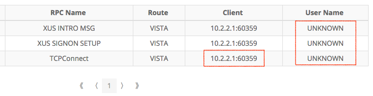

After login, the Router knows an end user's identity ...

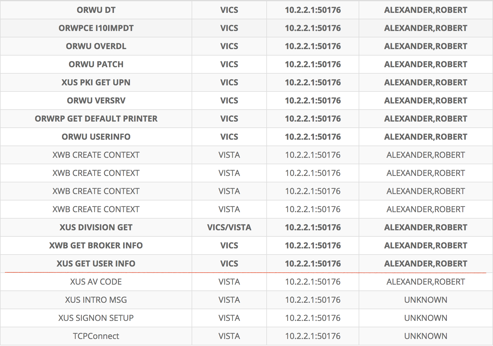

__Note__: user login is also the point at which the Router connects to VICS.

## VICS-VISTA Data Synchronization - Meta

Pre-patient selection traffic concerns meta data and most are read-only RPCs that can be fully redirected from VISTA to VICS by the RPC Router. But there are two _Change RPCs_ which alter meta data. __Such _Change RPCs_ introduce a VICS-VISTA Synchronization Requirement__ and must be sent to __both VICS and VISTA__ to update the data in both systems and keep both in sync.

Despite its name, _XUS DIVISION GET_ may set the active location of the logged in user ...

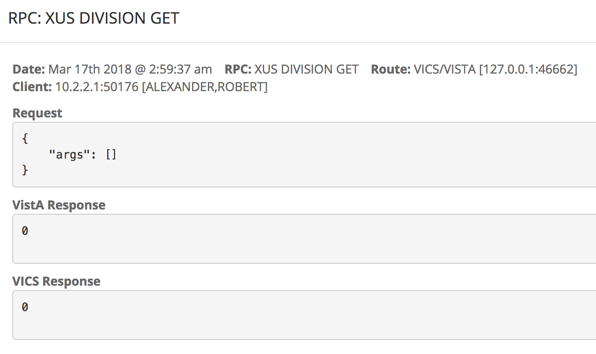

and as a result, this RPC is sent to both VISTA and VICS to ensure they keep in sync.

_ORWORB SETSORT_ is the only other _Change RPC_ in this first sequence ... 

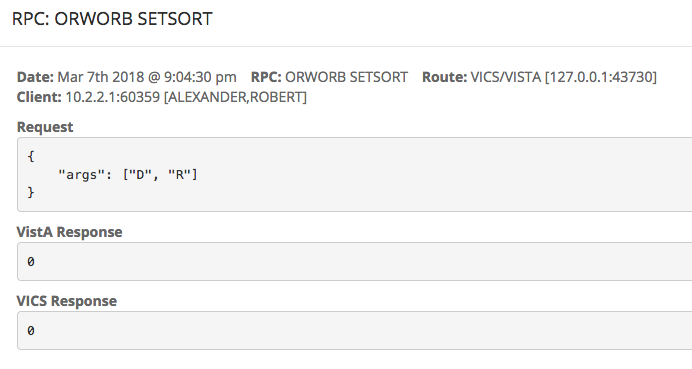

It is one of a series of RPCs that store CPRS configuration information in VISTA and that don't effect the operation of VISTA itself. If we later choose to move CPRS configuration out of VISTA, Change RPCs like this would become _VICS Only_.

## VICS, not VISTA owns (a part of) the Patient Record

Back in CPRS, select patient DAVID CARTER. CPRS goes to its Coversheet ...


The Coversheet shows that this patient has an empty record except for Clinical Reminders calculated by VISTA from demographic and service data. In addition to _User Identification_ and _Patient Selection_, Build 2 (and VAM Year 1) covers the functionality of the red boxes and the popups that can be launched from them.

The router shows a series of patient data fetches that CPRS uses to fill this coversheet.

Patient identity and basic details ...

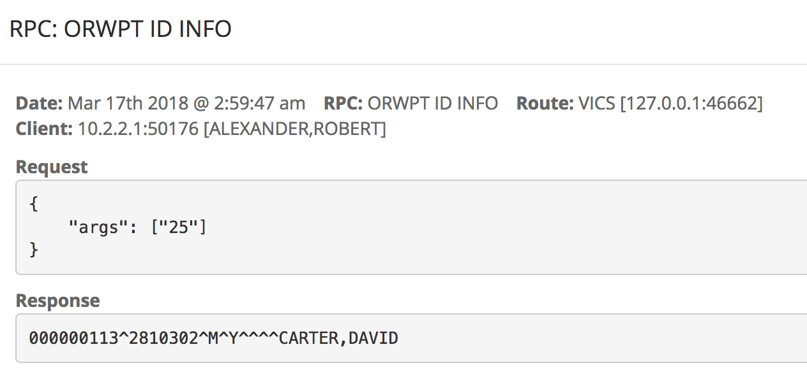

Allergies ...

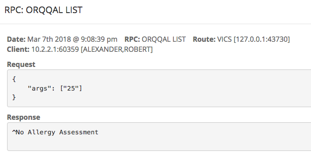

Vitals ...

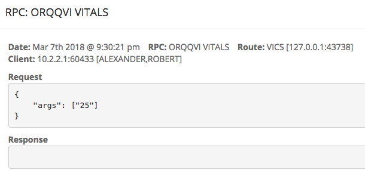

and Problems ...

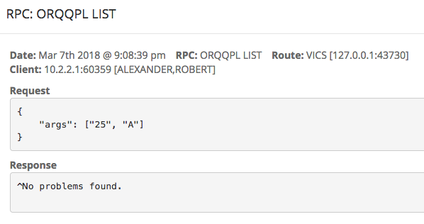

With Build 2's addition of Patient RPC support, the data from these clinical domains now come from VICS. It's important to remember that the same information is also in VISTA but __VICS now holds the master copy of this portion of the Patient's record__ for CPRS (and new clients).

__Note:__ Currently both Patient and Meta Data are on one Database. They could be distinguished in a future build, both for security reasons and because their size and lifecycles are very different.

## More Patient Demographics in VICS

As shown in these RPCs, VICS now holds patient lists ...

      

patient details ...


and Veteran Specific information ...

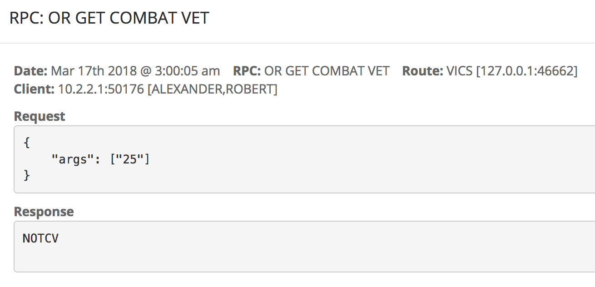

## VICS-VISTA Data Synchronization - Patient (Allergy)

Add an Allergy using CPRS ...

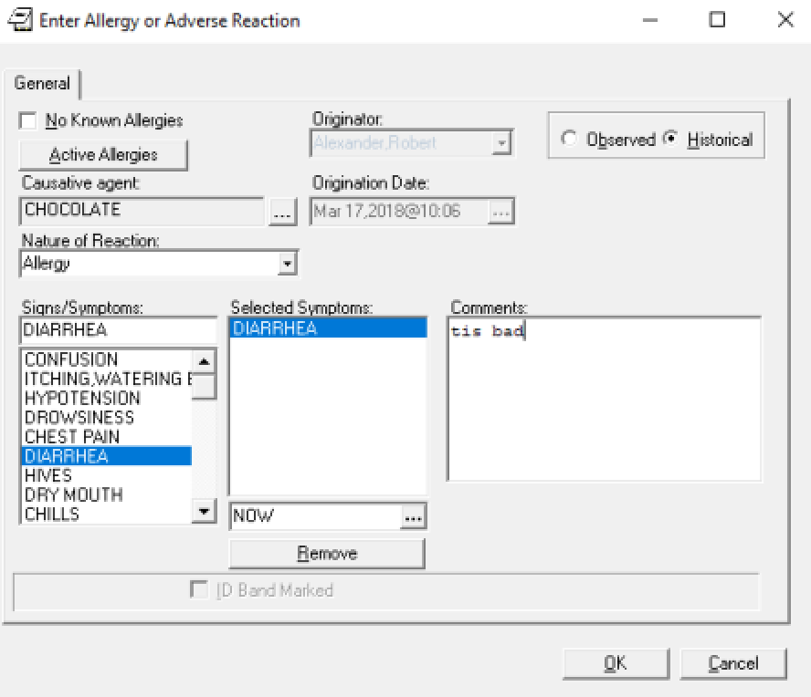

and the Router Manager shows ...


This is a _Change RPC_ that is sent to both VISTA and VICS. Though __VICS now holds the master copy of this Patient's allergies__, VISTA still requires the information for non VICS transferred domains such as Reminder Dialogs. The _Rambler_ client can confirm that the Allergy was synchronized to VISTA ...

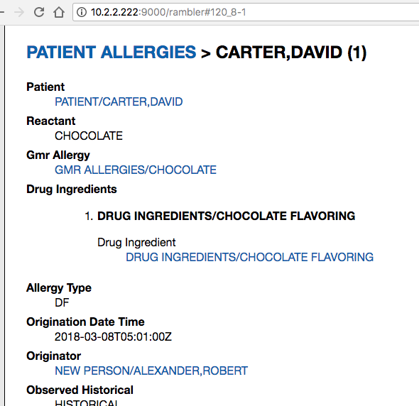

And the _Mongo Shell_ shows the same data in VICS ...


__Note__: until the _VICS Web Client_ displays VICS Data, the Mongo Shell is the easiest way to "visualize" the data in VICS.

## More on VICS as Master of the Patient Record

The router also shows _ORQQAL LIST_ RPC ("list allergies") ...

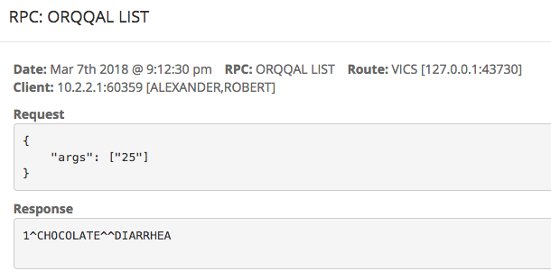

which is automatically sent by CPRS after the allergy was added.

Selecting that Allergy in CPRS brings up ...


for which Router shows ...

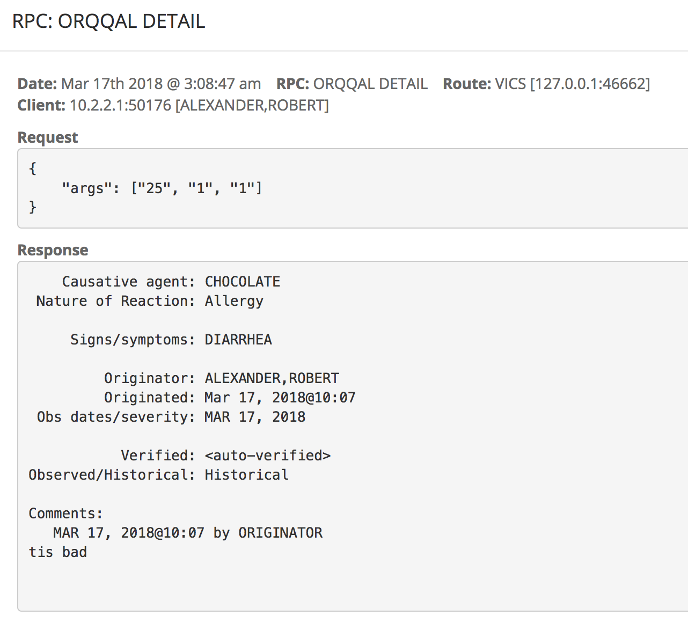

Unlike _SAVE_, _LIST_ and _DETAILS_ come exclusively from VICS in its role as the maintainer of the master copy of the Patient's Record.

## Many RPCs, Same Service

Back in CPRS, choose _Enter in Error_ ...


This choice kicks off a sequence of RPCs. Among the repeated calls to get the time, there is only one RPC requiring synchronization ...

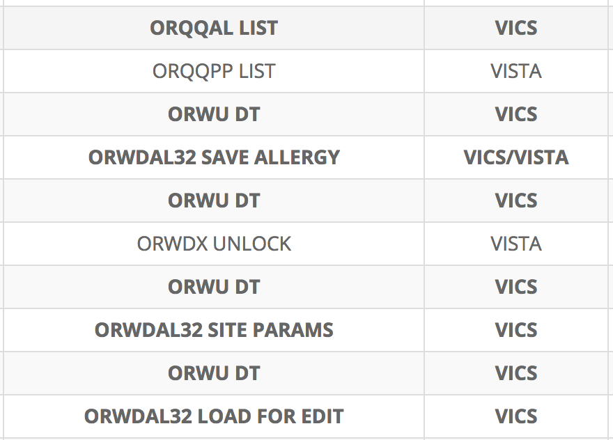

Take note of _ORWDAL32 LOAD FOR EDIT_, another READ RPC, resolved in VICS ...


For VICS, despite its cryptic format, it reduces to the same _describeAllergy_ service call used for the _ORQQAL DETAIL_ RPC called above. The designers of VISTA and CPRS decided to make VISTA reformat the same data in different ways on behalf of CPRS and this means __many RPCs reduce to the same service calls in VICS__. 

## Support for all Allergy Function

Back in CPRS, fill in the entered-in-error popup ...

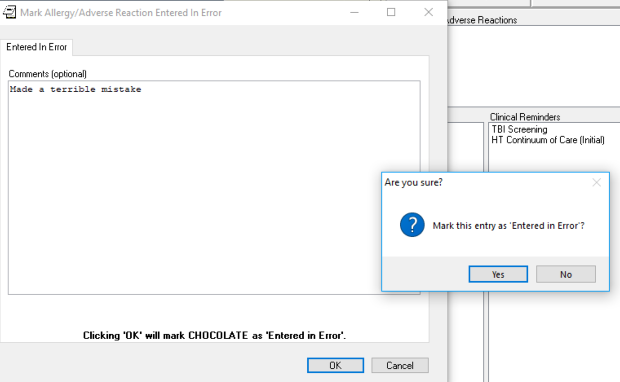

The router shows ...

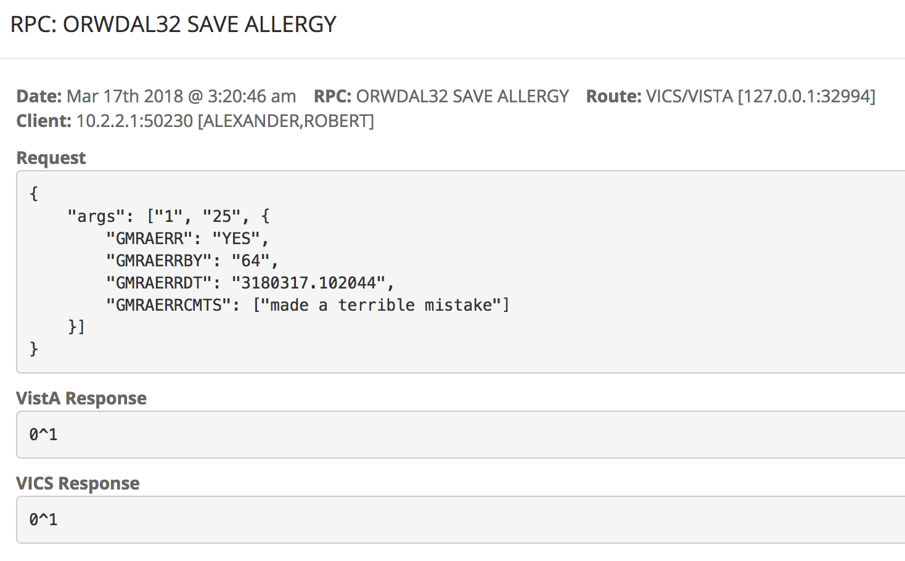

and back in CPRS, the allergy panel notes that the patient now has no allergy assessment ...

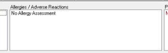

This confirmation comes from another call to the VICS-only, list allergy RPC ...

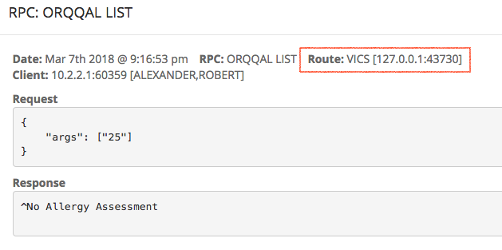

Finally, use CPRS to state that the patient has _no known allergies_ (NKA) ...


This change is reflected in the coversheet ...


In the router, we see a third variation of _ORWDAL32 SAVE ALLERGY_ was used to set no known allergy ...

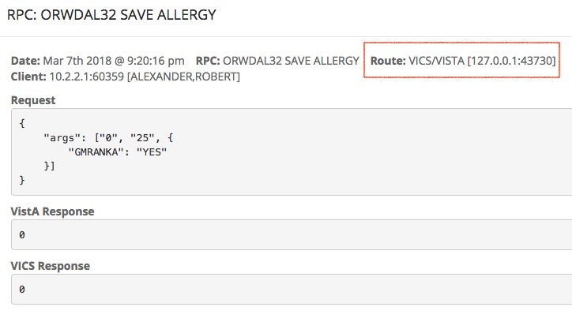

and that CPRS sent the VICS-sourced _ORQQAL LIST_ again to refresh its coversheet ...

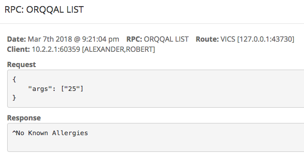

## Vitals and Other RPC Clients 

At this stage there are NO Vitals in CPRS ...

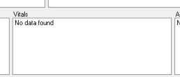

Rather than use CPRS, run a VICS Vitals Test Client to send all the RPCs used by CPRS from signon through login and vital creation and listing. It logins as _Mary Smith_ ...

```text
Connected to 10.2.2.222 on port 9011

...

<<<Received
65
0
0

0
0

Good morning SMITH,MARY
     You last signed on today at 02:03

...

>>> Sending RPC: ORWPT SELECT [ '25' ]

<<<Received
CARTER,DAVID^M^2810302^000000113^^^^^0^^0^0^^^37^0

...

>>> Sending RPC: GMV ADD VM [ '3180207.200921^25^1;120/90^10^65*51:109' ]

<<<Received

...

>>> Sending signoff

<<<Received
#BYE#

```

This test client uses the same RPC interface as CPRS and its traffic shows up in the Router Manager with the usual pre login and then login steps. Notice how this client's IP address and identified end user is different from CPRS's IP and user ...


In between grabbing meta data and reading patient vitals data, this client invoke two types of "dual routed" RPCs, first selecting the patient and then 
adding five new vitals using the _GMV ADD VM_ RPC ...

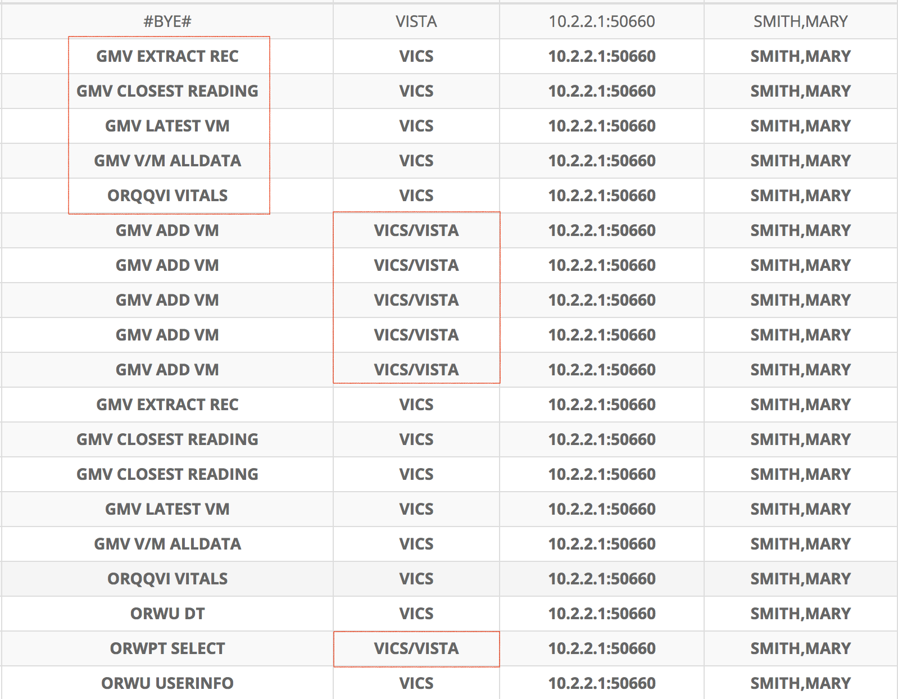

Notice the five _get vital RPCs_ highlighted in the top left ...

_GMV CLOSEST READING_ ...


_GMV EXTRACT REC_ ...

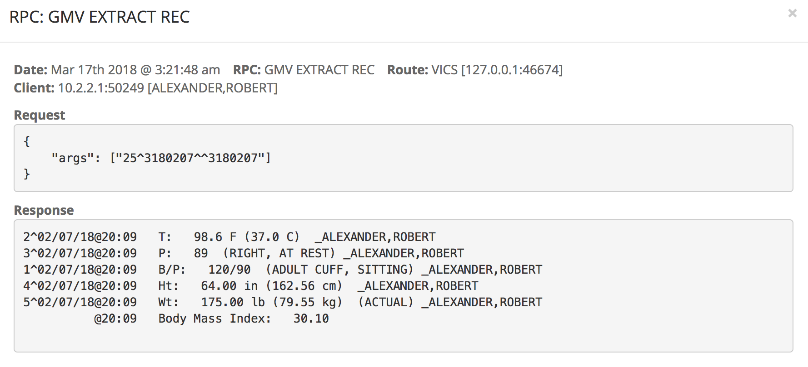

_GMV LATEST VM_ ...

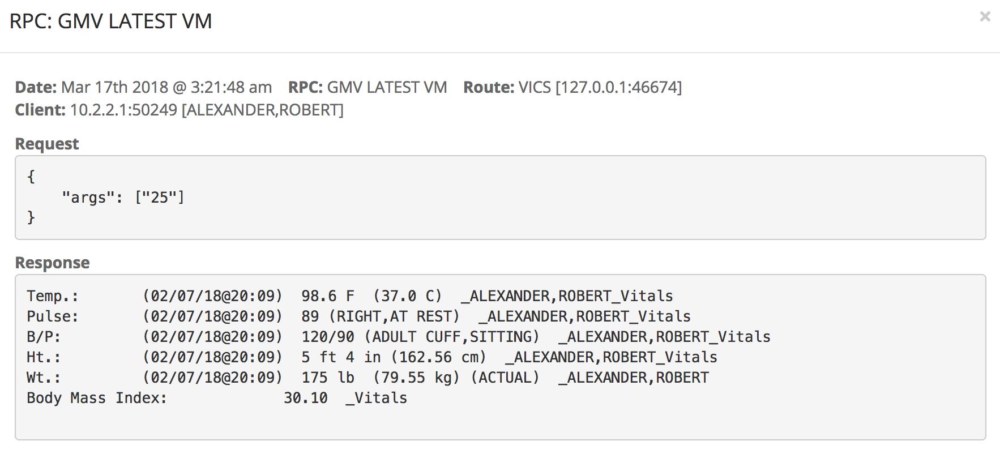

_ORQQVI VITALS_ ...


_GMV V/M ALLDATA_ ...

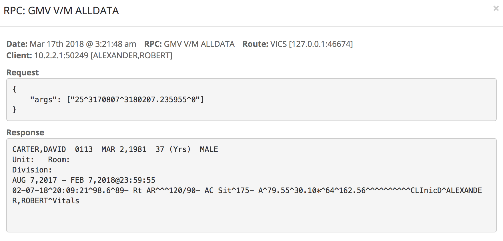

Each reduce to one of two different VICS service calls. This is another example of VISTA being asked to format data in precise ways for CPRS, something most clients would do themselves.

These five clearly show that both VISTA and VICS have new vitals data and during all this activity Robert Alexander's CPRS is still logged on. But despite the addition, CPRS still has _No data found_ for vitals ...


This is because CPRS is not event-driven. It pulls data right after patient select and relies on its own activity to drive subsequent pulls. It needs to be manually refreshed ...


Refresh causes CPRS to retrieve the vitals from VICS giving the display ...

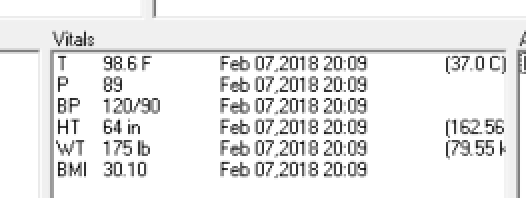
 
which as with Allergies and Problems, is data that comes not from VISTA but from VICS.

## Adding a Problem from Another Client

There is also a demo client for Problems. It logs in again as Robert Alexander (who is still logged in in CPRS) ...

```text
Connected to 10.2.2.222 on port 9011
>>> Sending greeting TCPConnect

<<<Received
accept

...

>>> Sending RPC: XUS AV CODE [ '$a(M E{}RARE{}CD_/!' ]

<<<Received
64
0
0

0
0

Good morning ALEXANDER,ROBERT
     You last signed on today at 02:15

...

>>> Sending RPC: ORQQPL4 LEX [ 'HYPERTENSION', 'PLS', '3170207.200701', '1' ]

<<<Received
7234857^FH: Hypertension^R69.^521774^SNOMED CT^160357008^249943016^ICD-10-CM
7726438^Family history of hypertension^R69.^521774^SNOMED CT^160357008^249942014^ICD-10-CM^1
8172586^Family history: Hypertension^R69.^521774^SNOMED CT^160357008^2666924010^ICD-10-CM^1
...
8670357^Hypertensive heart AND chronic kidney disease with congestive heart failure^R69.^521774^SNOMED CT^15781000119107^2985876012^ICD-10-CM^319
320 matches found

...

>>> Sending RPC: ORQQPL ADD SAVE [ '25^CARTER,DAVID^0113^',
  '64',
  '2957',
  { '1': 'GMPFLD(.01)="521774^R69."',
    '2': 'GMPFLD(.03)="3170207^Feb 07 2017"',
    '3': 'GMPFLD(.05)="^Hypertension"',
    '4': 'GMPFLD(.08)="3170207^Feb 07 2017"',
    '5': 'GMPFLD(.12)="A^ACTIVE"',
    '6': 'GMPFLD(.13)="^"',
    '7': 'GMPFLD(1.01)="7647488^Hypertension"',
    '8': 'GMPFLD(1.02)="P"',
    '9': 'GMPFLD(1.03)="63^ALEXANDER,ROBERT"',
    '10': 'GMPFLD(1.04)="63^ALEXANDER,ROBERT"',
    '11': 'GMPFLD(1.05)="63^Alexander,Robert"',
    '12': 'GMPFLD(1.06)="^"',
    '13': 'GMPFLD(1.07)="^"',
    '14': 'GMPFLD(1.08)="10^Clinicd"',
    '15': 'GMPFLD(1.09)="3170207^Feb 07 2017"',
    '16': 'GMPFLD(1.1)="^Unknown"',
    '17': 'GMPFLD(1.11)="0^NO"',
    '18': 'GMPFLD(1.12)="0^NO"',
    '19': 'GMPFLD(1.13)="0^NO"',
    '20': 'GMPFLD(1.14)="@^"',
    '21': 'GMPFLD(1.15)="0^NO"',
    '22': 'GMPFLD(1.16)="0^NO"',
    '23': 'GMPFLD(1.17)="0^NO"',
    '24': 'GMPFLD(1.18)="0^NO"',
    '25': 'GMPFLD(1.19)="^"',
    '26': 'GMPFLD(80001)="38341003^38341003"',
    '27': 'GMPFLD(80002)="64176011^64176011"',
    '28': 'GMPFLD(80101)="^"',
    '29': 'GMPFLD(80102)="^"',
    '30': 'GMPFLD(80201)="3170207^Feb 07 2017"',
    '31': 'GMPFLD(80202)="10D^ICD-10-CM"',
    '32': 'GMPFLD(10,"NEW",1)="a comment"',
    '33': 'GMPFLD(10,0)="1"' },
  'hypertension' ]

<<<Received
1

...

>>> Sending signoff
<<<Received
#BYE#
```

The Router Manager shows the RPCs invoked from login, patient selection, Problem addition and returning problem details ...

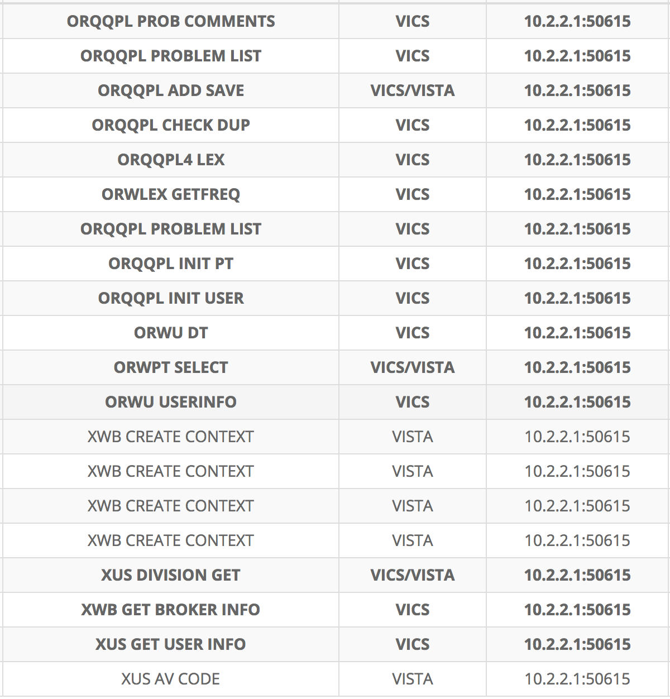

including Problem create ...

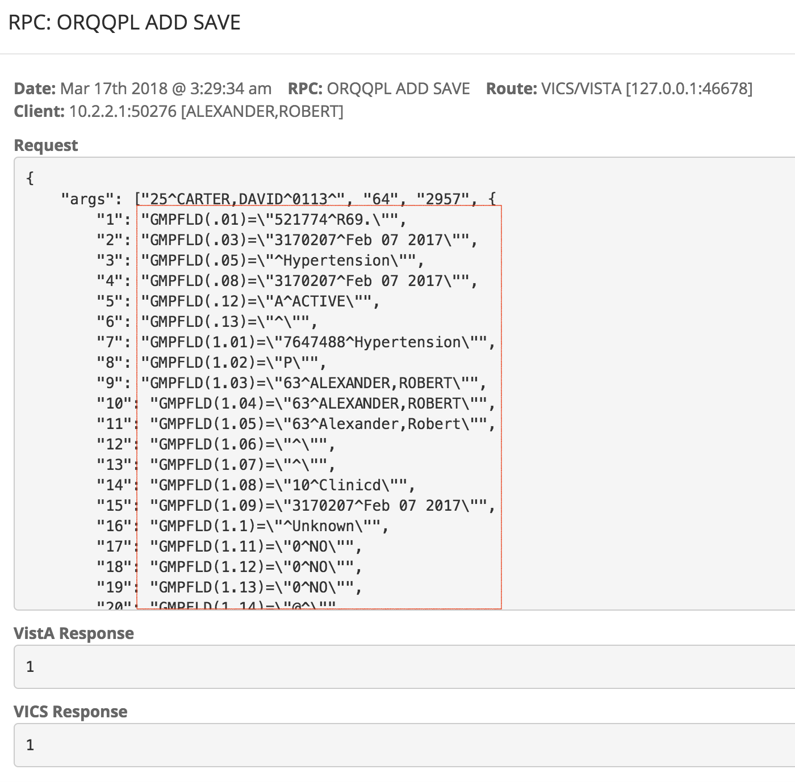

listing ...

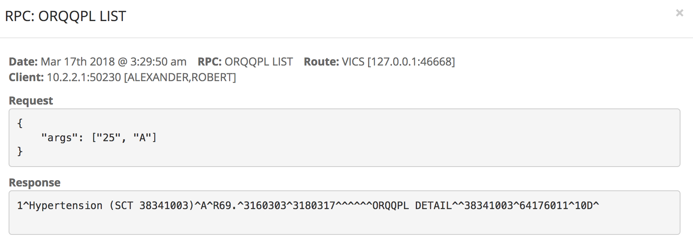

and details ...

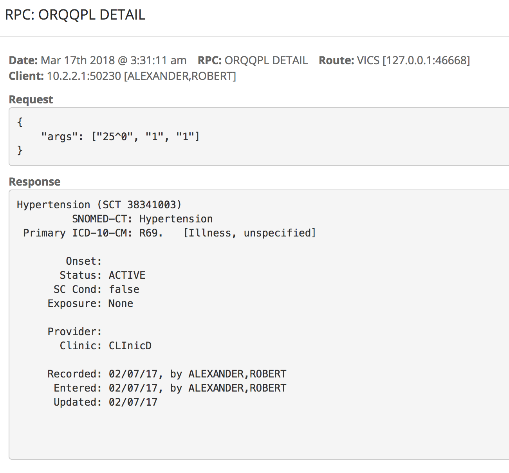

Once again, CPRS needs to be refreshed to see the problem ...

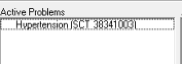

and that problem's details ...

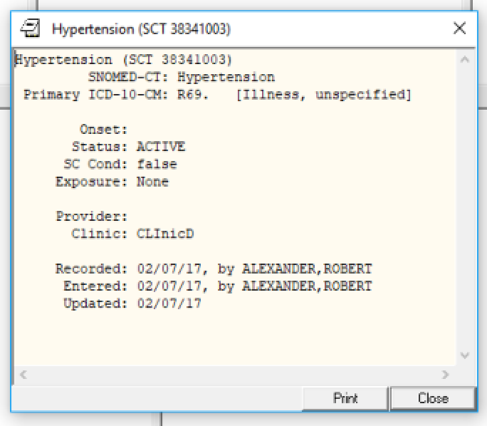


