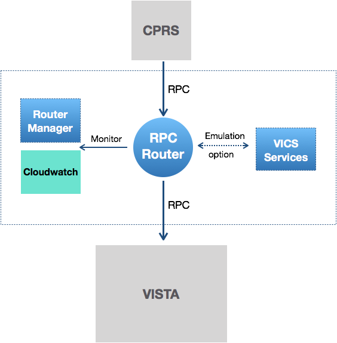
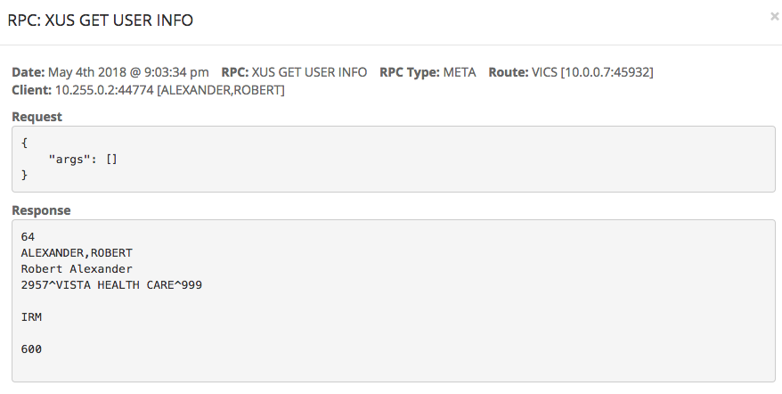
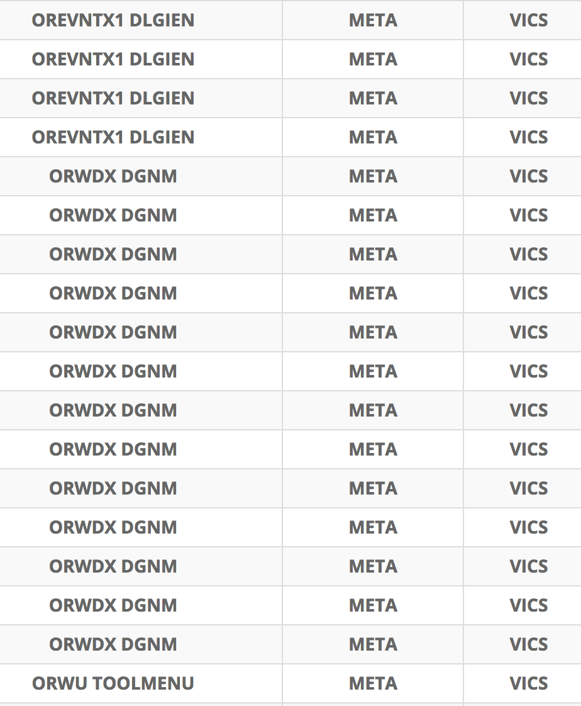
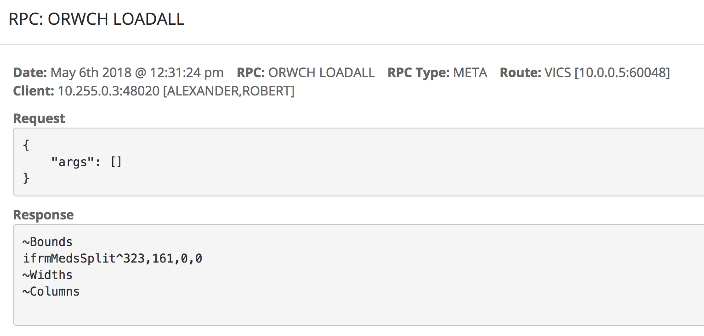
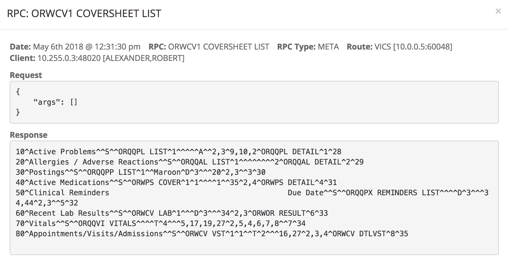
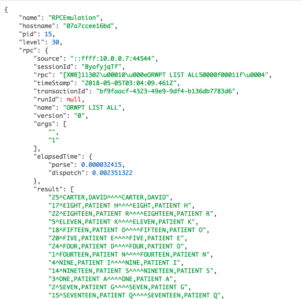
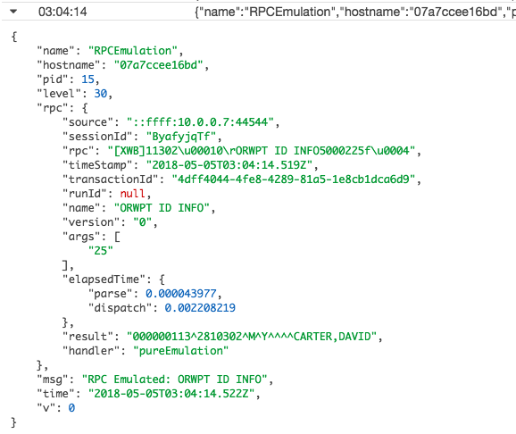
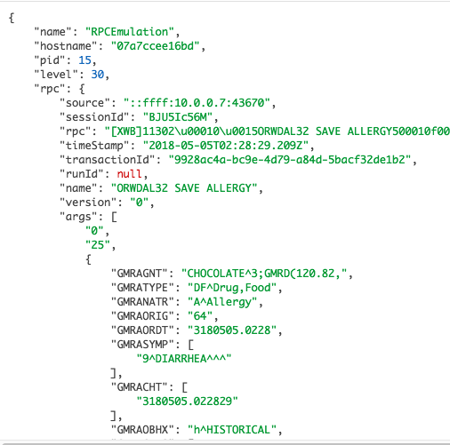

# VistA Adaptive Maintenance (VAM)

VAM uses straightforward off the shelf cloud services and micro-services for VistA Maintenance



... [1] monitoring and security and [2] an "emulation option" for RPC clients, facilitating the use of commerical cloud-based services for maintaining VistA

__Important__:
  * not a "new physician function" project - better, significantly more manageable execution of existing workflows 
  * two levels for "Emulation Option" - microservice(s) replace VistA function. [1] main focus is traffic efficiency and client speed; [2] the more ambitious is retiring and repackaging sections of VistA into a microservice architecture. 

VAM is in Build 3 (3/4 in Year 1). Build's 1 and 2 established basic functionality; Build's 3 and 4 are focused on patterns for __true__ cloud deployment - __Scalable, Microservices that take advantage of native cloud services__.

__Note__: all of the following is on public gits and available to anyone - there's no big bang release step. VAM is Public CI.

## This VAM Demonstration 

Behind the AWS Curtain ...

  * Setup using basic [AWS Demonstration Setup](https://github.com/vistadataproject/VAMDocker/wiki/Deploy-the-VAM-Demo-with-Docker-for-AWS) 
  * Cloudformation [Stack](https://us-west-1.console.aws.amazon.com/cloudformation/home?region=us-west-1#/stacks?filter=active)
  * [The two instances](https://us-west-1.console.aws.amazon.com/ec2/v2/home?region=us-west-1#Instances:sort=desc:dnsName)
  * See Public AWS Services in Shell ...
    * _ssh -i vam-demo-21.pem docker@13.56.181.159_
    * _docker service ls_

and all is also running locally on desktop (as fallback)

__Important__: while we will use Public AWS, we are active and testing in VAEC (GovCloud AWS): [See test servers in one subnet](https://console.amazonaws-us-gov.com/ec2/v2/home?region=us-gov-west-1#Instances:sort=instanceState)

Setup Browser Tabs ...

  * [Router Manager](http://vam-demo-external-c3cbkntv0cu8-1569201344.us-west-1.elb.amazonaws.com:9012/)
  * [CloudWatch](https://us-west-1.console.aws.amazon.com/cloudwatch/home?region=us-west-1#logs:) -- see tail end
  * [Rambler](http://vam-demo-external-c3cbkntv0cu8-1569201344.us-west-1.elb.amazonaws.com:9000/rambler#120_8) -- into AWS Allergy List

and CPRS pointed to the Router Load Balancer ...


## Models behind the Features 

  * RPC Models:
    * Patient
      * [ORQQPL DETAIL](https://github.com/vistadataproject/VICSServer/blob/master/emulation/models/orqqpl-detail.js#L20) - see READ, see Patient session (shouldn't be explicit as could change)
      * [ORQQPL ADD SAVE](https://github.com/vistadataproject/VICSServer/blob/master/emulation/models/orqqpl-add-save.js) - including [details not noted in current i/f file](https://github.com/vistadataproject/VICSServer/blob/master/emulation/models/orqqpl-add-save.js#L50)
    * Meta Get/Lookup: [ORQDAL32 ALLERGY MATCH](https://github.com/vistadataproject/VICSServer/blob/master/emulation/models/orwdal32-allergy-match.js) - META
    * Meta GET/SET
      * [orworb-setsort](https://github.com/vistadataproject/VICSServer/blob/master/emulation/models/orworb-setsort.js) - set SORT (META/CHANGE)
      * [orworb-get-sort](https://github.com/vistadataproject/VICSServer/blob/master/emulation/models/orworb-get-sort.js) - META/ PARAMETER / READ ie/ list parameters and files
  * [VICS Layered Model](https://github.com/vistadataproject/vicsDB/tree/master/JSONSchema)

... __distinguish Patient from Meta, National from Local, READ from CHANGE__.

... __we have NOT YET fully taken advantage of all the nuance available to us__.
  
## Points to see

__Note__: Variation of the [Build 2 Demo](http://vistaadaptivemaintenance.info/builds/build2/demo/)

__1. Router Manager shows how many RPCs are Emulated ("Emulation Option")__ 


... 143 RPCs that we emulate (VICS or VICS/VISTA). This number could be 0 or 10 or ... 

... __focus is CPRS efficiency (see volume below)__ but pattern could be for more

__2. Track User identity based on logins and session monitoring__ 

_User Name Unknown_ at first ...


and after login we know the user and user information is one of the items we emulated ... 



which shows we could centralize User Management.

__3. Meta that could move off VistA__ - the real focus

User Parameters, coversheet contents and sizes, order IENs, date time ... well over a hundred __over and over__ 

Example of repetition and small granularity ...



CPRS parameters ...



Cover in RM ...



__4. Patient Centralization Option__ 

see patient listing in the Router Manager ...


in cloud watch too ...



and see Patient ID info ...


which is also in cloud watch ...



... again could centralize patient lists

and see a series of basic Patient data retrievals showing no data right now ...


__5. Change: Save Allergy__

The search of Alergins is NATIONAL META DATA and __serving the lookup could move off VistA__


which is captured in Cloudwatch too ...



and see in FMQL/VistA too ...


__6. Vitals off Shell__ w/ Mary Smith

> node vitalsDemoClient.js (/Users/conordowling/Caregraf/vistadataproject/VICSServer/remoteTestCD)

```shell
Connected to 10.2.2.222 on port 9011

...

<<<Received
65
0
0

0
0

Good morning SMITH,MARY
     You last signed on today at 02:03

...

>>> Sending RPC: ORWPT SELECT [ '25' ]

<<<Received
CARTER,DAVID^M^2810302^000000113^^^^^0^^0^0^^^37^0

...

>>> Sending RPC: GMV ADD VM [ '3180207.200921^25^1;120/90^10^65*51:109' ]

<<<Received

...

>>> Sending signoff

<<<Received
#BYE#
```

and __different variations of Vital GETS__, again inefficiency that could be smoothed out.

And Refresh in CPRS.

__7. See Problem List Lookup__

The _Hypert size_ ... CPRS rendering but also traffic.

## Extras
 
   * REM: local IP - ipconfig getifaddr en0
