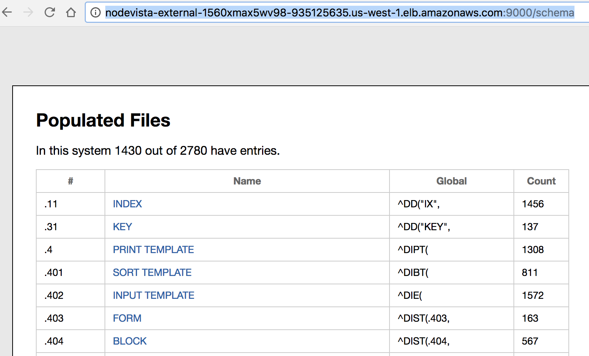

# Build 3 AWS

Properly deploying VICS and the RPC Router in AWS means taking full advantage of this "elastic" cloud. The VICS Architecture will evolve during build 3 so that AWS is not just another "port" of VICS but is fully exploited. At the same time, for development and flexible demonstration, VICS components must continue to operate successfully on OS X and stand alone Linux VMs.

AWS deployment will build upon [docker for AWS](https://docs.docker.com/docker-for-aws/why/) which pre-packages an AWS [CloudFormation](https://aws.amazon.com/cloudformation) for docker swarms like VICS'.

AWS provides facilities for the basic infrastructure of cloud-based services. VICS needs to take advantage to be a "native AWS service". These facilities include:
  * [Amazon Cogito](https://aws.amazon.com/cognito/) - standards based user authentication, including SAML, and role based access control in a generic user management service
  * [Cloudwatch logging](https://docs.aws.amazon.com/AmazonCloudWatch/latest/logs/WhatIsCloudWatchLogs.html) - incorporates processing and alerts too
  * [Elastic Load Balancer](https://aws.amazon.com/elasticloadbalancing/) - among its many features, supports scaling and fail over
  * [Simple Email Service](https://aws.amazon.com/ses/) - VISTA emails many of its _bulletins_ and has a built in email service (_mailman_)

__Caveats__: 
  * VICS may only take advantage of AWS services and docker support offered in VA's internal AWS cloud.
  * VICS must continue to be deployable in basic Linux-based VMs and on OS X (our development platform). Scaling, identity management and logging must be addressed in this environment too. 

The result should be a VICS deployment with more, but smaller components, with failover support and support for using AWS tools and interfaces for application monitoring.

## Build 3 Sprint 2 Status

The [build 2 docker swarm](https://github.com/vistadataproject/VAMDocker/tree/master/demo) has been deployed to Public AWS (not VA internal). As with a Linux or OS X install, CPRS and the VDM Rambler are supported ...

 
