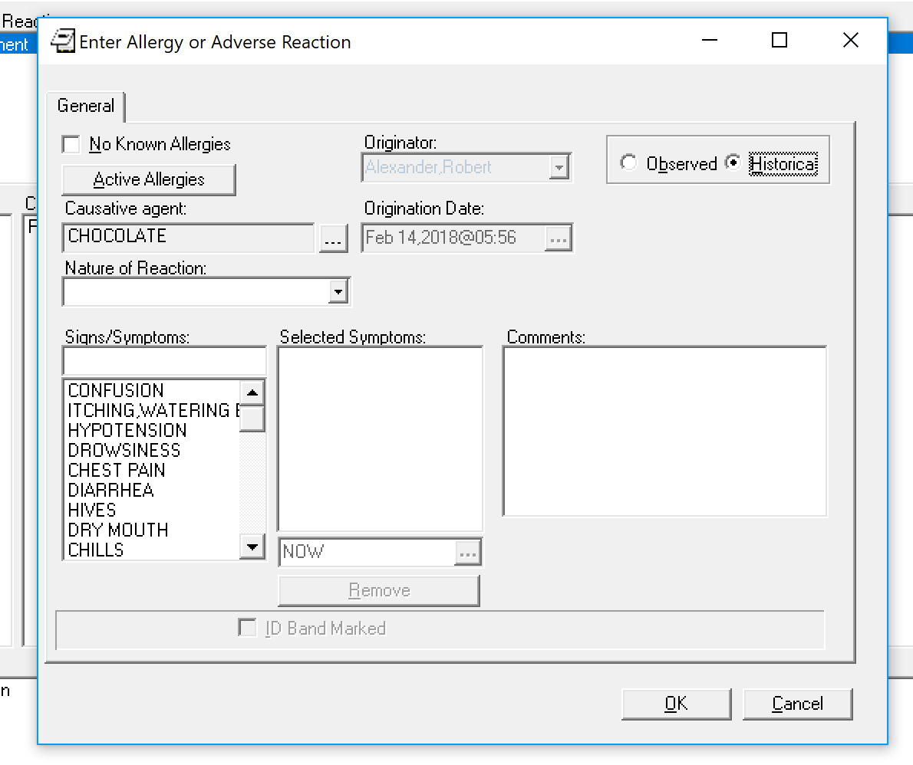
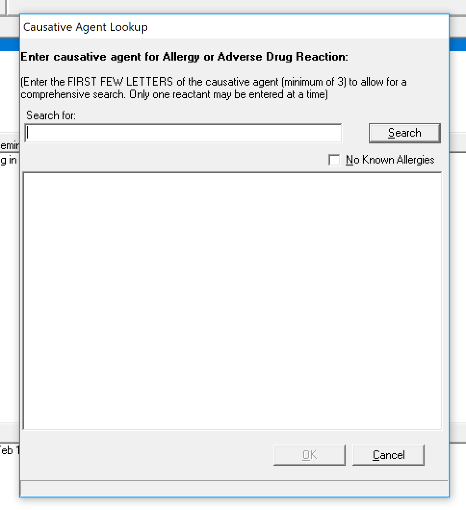
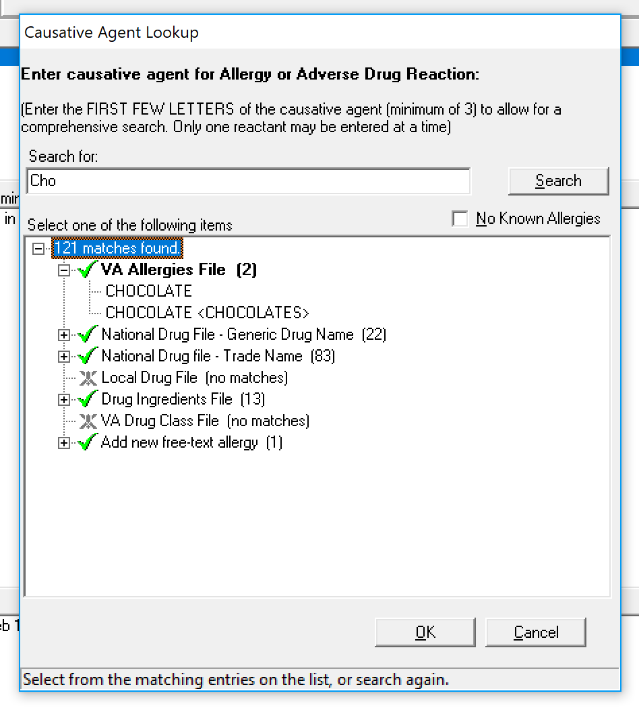
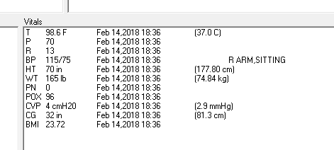
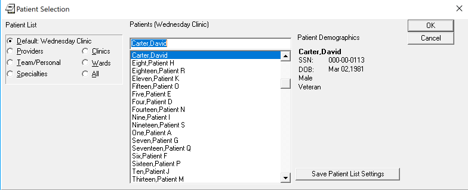
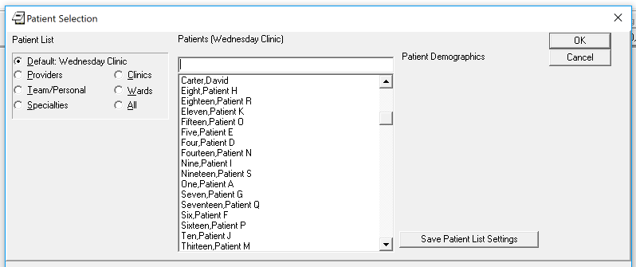

# CPRS Compare 

AllergyEnterDetails ...

AllergyEnterSearch ...

AllergyEnterSearchCho ...

AllergyEnterSearchChoEnter ...

Coversheet ...

CoversheetProblemWidgetThree ...

CoversheetVitalsWidgetMany ...

PatientCoversheetAllergyOptions ...

PatientSelectionChoice ...

PatientSelectionNoChoice ...

ProblemDetailPopup ...

