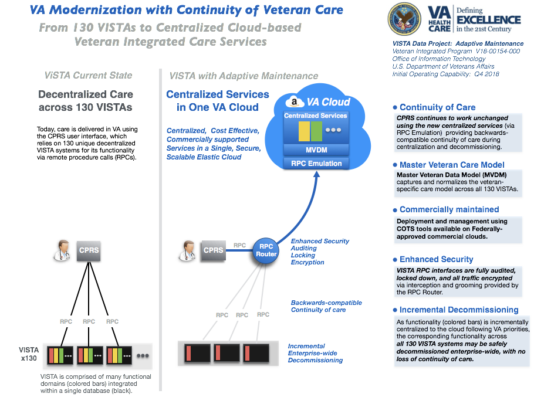

 

## VA Modernization with Continuity of Care

The Veterans Health Information Systems Technology Architecture ([VISTA](https://en.wikipedia.org/wiki/VistA)) is the comprehensive  longitudinal  clinical, business, and administrative information system of the U.S. Veterans Health Administration ([VHA](https://www.va.gov/health/aboutVHA.asp)). 130 unique decentralized instances of VISTA support the operations 1200 VA hospitals and clinics nationwide.  Under the VA Electronic Health Record Modernization program, all VISTA sytems and functionality will be centralized and migrated to a single commercially supported platform.  

The _VistA Cloud Adaptive Maintenance Project_ shows how to safely and seamlessly migrate the functionality of the 130 decentralized VA VISTA systems to a single, secure, centralized cloud-based __Veteran Integrated Care Service (VICS)__ to ensure continuity of veteran care, and simplify the enterprise-wide transition from 130 VISTA instances to a single commercially-supported EHR platform.

__Strategic Benefits__:
  * Current VISTA clients (CPRS/JLV) and workflows fully supported and secured
  * Safely and incrementally retire all 130 VISTA systems with an enterprise-wide approach, with no loss of veteran-specific care or services
  * Implement commodity commercial clinical and business information systems,  while preserving veteran-specific care and services
  * Move from disparate data centers to U.S. Fedramp-approved cloud without disturbing veteran care

__Show Me:__ browse through and run VDP's [Clinical](/vam/build1_1/demo) and [Non Clinical](/demo2) Demos.

 

## Background

The VISTA Cloud Adaptive Maintenance has progressed in two phases.

* __Cloud Data Discovery (FY16-17)__: In the VistA Metadata Audit, Analytics, and Automation project, the underlying models and metadata that drives all VISTA systems are exposed in industry-standard, machine-processable form, audited, and normalized to create a Master VistA Data model (MVDM) spanning all VistA systems.  The MVDM provides a modern, secure, symmetric, standards-based, model-driven read-write interface across all VistA systems. The business logic (remote procedure calls, or RPCs) of the clinical interface (CPRS) are exposed in industry-standard form, and emulated as services on top of the secure read-write MVDM.
* __Cloud Data Operations (FY18-20)__: In the VistA Cloud Adaptive Maintenance (VAM) project, MVDM and its secure read-write service interfaces to CPRS are operationalized - via RPC routing - to VA's new Federally-mandated, HIPAA-secured enterprise commercial cloud (Amazon).

 

